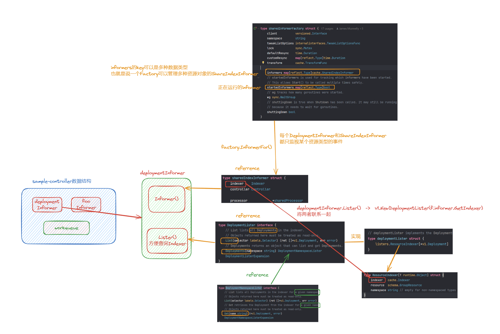
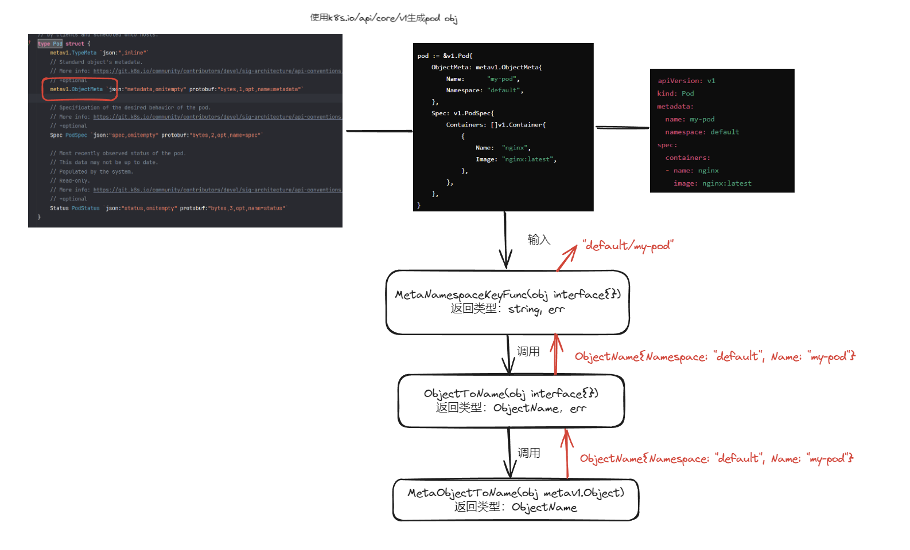
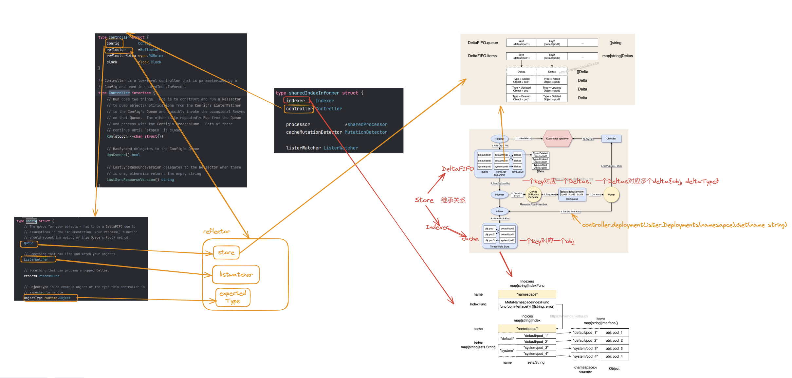
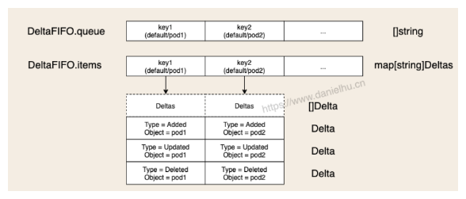
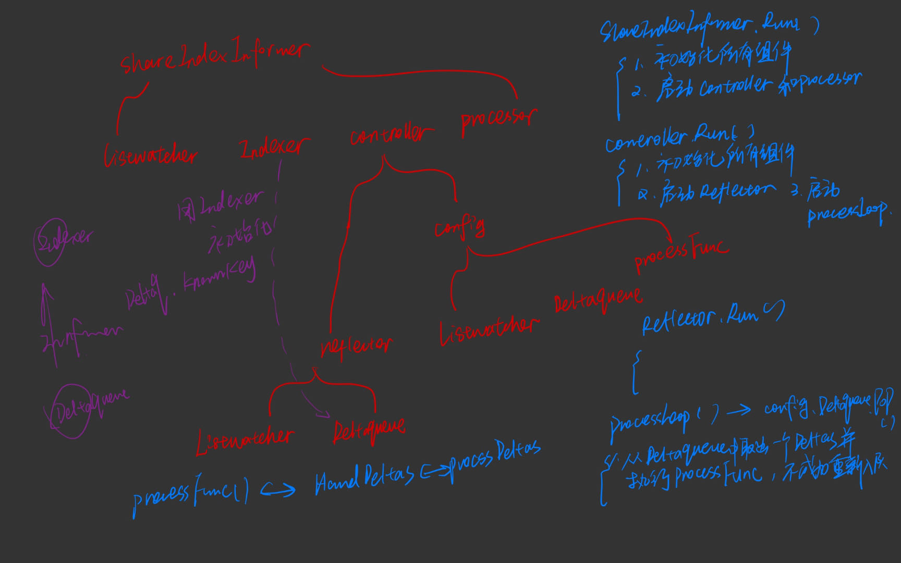

# sample controller 源码解读
controller是管理控制某些资源的的资源对象，比如Deployment Controller、DaemonSet Controller、Service Controller等等

k8s也支持自定义sample-controller来控制CRD

所有controller由k8s-controller-manager pod控制

下面介绍一个用于controll资源foo的sample controller

## 1. main.go
[main.go](DistreibutedSystem\Controller\main.go)
1. 创建content.Content对象(ctx)，In Go, context.Context is a built-in interface（内置接口） that is used to pass request-scoped values, cancellation signals, and deadlines across API boundaries to all the goroutines involved in handling a request.
    ```go
    ctx := signals.SetupSignalHandler()
    ```
    下面是SetupSignalHandler()函数：
    1.  It creates a new context (ctx) derived from the background context (context.Background()).
    2. It sets up a channel (c) to receive OS signals like SIGINT (Ctrl+C) and SIGTERM.
    3. It starts a goroutine that listens on the c channel for signals. When the first signal is received, it cancels the ctx context. If a second signal is received, it exits the program with an exit code of 1.
    ```go
    // pkg/signals/signal.go
    func SetupSignalHandler() context.Context {
        close(onlyOneSignalHandler) // panics when called twice

        c := make(chan os.Signal, 2)
        ctx, cancel := context.WithCancel(context.Background())
        signal.Notify(c, shutdownSignals...)
        go func() {
            <-c
            cancel()
            <-c
            os.Exit(1) // second signal. Exit directly.
        }()

        return ctx
    }
   ```
2. 创建rest.Config对象(cfg)，用来contains the necessary configuration for connecting to the **Kubernetes API server**, such as the server address, authentication credentials, and other options.
    ```go
    cfg, err := clientcmd.BuildConfigFromFlags(masterURL, kubeconfig)
    ```
3. 创建kubernetes.interface 对象(kubeClient)，用来interact with various Kubernetes resources and APIs, such as Pods, Deployments, Services
4. 创建clientset.Interface 对象(exampleClient)，用来interacting with the CRDs defined
    ```go
    kubeClient, err := kubernetes.NewForConfig(cfg)
    exampleClient, err := clientset.NewForConfig(cfg)   
    ```
5. 创建两个SharedInformerFactory对象(kubeInformerFactory，exampleInformerFactory)，用来creating and managing informers, which are used to watch and cache Kubernetes resources。[informer对象](#informer对象)可以用来监控资源发生的事件，并执行相应的处理
    ```go
    kubeInformerFactory := kubeinformers.NewSharedInformerFactory(kubeClient, time.Second*30)
	exampleInformerFactory := informers.NewSharedInformerFactory(exampleClient, time.Second*30)
    ```
6. 创建Controller对象(controller)，这个对象即为sample controller。用来同时监视管理app.v1里的deploy资源以及foo资源。初始化参数如下：
    - ctx: A context object used for cancellation and timeouts.
    - kubeClient: The Kubernetes client created earlier.
    - exampleClient: The client for the CRDs defined in the project.
    - kubeInformerFactory.Apps().V1().Deployments(): An informer for Kubernetes Deployments.
    - exampleInformerFactory.Samplecontroller().V1alpha1().Foos(): An informer for the Foo CRD - defined in the project.
    ```go
    controller := NewController(ctx, kubeClient, exampleClient,
	    kubeInformerFactory.Apps().V1().Deployments(),
	    exampleInformerFactory.Samplecontroller().V1alpha1().Foos())
    ```
7. 启动kubeInformerFactory和exampleInformerFactory。ctx.Done()返回一个channel，当sample contoller被关闭时，会关闭这个channel，然后通过channel通知所有的Informer终止。
    ```go
    kubeInformerFactory.Start(ctx.Done())
	exampleInformerFactory.Start(ctx.Done())
    ```

### 1.1 sharedInformerFactory


用于创建多种资源对象ShareIndexInformer

结构体：

```go
type sharedInformerFactory struct {
	client           versioned.Interface
	namespace        string  
	tweakListOptions internalinterfaces.TweakListOptionsFunc
	lock             sync.Mutex
	defaultResync    time.Duration
	customResync     map[reflect.Type]time.Duration
	transform        cache.TransformFunc

	informers map[reflect.Type]cache.SharedIndexInformer
	// startedInformers is used for tracking which informers have been started.
	// This allows Start() to be called multiple times safely.
	startedInformers map[reflect.Type]bool
	// wg tracks how many goroutines were started.
	wg sync.WaitGroup
	// shuttingDown is true when Shutdown has been called. It may still be running
	// because it needs to wait for goroutines.
	shuttingDown bool
}
```

主要关注client，informers，startedInformers，namespace这两个成员，总结起来就是**创建多个资源对象监视器，一个命名空间**

1. client: ```TODO```
2. informers: key为任何reflect.Type（反射类型），val为key对应资源对象的SharedIndexInformer。
   - reflect.Type:可以由```reflect.TypeOf(&corev1.Pod{})```获取```corev1.Pod{}```的反射类型，为core.v1.Pod，即包名.资源对象名
   - informers的key可以是多种不同反射类型，所以Factory可以创建多个管理不同资源的informers
3. startedInformers：跟踪哪些informer已经被使用
4. namespace: Factory对象创建的不同资源对象的SharedIndexInformer只能监听同一个命名空间下的资源对象


启动一个Factory:
```go
func (f *sharedInformerFactory) Start(stopCh <-chan struct{}) {
	f.lock.Lock()
	defer f.lock.Unlock()

	if f.shuttingDown {
		return
	}

	for informerType, informer := range f.informers {
		if !f.startedInformers[informerType] {
			f.wg.Add(1)
			// We need a new variable in each loop iteration,
			// otherwise the goroutine would use the loop variable
			// and that keeps changing.
			informer := informer
			go func() {
				defer f.wg.Done()
				informer.Run(stopCh)
			}()
			f.startedInformers[informerType] = true
		}
	}
}
```

Start()判断informers中的informer是否已经在startedInformers中，如果没有，则启动一个goroutine来启动这个informer。


## 2. contoller.go
[controller.go](DistreibutedSystem\Controller\controller.go)

介绍sample-controller的主要运行逻辑和相关函数

### 2.0 struct controller 定义

首先给出整个controller的组件的大致构成

```go
type Controller struct {
	// kubeclientset is a standard kubernetes clientset
	kubeclientset kubernetes.Interface
	// sampleclientset is a clientset for our own API group
	sampleclientset clientset.Interface

	deploymentsLister appslisters.DeploymentLister
	deploymentsSynced cache.InformerSynced
	foosLister        listers.FooLister
	foosSynced        cache.InformerSynced

	// workqueue is a rate limited work queue. This is used to queue work to be
	// processed instead of performing it as soon as a change happens. This
	// means we can ensure we only process a fixed amount of resources at a
	// time, and makes it easy to ensure we are never processing the same item
	// simultaneously in two different workers.
	workqueue workqueue.TypedRateLimitingInterface[string]
	// recorder is an event recorder for recording Event resources to the
	// Kubernetes API.
	recorder record.EventRecorder
}
```
重点是deploymentsLister（以及foosLister），deploymentsSynced（以及foosSynced），以及workqueue

前两者都封装在DeploymentInformer（以及FooInformer）接口内，workqueue是TypedRateLimitingInterface接口

NewController函数涉及到所有controller的组件的初始化，这里就不过多赘述了
```go
func NewController(
	ctx context.Context,
	kubeclientset kubernetes.Interface,
	sampleclientset clientset.Interface,
	deploymentInformer appsinformers.DeploymentInformer,
	fooInformer informers.FooInformer) *Controller {
	logger := klog.FromContext(ctx)

	// Create event broadcaster
	// Add sample-controller types to the default Kubernetes Scheme so Events can be
	// logged for sample-controller types.
	utilruntime.Must(samplescheme.AddToScheme(scheme.Scheme))
	logger.V(4).Info("Creating event broadcaster")

	eventBroadcaster := record.NewBroadcaster(record.WithContext(ctx))
	eventBroadcaster.StartStructuredLogging(0)
	eventBroadcaster.StartRecordingToSink(&typedcorev1.EventSinkImpl{Interface: kubeclientset.CoreV1().Events("")})
	recorder := eventBroadcaster.NewRecorder(scheme.Scheme, corev1.EventSource{Component: controllerAgentName})
	ratelimiter := workqueue.NewTypedMaxOfRateLimiter(
		workqueue.NewTypedItemExponentialFailureRateLimiter[string](5*time.Millisecond, 1000*time.Second),
		&workqueue.TypedBucketRateLimiter[string]{Limiter: rate.NewLimiter(rate.Limit(50), 300)},
	)

	controller := &Controller{
		kubeclientset:     kubeclientset,
		sampleclientset:   sampleclientset,
		deploymentsLister: deploymentInformer.Lister(),
		deploymentsSynced: deploymentInformer.Informer().HasSynced,
		foosLister:        fooInformer.Lister(),
		foosSynced:        fooInformer.Informer().HasSynced,
		workqueue:         workqueue.NewTypedRateLimitingQueue(ratelimiter),
		recorder:          recorder,
	}

	logger.Info("Setting up event handlers")
	// Set up an event handler for when Foo resources change
	fooInformer.Informer().AddEventHandler(cache.ResourceEventHandlerFuncs{
		AddFunc: controller.enqueueFoo,
		UpdateFunc: func(old, new interface{}) {
			controller.enqueueFoo(new)
		},
	})
	// Set up an event handler for when Deployment resources change. This
	// handler will lookup the owner of the given Deployment, and if it is
	// owned by a Foo resource then the handler will enqueue that Foo resource for
	// processing. This way, we don't need to implement custom logic for
	// handling Deployment resources. More info on this pattern:
	// https://github.com/kubernetes/community/blob/8cafef897a22026d42f5e5bb3f104febe7e29830/contributors/devel/controllers.md
	// 回调函数
	deploymentInformer.Informer().AddEventHandler(cache.ResourceEventHandlerFuncs{
		AddFunc: controller.handleObject,
		UpdateFunc: func(old, new interface{}) {
			newDepl := new.(*appsv1.Deployment)
			oldDepl := old.(*appsv1.Deployment)
			if newDepl.ResourceVersion == oldDepl.ResourceVersion {
				// Periodic resync will send update events for all known Deployments.
				// Two different versions of the same Deployment will always have different RVs.
				return
			}
			controller.handleObject(new)
		},
		DeleteFunc: controller.handleObject,
	})
```

### 2.1 Run() 和 runWorker()
Run()等待deploymentInformer和fooInformer的cache同步完成，然后启动worke(runWorker())
```go
func (c *Controller) Run(ctx context.Context, workers int) error {
	defer utilruntime.HandleCrash()
	defer c.workqueue.ShutDown()
	logger := klog.FromContext(ctx)

	// Start the informer factories to begin populating the informer caches
	logger.Info("Starting Foo controller")

	// Wait for the caches to be synced before starting workers
	logger.Info("Waiting for informer caches to sync")

	if ok := cache.WaitForCacheSync(ctx.Done(), c.deploymentsSynced, c.foosSynced); !ok {
		return fmt.Errorf("failed to wait for caches to sync")
	}

	logger.Info("Starting workers", "count", workers)
	// Launch two workers to process Foo resources
	// 并行处理foo资源event的worker数
	for i := 0; i < workers; i++ {
		go wait.UntilWithContext(ctx, c.runWorker, time.Second)
	}

	logger.Info("Started workers")
	// 阻塞，直到ctx.Done()被关闭
	<-ctx.Done()
	logger.Info("Shutting down workers")

	return nil
}

// runWorker is a long-running function that will continually call the
// processNextWorkItem function in order to read and process a message on the
// workqueue.
func (c *Controller) runWorker(ctx context.Context) {
	for c.processNextWorkItem(ctx) {
	}
}
```

runWorker函数主要是循环处理workqueue里的obj，也就是循环调用processNextWorkItem()

### 2.2 processNextWorkItem() 和 syncHandler()

processNextWorkItem():worker从controller.workqueue中取出一个资源事件obj(string类型)，并将该obj交给syncHandler()处理。**实现了syscHandler返回结果的处理逻辑**。

```go
// processNextWorkItem will read a single work item off the workqueue and
// attempt to process it, by calling the syncHandler.
func (c *Controller) processNextWorkItem(ctx context.Context) bool {
    // 取出资源事件在indexer中的key(string 类型)
	obj, shutdown := c.workqueue.Get()
	logger := klog.FromContext(ctx)
	if shutdown {
		return false
	}
	// We wrap this block in a func so we can defer c.workqueue.Done.
	err := func() error {
		// We call Done here so the workqueue knows we have finished
		// processing this item. We also must remember to call Forget if we
		// do not want this work item being re-queued. For example, we do
		// not call Forget if a transient error occurs, instead the item is
		// put back on the workqueue and attempted again after a back-off
		// period.
		defer c.workqueue.Done(obj)
		// Run the syncHandler, passing it the namespace/name string of the
		// Foo resource to be synced.
		if err := c.syncHandler(ctx, obj); err != nil {
			// Put the item back on the workqueue to handle any transient errors.
			c.workqueue.AddRateLimited(obj)
			return fmt.Errorf("error syncing '%s': %s, requeuing", obj, err.Error())
		}
		// Finally, if no error occurs we Forget this item so it does not
		// get queued again until another change happens.
		c.workqueue.Forget(obj)
		logger.Info("Successfully synced", "resourceName", obj)
		return nil
	}()
	if err != nil {
		utilruntime.HandleError(err)
		return true
	}
	return true
}
```
### 2.3 enqueueFoo()

>该函数被用作Foo资源的ResourceHandler函数

调用MetaNamespaceKeyFunc()方法，将obj转换为namespace/name字符串，然后将该字符串(前面提到的obj的key)放入workqueue中。

```go
// enqueueFoo takes a Foo resource and converts it into a namespace/name
// string which is then put onto the work queue. This method should *not* be
// passed resources of any type other than Foo.
func (c *Controller) enqueueFoo(obj interface{}) {
	var key string
	var err error
	if key, err = cache.MetaNamespaceKeyFunc(obj); err != nil {
		utilruntime.HandleError(err)
		return
	}
	c.workqueue.Add(key)
}
```

cache文件中的MetaNamespaceKeyFunc以及其调用的函数：
```go
// MetaObjectToName returns the structured name for the given object
func MetaObjectToName(obj metav1.Object) ObjectName {
	if len(obj.GetNamespace()) > 0 {
		return ObjectName{Namespace: obj.GetNamespace(), Name: obj.GetName()}
	}
	return ObjectName{Namespace: "", Name: obj.GetName()}
}

// ObjectToName returns the structured name for the given object,
// if indeed it can be viewed as a metav1.Object.
func ObjectToName(obj interface{}) (ObjectName, error) {
    // meta.Accessor(obj) 获取obj的metadata{name, namespace}
	meta, err := meta.Accessor(obj)
	if err != nil {
		return ObjectName{}, fmt.Errorf("object has no meta: %v", err)
	}
	return MetaObjectToName(meta), nil
}

func MetaNamespaceKeyFunc(obj interface{}) (string, error) {
	if key, ok := obj.(ExplicitKey); ok {
		return string(key), nil
	}
	objName, err := ObjectToName(obj)
	if err != nil {
		return "", err
	}
	return objName.String(), nil
}
```
详细过程如下图：


### 2.4 handleObject(obj interface{})

>该函数被用作deployment资源的ResourceHandler函数

主要做的事就是把控制这个deployment资源的foo资源列出来，并入队

```go
// handleObject will take any resource implementing metav1.Object and attempt
// to find the Foo resource that 'owns' it. It does this by looking at the
// objects metadata.ownerReferences field for an appropriate OwnerReference.
// It then enqueues that Foo resource to be processed. If the object does not
// have an appropriate OwnerReference, it will simply be skipped.
func (c *Controller) handleObject(obj interface{}) {
	var object metav1.Object
	var ok bool
	logger := klog.FromContext(context.Background())
	if object, ok = obj.(metav1.Object); !ok {
		tombstone, ok := obj.(cache.DeletedFinalStateUnknown)
		if !ok {
			utilruntime.HandleError(fmt.Errorf("error decoding object, invalid type"))
			return
		}
		object, ok = tombstone.Obj.(metav1.Object)
		if !ok {
			utilruntime.HandleError(fmt.Errorf("error decoding object tombstone, invalid type"))
			return
		}
		logger.V(4).Info("Recovered deleted object", "resourceName", object.GetName())
	}
	logger.V(4).Info("Processing object", "object", klog.KObj(object))
	// 这里为什么要判断是否属于Foo管控
	if ownerRef := metav1.GetControllerOf(object); ownerRef != nil {
		// If this object is not owned by a Foo, we should not do anything more
		// with it.
		if ownerRef.Kind != "Foo" {
			return
		}
		foo, err := c.foosLister.Foos(object.GetNamespace()).Get(ownerRef.Name)
		if err != nil {
			logger.V(4).Info("Ignore orphaned object", "object", klog.KObj(object), "foo", ownerRef.Name)
			return
		}

		c.enqueueFoo(foo)
		return
	}
}
```

## 3. controller的Informer成员
单纯实现controoler逻辑好像不需要知道具体的实现

大致组件构成



从shareInformer接口的实现类开始：

```go
type sharedIndexInformer struct {
	indexer    Indexer
	controller Controller

	processor             *sharedProcessor
	cacheMutationDetector MutationDetector

	listerWatcher ListerWatcher

	// objectType is an example object of the type this informer is expected to handle. If set, an event
	// with an object with a mismatching type is dropped instead of being delivered to listeners.
	objectType runtime.Object

	// objectDescription is the description of this informer's objects. This typically defaults to
	objectDescription string

	// resyncCheckPeriod is how often we want the reflector's resync timer to fire so it can call
	// shouldResync to check if any of our listeners need a resync.
	resyncCheckPeriod time.Duration
	// defaultEventHandlerResyncPeriod is the default resync period for any handlers added via
	// AddEventHandler (i.e. they don't specify one and just want to use the shared informer's default
	// value).
	defaultEventHandlerResyncPeriod time.Duration
	// clock allows for testability
	clock clock.Clock

	started, stopped bool
	startedLock      sync.Mutex

	// blockDeltas gives a way to stop all event distribution so that a late event handler
	// can safely join the shared informer.
	blockDeltas sync.Mutex

	// Called whenever the ListAndWatch drops the connection with an error.
	watchErrorHandler WatchErrorHandler

	transform TransformFunc
}
```

重点关注indexer、controller、processor和listerWatcher，以及Run()函数

### 3.1 indexer

和controller.config.queue不是同一个组件

接口Store->接口DeltaFIFO[3.2.1.1](queue)
		->接口Indexer->类cache

这里的Indexer成员的实现类为cache，简单理解就是一个map，一个key(namespace/name)对应一个obj(资源对象类)

### 3.2 controller

这里的controller与sample-controller不是一个东西，这个controller是用来控制Informer的DeltaFIFO事件加入取出的逻辑的。
```go
type controller struct {
	config         Config
	reflector      *Reflector
	reflectorMutex sync.RWMutex
	clock          clock.Clock
}
```

```go
// Controller is a low-level controller that is parameterized by a
// Config and used in sharedIndexInformer.
type Controller interface {
	// Run does two things.  One is to construct and run a Reflector
	// to pump objects/notifications from the Config's ListerWatcher
	// to the Config's Queue and possibly invoke the occasional Resync
	// on that Queue.  The other is to repeatedly Pop from the Queue
	// and process with the Config's ProcessFunc.  Both of these
	// continue until `stopCh` is closed.
	Run(stopCh <-chan struct{})

	// HasSynced delegates to the Config's Queue
	HasSynced() bool

	// LastSyncResourceVersion delegates to the Reflector when there
	// is one, otherwise returns the empty string
	LastSyncResourceVersion() string
}
```
controller的关键成员是config和reflector,关键函数是Run()


#### 3.2.1 Config
```go
type Config struct {
	// The queue for your objects - has to be a DeltaFIFO due to
	// assumptions in the implementation. Your Process() function
	// should accept the output of this Queue's Pop() method.
	Queue

	// Something that can list and watch your objects.
	ListerWatcher

	// Something that can process a popped Deltas.
	Process ProcessFunc

	// ObjectType is an example object of the type this controller is
	// expected to handle.
	ObjectType runtime.Object

	// ObjectDescription is the description to use when logging type-specific information about this controller.
	ObjectDescription string

	// FullResyncPeriod is the period at which ShouldResync is considered.
	FullResyncPeriod time.Duration

	// MinWatchTimeout, if set, will define the minimum timeout for watch requests send
	// to kube-apiserver. However, values lower than 5m will not be honored to avoid
	// negative performance impact on controlplane.
	// Optional - if unset a default value of 5m will be used.
	MinWatchTimeout time.Duration

	// ShouldResync is periodically used by the reflector to determine
	// whether to Resync the Queue. If ShouldResync is `nil` or
	// returns true, it means the reflector should proceed with the
	// resync.
	ShouldResync ShouldResyncFunc

	// If true, when Process() returns an error, re-enqueue the object.
	// TODO: add interface to let you inject a delay/backoff or drop
	//       the object completely if desired. Pass the object in
	//       question to this interface as a parameter.  This is probably moot
	//       now that this functionality appears at a higher level.
	RetryOnError bool

	// Called whenever the ListAndWatch drops the connection with an error.
	WatchErrorHandler WatchErrorHandler

	// WatchListPageSize is the requested chunk size of initial and relist watch lists.
	WatchListPageSize int64
}
```

继承了queue和ListerWatcher，另外还有Process需要关注

##### 3.2.1.1 queue

```go
type Queue interface {
	Store

	// Pop blocks until there is at least one key to process or the
	// Queue is closed.  In the latter case Pop returns with an error.
	// In the former case Pop atomically picks one key to process,
	// removes that (key, accumulator) association from the Store, and
	// processes the accumulator.  Pop returns the accumulator that
	// was processed and the result of processing.  The PopProcessFunc
	// may return an ErrRequeue{inner} and in this case Pop will (a)
	// return that (key, accumulator) association to the Queue as part
	// of the atomic processing and (b) return the inner error from
	// Pop.
	Pop(PopProcessFunc) (interface{}, error)

	// AddIfNotPresent puts the given accumulator into the Queue (in
	// association with the accumulator's key) if and only if that key
	// is not already associated with a non-empty accumulator.
	AddIfNotPresent(interface{}) error

	// HasSynced returns true if the first batch of keys have all been
	// popped.  The first batch of keys are those of the first Replace
	// operation if that happened before any Add, AddIfNotPresent,
	// Update, or Delete; otherwise the first batch is empty.
	HasSynced() bool

	// Close the queue
	Close()
}
```

关于Queue和Queue继承的Store接口详见 [5. store](cache.Store), queue的具体实现就是DeltaFIFO类，给出关键成员items和queue([]string，别和前面的Queue搞混了)

```go
type DeltaFIFO struct {
	// `items` maps a key to a Deltas.
	// Each such Deltas has at least one Delta.
	items map[string]Deltas

	// `queue` maintains FIFO order of keys for consumption in Pop().
	// There are no duplicates in `queue`.
	// A key is in `queue` if and only if it is in `items`.
	queue []string  

	// keyFunc is used to make the key used for queued item
	// insertion and retrieval, and should be deterministic.
	keyFunc KeyFunc

	// knownObjects list keys that are "known" --- affecting Delete(),
	// Replace(), and Resync()
	knownObjects KeyListerGetter
}
// Deltas is a list of one or more 'Delta's to an individual object.
// The oldest delta is at index 0, the newest delta is the last one.
type Deltas []Delta
// Delta is a member of Deltas (a list of Delta objects) which
// in its turn is the type stored by a DeltaFIFO. It tells you what
// change happened, and the object's state after* that change.
//
// [*] Unless the change is a deletion, and then you'll get the final
// state of the object before it was deleted.
type Delta struct {
	Type   DeltaType
	Object interface{}
}
// Change type definition
const (
	Added   DeltaType = "Added"
	Updated DeltaType = "Updated"
	Deleted DeltaType = "Deleted"
	// Replaced is emitted when we encountered watch errors and had to do a
	// relist. We don't know if the replaced object has changed.
	//
	// NOTE: Previous versions of DeltaFIFO would use Sync for Replace events
	// as well. Hence, Replaced is only emitted when the option
	// EmitDeltaTypeReplaced is true.
	Replaced DeltaType = "Replaced"
	// Sync is for synthetic events during a periodic resync.
	Sync DeltaType = "Sync"
)
```



items的key为namespace/name, val为Detlas, Deltas是Delta的数组，Delta是资源事件类型（DeltaType）和资源对象（Object）的组合

先看如何将资源事件入队：Add()和Delete()函数（update(),Replaced()函数同理），先不管哪里调用了这几个函数(大概率是reflector和listwatcher)。
```go
func (f *DeltaFIFO) Add(obj interface{}) error {
	f.lock.Lock()
	defer f.lock.Unlock()
	f.populated = true
	return f.queueActionLocked(Added, obj)
}

func (f *DeltaFIFO) Delete(obj interface{}) error {
	id, err := f.KeyOf(obj)
	if err != nil {
		return KeyError{obj, err}
	}
	f.lock.Lock()
	defer f.lock.Unlock()
	f.populated = true
	if f.knownObjects == nil {
		if _, exists := f.items[id]; !exists {
			// Presumably, this was deleted when a relist happened.
			// Don't provide a second report of the same deletion.
			return nil
		}
	} else {
		// We only want to skip the "deletion" action if the object doesn't
		// exist in knownObjects and it doesn't have corresponding item in items.
		// Note that even if there is a "deletion" action in items, we can ignore it,
		// because it will be deduped automatically in "queueActionLocked"
		_, exists, err := f.knownObjects.GetByKey(id)
		_, itemsExist := f.items[id]
		if err == nil && !exists && !itemsExist {
			// Presumably, this was deleted when a relist happened.
			// Don't provide a second report of the same deletion.
			return nil
		}
	}
	// exist in items and/or KnownObjects
	return f.queueActionLocked(Deleted, obj)
}
```
Add()、Delete()、update()、Replaced()函数的功能都是相同的都用来处理不同资源对象的**增量事件**入DeltaQueue的逻辑。

当DeltaQueue中没有**Delete类型资源事件的资源对象**时或者**有这个资源对象但其Deltas为空**时，忽略该Delete事件

处理了一些基本逻辑后，每个函数都调用了queueActionLocked(DeltaType, obj)函数，很显然是真正处理入队的操作。那么来看看

```go
func (f *DeltaFIFO) queueActionInternalLocked(actionType, internalActionType DeltaType, obj interface{}) error {
	id, err := f.KeyOf(obj)
	if err != nil {
		return KeyError{obj, err}
	}

	// Every object comes through this code path once, so this is a good
	// place to call the transform func.
	//
	// If obj is a DeletedFinalStateUnknown tombstone or the action is a Sync,
	// then the object have already gone through the transformer.
	//
	// If the objects already present in the cache are passed to Replace(),
	// the transformer must be idempotent to avoid re-mutating them,
	// or coordinate with all readers from the cache to avoid data races.
	// Default informers do not pass existing objects to Replace.
	if f.transformer != nil {
		_, isTombstone := obj.(DeletedFinalStateUnknown)
		if !isTombstone && internalActionType != Sync {
			var err error
			obj, err = f.transformer(obj)
			if err != nil {
				return err
			}
		}
	}

	oldDeltas := f.items[id]
	newDeltas := append(oldDeltas, Delta{actionType, obj})
	newDeltas = dedupDeltas(newDeltas)

	if len(newDeltas) > 0 {
		if _, exists := f.items[id]; !exists {
			f.queue = append(f.queue, id)
		}
		f.items[id] = newDeltas
		f.cond.Broadcast()
	} else {
		// This never happens, because dedupDeltas never returns an empty list
		// when given a non-empty list (as it is here).
		// If somehow it happens anyway, deal with it but complain.
		if oldDeltas == nil {
			klog.Errorf("Impossible dedupDeltas for id=%q: oldDeltas=%#+v, obj=%#+v; ignoring", id, oldDeltas, obj)
			return nil
		}
		klog.Errorf("Impossible dedupDeltas for id=%q: oldDeltas=%#+v, obj=%#+v; breaking invariant by storing empty Deltas", id, oldDeltas, obj)
		f.items[id] = newDeltas
		return fmt.Errorf("Impossible dedupDeltas for id=%q: oldDeltas=%#+v, obj=%#+v; broke DeltaFIFO invariant by storing empty Deltas", id, oldDeltas, obj)
	}
	return nil
}
```
其实就是获取资源对象的key，并经过一些准入判断之后，对Deltas和items进行更新

------
**Pop()**

再来看下资源事件如何出队(DeltaFIFO)并放入Indexer：pop()函数。Pop函数主要功能为删除DeltaFIFO.queue的首元素及其deltas，并调用processFunc处理deltas
```go
func (f *DeltaFIFO) Pop(process PopProcessFunc) (interface{}, error) {
	f.lock.Lock()
	defer f.lock.Unlock()
	for {
		for len(f.queue) == 0 {
			// When the queue is empty, invocation of Pop() is blocked until new item is enqueued.
			// When Close() is called, the f.closed is set and the condition is broadcasted.
			// Which causes this loop to continue and return from the Pop().
			if f.closed {
				return nil, ErrFIFOClosed
			}

			f.cond.Wait()
		}
		isInInitialList := !f.hasSynced_locked()
		// 获取queue的首元素(是delta的key)并删除
		id := f.queue[0]
		f.queue = f.queue[1:]
		depth := len(f.queue)
		if f.initialPopulationCount > 0 {
			f.initialPopulationCount--
		}
		// 获取deltas
		item, ok := f.items[id]
		if !ok {
			// This should never happen
			klog.Errorf("Inconceivable! %q was in f.queue but not f.items; ignoring.", id)
			continue
		}
	 	// 删除deltas
		delete(f.items, id)
		// Only log traces if the queue depth is greater than 10 and it takes more than
		// 100 milliseconds to process one item from the queue.
		// Queue depth never goes high because processing an item is locking the queue,
		// and new items can't be added until processing finish.
		// https://github.com/kubernetes/kubernetes/issues/103789
		if depth > 10 {
			trace := utiltrace.New("DeltaFIFO Pop Process",
				utiltrace.Field{Key: "ID", Value: id},
				utiltrace.Field{Key: "Depth", Value: depth},
				utiltrace.Field{Key: "Reason", Value: "slow event handlers blocking the queue"})
			defer trace.LogIfLong(100 * time.Millisecond)
		}
		// 执行processFunc，处理deltas
		err := process(item, isInInitialList)
		if e, ok := err.(ErrRequeue); ok {
			f.addIfNotPresent(id, item)
			err = e.Err
		}
		// Don't need to copyDeltas here, because we're transferring
		// ownership to the caller.
		return item, err
	}
}
```
-----------
**ProcessFunc()**

processFunc函数如下：
```go
func processDeltas(
	// Object which receives event notifications from the given deltas
	handler ResourceEventHandler,
	clientState Store,
	deltas Deltas,
	isInInitialList bool,
) error {
	// from oldest to newest
	for _, d := range deltas {
		obj := d.Object

		switch d.Type {
		case Sync, Replaced, Added, Updated:
			// clientState是controller的Indexer，下文会讲到, 数据结构是map[namespace/name]obj
			// 也就是只会储存obj的最新deltaType
			if old, exists, err := clientState.Get(obj); err == nil && exists {
				if err := clientState.Update(obj); err != nil {
					return err
				}
				handler.OnUpdate(old, obj)
			} else {
				if err := clientState.Add(obj); err != nil {
					return err
				}
				handler.OnAdd(obj, isInInitialList)
			}
		case Deleted:
			if err := clientState.Delete(obj); err != nil {
				return err
			}
			handler.OnDelete(obj)
		}
	}
	return nil
}
```

**Replace()**

作用是刷新当前DeltaFIFO，先不管在哪会调用

```go
// Replace atomically does two things: (1) it adds the given objects
// using the Sync or Replace DeltaType and then (2) it does some deletions.
// In particular: for every pre-existing key K that is not the key of
// an object in `list` there is the effect of
// `Delete(DeletedFinalStateUnknown{K, O})` where O is the latest known
// object of K. The pre-existing keys are those in the union set of the keys in
// `f.items` and `f.knownObjects` (if not nil). The last known object for key K is
// the one present in the last delta in `f.items`. If there is no delta for K
// in `f.items`, it is the object in `f.knownObjects`
func (f *DeltaFIFO) Replace(list []interface{}, _ string) error {
	f.lock.Lock()
	defer f.lock.Unlock()
	keys := make(sets.String, len(list))

	// keep backwards compat for old clients
	action := Sync
	if f.emitDeltaTypeReplaced {
		action = Replaced
	}

	// Add Sync/Replaced action for each new item.
	for _, item := range list {
		key, err := f.KeyOf(item)
		if err != nil {
			return KeyError{item, err}
		}
		keys.Insert(key)
		if err := f.queueActionInternalLocked(action, Replaced, item); err != nil {
			return fmt.Errorf("couldn't enqueue object: %v", err)
		}
	}

	// Do deletion detection against objects in the queue
	queuedDeletions := 0
	for k, oldItem := range f.items {
		if keys.Has(k) {
			continue
		}
		// Delete pre-existing items not in the new list.
		// This could happen if watch deletion event was missed while
		// disconnected from apiserver.
		var deletedObj interface{}
		if n := oldItem.Newest(); n != nil {
			deletedObj = n.Object

			// if the previous object is a DeletedFinalStateUnknown, we have to extract the actual Object
			if d, ok := deletedObj.(DeletedFinalStateUnknown); ok {
				deletedObj = d.Obj
			}
		}
		queuedDeletions++
		if err := f.queueActionLocked(Deleted, DeletedFinalStateUnknown{k, deletedObj}); err != nil {
			return err
		}
	}

	if f.knownObjects != nil {
		// Detect deletions for objects not present in the queue, but present in KnownObjects
		knownKeys := f.knownObjects.ListKeys()
		for _, k := range knownKeys {
			if keys.Has(k) {
				continue
			}
			if len(f.items[k]) > 0 {
				continue
			}

			deletedObj, exists, err := f.knownObjects.GetByKey(k)
			if err != nil {
				deletedObj = nil
				klog.Errorf("Unexpected error %v during lookup of key %v, placing DeleteFinalStateUnknown marker without object", err, k)
			} else if !exists {
				deletedObj = nil
				klog.Infof("Key %v does not exist in known objects store, placing DeleteFinalStateUnknown marker without object", k)
			}
			queuedDeletions++
			if err := f.queueActionLocked(Deleted, DeletedFinalStateUnknown{k, deletedObj}); err != nil {
				return err
			}
		}
	}

	if !f.populated {
		f.populated = true
		f.initialPopulationCount = keys.Len() + queuedDeletions
	}

	return nil
}
```

**题外话：**

DeltaFIFO->Config->Reflector->Controller->ShareIndexInformer, 这五个类（或接口）都只作用于一种资源对象，也就是说Informer只能监视一个资源对象，DeltaFIFO只能存储一个资源对象，但是可以存储同一资源对象的不同命名空间下的不同名称的对象

##### 3.2.1.2 listwatcher

#### 3.2.2 Reflector

#### 3.2.3 controller的Run方法

**TODO**7.2从run到processDeltas的数据流


### 3.3 processor

### 3.4 listwatcher

### 3.5 从ShareIndexInformer.Run()到processDeltas()



## 4. controller的Lister成员

deploymentLister通过调用deploymentInformer.Lister()返回，本质是deploymentInformer提供给controller的一个 **查询Indexer** 的接口

### 4.1 ResourceIndexer成员

```go
type ResourceIndexer[T runtime.Object] struct {
	indexer   cache.Indexer
	resource  schema.GroupResource
	namespace string // empty for non-namespaced types
}
```

封装了indexer(cache.cache类 -> cache.Indexer接口 -> cache.Store接口)

在[3.1 indexer](indexer)中已经介绍了indexer的具体实现原理，这里就给出shareIndexInformer和DeploymentLister中的indexer是怎么联系起来的：

```go

// controller.NewController()
controller := &Controller{
		kubeclientset:     kubeclientset,
		sampleclientset:   sampleclientset,
		deploymentsLister: deploymentInformer.Lister(),
		deploymentsSynced: deploymentInformer.Informer().HasSynced,
		foosLister:        fooInformer.Lister(),
		foosSynced:        fooInformer.Informer().HasSynced,
		workqueue:         workqueue.NewTypedRateLimitingQueue(ratelimiter),
		recorder:          recorder,
	}

// deployment.Lister()

func (f *deploymentInformer) Lister() v1.DeploymentLister {
	return v1.NewDeploymentLister(f.Informer().GetIndexer())
}

// v1.NewDeploymentLister(), indexer形参通过f.Informer().GetIndexer()获得
func NewDeploymentLister(indexer cache.Indexer) DeploymentLister {
	return &deploymentLister{listers.New[*v1.Deployment](indexer, v1.Resource("deployment"))}
}

// Informer.GetIndexer()
func (s *sharedIndexInformer) GetIndexer() Indexer {
	return s.indexer
}
```

## 5. controller中的workQueue成员

### 5.1 workQueue里的queue和store
需要从k8s源码中的Interface接口、Typed类讲起
// [参考](https://www.cnblogs.com/daniel-hutao/p/18010835/k8s_clientgo_workqueue)

Done(obj):把obj从processed队列中移出
Forget(obj):把obj从workqueue中删除

## 6. cache.Store

Indexer和DeltaFIFO的祖先接口

