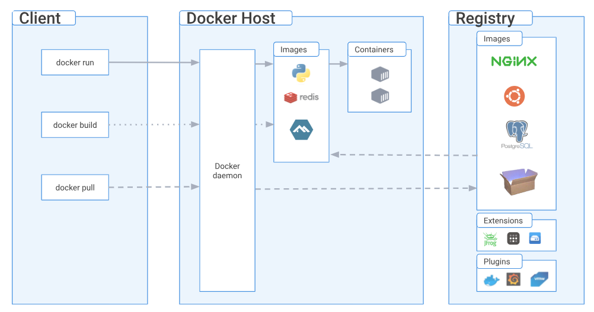
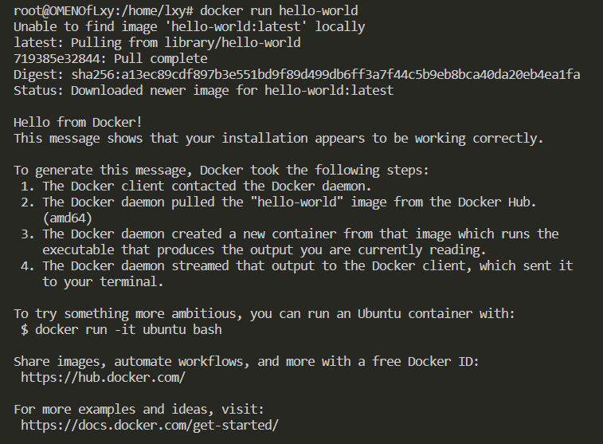
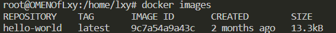
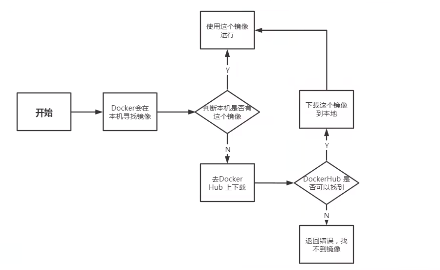
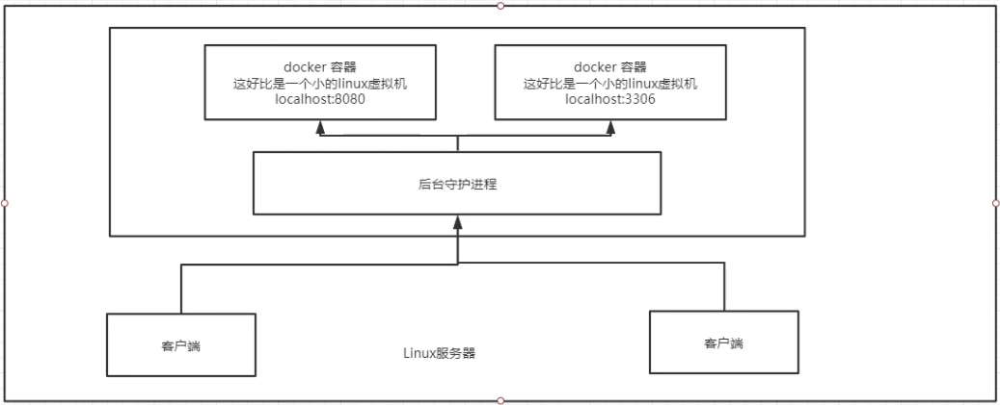
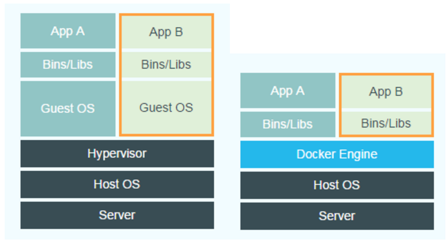

### 1. 概念

#### 镜像（image）
软件安装包，模板
通过镜像创建容器服务
#### 容器（container）
运行的软件，实例
容器功能：启动、停止、删除、基本命令
#### 仓库（repository）
存放镜像的地方
公有仓库和私有仓库

#### 架构图


### 2. 实操

#### 安装docker
```
curl -fsSL https://get.docker.com -o get-docker.sh
sh get-docker.sh
```
安装过程都包括在get-docker.sh这个文件里

#### 运行docker
wsl 不支持systemctl命令，用下面两种命令替代

```
systemctl status docker     # ERROR
/etc/init.d/docker status   # OK
service docker status       # OK
```

### 卸载docker
```
sudo apt-get purge docker-ce docker-ce-cli containerd.io docker-buildx-plugin docker-compose-plugin docker-ce-rootless-extras
```
```
rm -rf /var/lib/docker
rm -rf /var/lib/containerd
```
#### 运行镜像
```
docker run hello-world
```


#### 查看镜像   
```
docker image
```



#### hello-world 镜像启动过程


### 3. 底层原理

#### C/S架构
docker是C/S架构的， 在服务器上启动多个容器时，供外部客户端访问。


#### docker与vm的区别



虚拟机在本机操作系统上还有一个虚拟化层，并且虚拟机会虚拟出一整个操作系统Guest OS。而docker的所有容器都是在本机操作系统上运行的