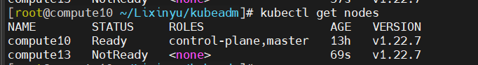
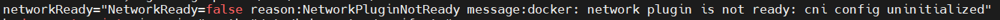
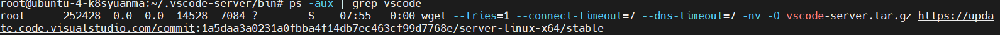
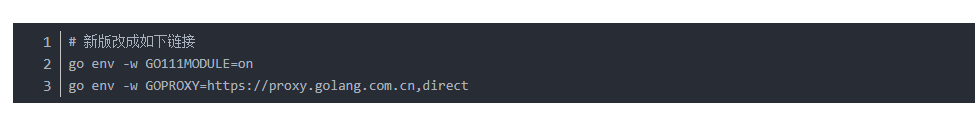
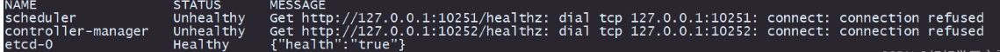

基本遵从https://blog.csdn.net/weixin_44559544/article/details/123381441

使用kubeadm搭建集群

# 可能出现的问题：

## 1. kubeadm初始化时，访问kubelet，节点上的10248端口无法访问。

```
[wait-control-plane] Waiting for the kubelet to boot up the control plane as static Pods from directory "/etc/kubernetes/manifests". This can take up to 4m0s
[kubelet-check] Initial timeout of 40s passed.
[kubelet-check] It seems like the kubelet isn't running or healthy.
[kubelet-check] The HTTP call equal to 'curl -sSL http://localhost:10248/healthz' failed with error: Get "http://localhost:10248/healthz": dial tcp 127.0.0.1:10248: connect: connection refused.
[kubelet-check] It seems like the kubelet isn't running or healthy.
[kubelet-check] The HTTP call equal to 'curl -sSL http://localhost:10248/healthz' failed with error: Get "http://localhost:10248/healthz": dial tcp 127.0.0.1:10248: connect: connection refused.
[kubelet-check] It seems like the kubelet isn't running or healthy.
[kubelet-check] The HTTP call equal to 'curl -sSL http://localhost:10248/healthz' failed with error: Get "http://localhost:10248/healthz": dial tcp 127.0.0.1:10248: connect: connection refused.
[kubelet-check] It seems like the kubelet isn't running or healthy.
[kubelet-check] The HTTP call equal to 'curl -sSL http://localhost:10248/healthz' failed with error: Get "http://localhost:10248/healthz": dial tcp 127.0.0.1:10248: connect: connection refused.
[kubelet-check] It seems like the kubelet isn't running or healthy.
[kubelet-check] The HTTP call equal to 'curl -sSL http://localhost:10248/healthz' failed with error: Get "http://localhost:10248/healthz": dial tcp 127.0.0.1:10248: connect: connection refused.

        Unfortunately, an error has occurred:
                timed out waiting for the condition

        This error is likely caused by:
                - The kubelet is not running
                - The kubelet is unhealthy due to a misconfiguration of the node in some way (required cgroups disabled)

        If you are on a systemd-powered system, you can try to troubleshoot the error with the following commands:
                - 'systemctl status kubelet'
                - 'journalctl -xeu kubelet'
```

解决方法：


https://blog.csdn.net/shida_csdn/article/details/104054041

## 2. 部署k8s网络到集群上失败


解决方法：
下载更老版本的calico并部署


### 2.1 calico成功部署仍无法访问其他节点


查看节点的kubelet日志：


这是因为部署网络插件时还未加入节点，那么网络插件pod就不会部署到节点上，所以要先节点加入集群再部署网络插件

## 3. 节点加入集群失败


原因：节点访问api-server来将注册信息写入etcd，但是master节点的用于api-server的监听端口没有开。在openstack平台的安全组里加上这端口的规则即可。

#### 4. 加入失败后再次加入报错


解决方法：
```shell
kubeadm reset
```

## 5. 如何设置ssh root用户登录

编辑/root/.ssh/authorized_keys文件

移除开头的
```shell
no-port-forwarding,no-agent-forwarding,no-X11-forwarding,command="echo 'Please login as the user \"ubuntu\" rather than the user \"root\".';echo;sleep 10;exit 142"
```

再编辑/etc/ssh/sshd_config文件，如下修改
```shell
PermitRootLogin yes #允许root登录
PermitEmptyPasswords yes #允许免密登录
```

重启ssh服务

```shell
service sshd restart
```

## vscode ssh 远程连接失败（这里指ssh本身可以连上，但vscode无法通过ssh连上）

1. 先检查是否ssh连接时是否有所占用情况，在output中查看是否阻塞在acquire lock on .vscode/bin/...文件，如果是用其他的终端将这个文件删除，并kill掉关于vscode的进程
2. 删除本地.ssh/know_host文件里的关于该远程IP的信息
3. 当出现启动卡在wget downloading上时，检查进程发现：
   
   说明是wget一直没有把linux端的vscode-server下载下来，那就手动下，直接去后面这个网址 https://update.code.visualstudio.com/commit:1a5daa3a0231a0fbba4f14db7ec463cf99d7768e/server-linux-x64/stable 里下载，然后把下载的压缩包解压重命名为1a5daa3a0231a0fbba4f14db7ec463cf99d7768e文件夹，把该文件夹移到登录用户的.vscode/bin/目录下即可

## 6. vscode ssh 远程连接后，无法安装go插件

1. go项目所需的go版本与本地go版本不一致
   ```shell
   rm -rf /usr/local/go && tar -C /usr/local -xzf go1.21.4.linux-amd64.tar.gz
   export PATH=$PATH:/usr/local/go/bin
   ```
2. 安装时未使用国内代理，解决方法如下：
   

## 7. kc get cs查看控制节点组件时出错



查看控制器pod发现就绪探针一直检测失败

参考[这个博客](https://blog.csdn.net/hedao0515/article/details/125993695?spm=1001.2101.3001.6650.8&utm_medium=distribute.pc_relevant.none-task-blog-2%7Edefault%7EBlogCommendFromBaidu%7ERate-8-125993695-blog-121940591.235%5Ev38%5Epc_relevant_anti_t3_base&depth_1-utm_source=distribute.pc_relevant.none-task-blog-2%7Edefault%7EBlogCommendFromBaidu%7ERate-8-125993695-blog-121940591.235%5Ev38%5Epc_relevant_anti_t3_base)