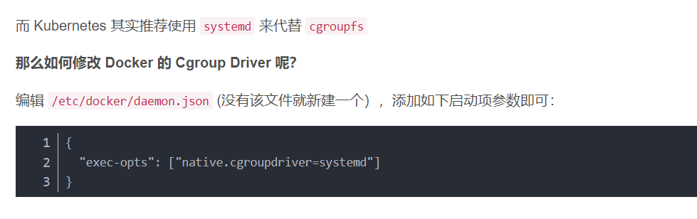
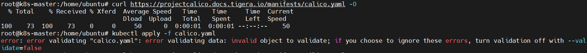
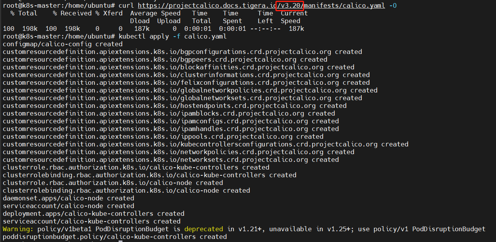
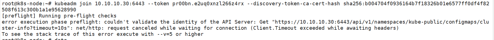
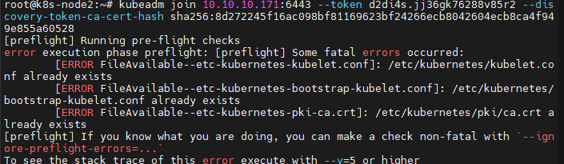

基本遵从https://blog.csdn.net/weixin_44559544/article/details/123381441

使用kubeadm搭建集群

# 可能出现的问题：

## 1. kubeadm初始化时，访问kubelet，节点上的10248端口无法访问。

```
[wait-control-plane] Waiting for the kubelet to boot up the control plane as static Pods from directory "/etc/kubernetes/manifests". This can take up to 4m0s
[kubelet-check] Initial timeout of 40s passed.
[kubelet-check] It seems like the kubelet isn't running or healthy.
[kubelet-check] The HTTP call equal to 'curl -sSL http://localhost:10248/healthz' failed with error: Get "http://localhost:10248/healthz": dial tcp 127.0.0.1:10248: connect: connection refused.
[kubelet-check] It seems like the kubelet isn't running or healthy.
[kubelet-check] The HTTP call equal to 'curl -sSL http://localhost:10248/healthz' failed with error: Get "http://localhost:10248/healthz": dial tcp 127.0.0.1:10248: connect: connection refused.
[kubelet-check] It seems like the kubelet isn't running or healthy.
[kubelet-check] The HTTP call equal to 'curl -sSL http://localhost:10248/healthz' failed with error: Get "http://localhost:10248/healthz": dial tcp 127.0.0.1:10248: connect: connection refused.
[kubelet-check] It seems like the kubelet isn't running or healthy.
[kubelet-check] The HTTP call equal to 'curl -sSL http://localhost:10248/healthz' failed with error: Get "http://localhost:10248/healthz": dial tcp 127.0.0.1:10248: connect: connection refused.
[kubelet-check] It seems like the kubelet isn't running or healthy.
[kubelet-check] The HTTP call equal to 'curl -sSL http://localhost:10248/healthz' failed with error: Get "http://localhost:10248/healthz": dial tcp 127.0.0.1:10248: connect: connection refused.

        Unfortunately, an error has occurred:
                timed out waiting for the condition

        This error is likely caused by:
                - The kubelet is not running
                - The kubelet is unhealthy due to a misconfiguration of the node in some way (required cgroups disabled)

        If you are on a systemd-powered system, you can try to troubleshoot the error with the following commands:
                - 'systemctl status kubelet'
                - 'journalctl -xeu kubelet'
```

解决方法：


https://blog.csdn.net/shida_csdn/article/details/104054041

## 2. 部署k8s网络到集群上失败



解决方法：
下载更老版本的calico并部署



## 3. 节点加入集群失败



原因：节点访问api-server来将注册信息写入etcd，但是master节点的用于api-server的监听端口没有开。在openstack平台的安全组里加上这端口的规则即可。

#### 4. 加入失败后再次加入报错



解决方法：
```shell
kubeadm reset
```

## 如何设置ssh root用户登录

编辑/root/.ssh/authorized_keys文件

移除开头的
```shell
no-port-forwarding,no-agent-forwarding,no-X11-forwarding,command="echo 'Please login as the user \"ubuntu\" rather than the user \"root\".';echo;sleep 10;exit 142"
```

再编辑/etc/ssh/sshd_config文件，如下修改
```shell
PermitRootLogin yes #允许root登录
PermitEmptyPasswords yes #允许免密登录
```

重启ssh服务

```shell
service sshd restart
```