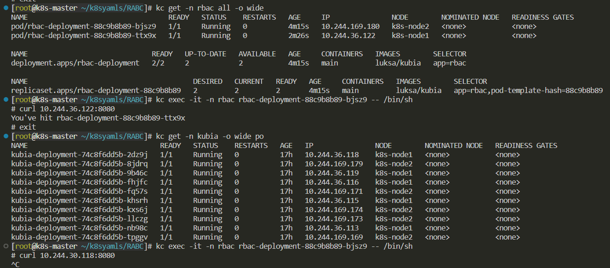
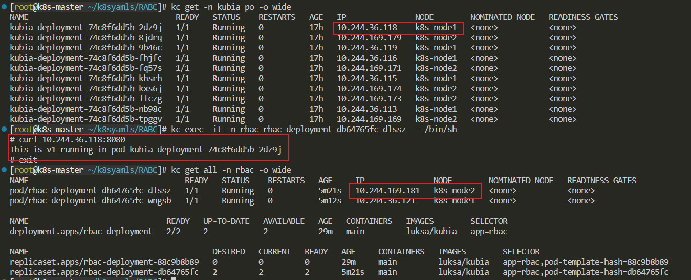

# ServiceAccount
同一个sa可以绑定多个role和clusterrole

创建pod时，如果不指定sa，那么默认会有一个sa，叫做default，即创建ns时，都会创建一个default sa，以及创建该sa所需的secret资源(token,ca.crt,ns)


# 两种权限资源对象

## role
针对某一个命名空间下的资源权限管理，创建时必须指定某个命名空间。

## clusterrole
对全命名空间下的资源权限管理，创建时不需指定某个命名空间，因为默认对所有命名空间有效。

# rolebinding
rb用来将同一命名空间下的role绑定到subject，subject包含：
- serviceaccount
- user
- group

创建sa,role,sb:
```yaml
apiVersion: v1
kind: Namespace
metadata:
  name: rbac
--- 
apiVersion: rbac.authorization.k8s.io/v1
kind: Role
metadata:
  name: rbac-role
  namespace: rbac
rules:
- apiGroups:
  - ""
  resources:
  - pods
  - services
  verbs:
  - get
  - watch
  - list
---
apiVersion: v1
kind: ServiceAccount
metadata:
  namespace: rbac
  name: rbac-sa
--- 
kind: RoleBinding
apiVersion: rbac.authorization.k8s.io/v1
metadata:
  namespace: rbac
  name: rbac-rb
subjects:
- kind: ServiceAccount
  namespace: rbac
  # 用户名称
  name: rbac-sa
roleRef:
  kind: Role
  # 角色名称
  name: rbac-role
  apiGroup: rbac.authorization.k8s.io
---
apiVersion: apps/v1
kind: Deployment
metadata:
  labels:
    app: rbac
  name: rbac-deployment
  namespace: rbac
spec:
  replicas: 2
  selector: 
    matchLabels:
      app: rbac
  template:
    metadata:
      name: rbac-pod
      labels:
        app: rbac
      namespace: rbac
    spec:
      containers:
      - name: main
        image: luksa/kubia
        ports:
        - containerPort: 8080
          protocol: TCP
```

同一ns下的不同pod因为绑定了给予pod get权限的role，所以可以相互访问

# clusterrolebinding

创建clusterrole，clusterrolebinding，同时把sa和cr绑定，此时，pod拥有了全命名空间下的pod get权限

