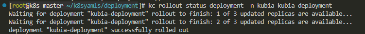
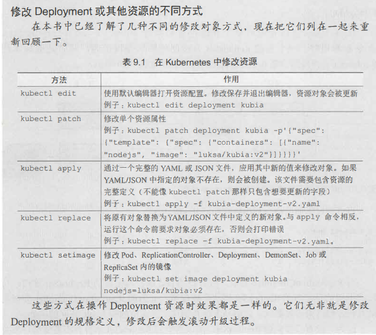
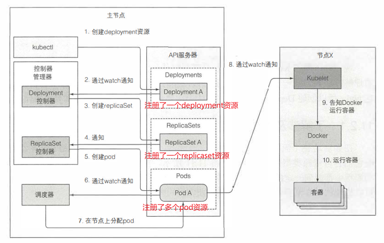

# deployment

## 应用更新策略

### 蓝绿部署

在旧应用都存在的情况下，不改变请求流向，先把所有新版本的应用都上线，再统一删除旧版的应用，然后将服务流向改向新的应用。

### 金丝雀部署

新应用（往往有一个或几个新功能）需要先给小部分用户使用。先发布一部分新引用，并使其接受用户请求，即此时用户请求可流向新应用也可流向就应用。到一定程度后，再滚动更新。

## 创建deployment

创建一个deployment，与rs，rc类似

```yaml
apiVersion: v1
kind: Namespace
metadata:
  name: kubia
---
apiVersion: apps/v1
kind: Deployment
metadata:
  name: kubia-deployment
  namespace: kubia
spec:
  replicas: 3
  selector: 
    matchLabels:
      app: kubia
  template:
    metadata:
      name: kubia
      labels:
        app: kubia
    spec:
      containers:
      - image: luksa/kubia:v1
        name: nodejs
```

使用```kc describe / kc get / kc rollout status```均可查看deployment的状况。



## 更新deployment

更新策略：
1. RollingUpdate：默认策略，滚动更新
2. Recreate：删除上个版本的所有pod后再创建新版本的pod。这种方式与使用RC的更新策略是类似。所以应用在更新过程中会有短暂的不可用。

修改资源对象的方式：



**只有修改了deployment里的pod模板才会使更新触发**。另外如果pod引用了Configmap（以环境变量形式引用或以卷的形式），更新configmap对象是不会触发滚动更新的。但是后一种方式会使引用了configmap的pod自身进行热更新。根本原因是deployment里的pod模板没有更新。

要想通过configmap触发滚动更新，可以通过创建新的configmap，并更新pod模板引用新的configmap

每次更新，deployment会保留一个该版本的rs，方便回滚

### 更新过程

k8s根据deployment的更新，创建新的rs。此时就有两个rs受deployment控制（实际会有更多，每个版本的rs都会存留）。创建新rs后，很重要的一点是其标签选择会发生改变，那么就不会选中之前的pod，实际上是添加了一组标签，并且给之前的pod和rs也添加了一个新标签但值不同，那么这两组pod就由两个rs控制，并且都还有之前共同的标签（比如app=nodejs），那么服务在选择pod时，两组pod都会被选中。

两个rs不断地++replicas --replicas，最终达到新状态。

在控制层面进一步观察更新的过程：

1. kc 向 apiserver 发起注册一个 deployment 资源对象的请求，apiserver 会把资源对象信息写入etcd数据库
2. deployment 控制器会通过 watch 机制监听到新的 deployment 对象产生，然后它会向 apiserver 发送请求注册一个 replicaset 资源对象，apiserver 会把资源对象信息写入etcd数据库
3. 同理 replicaset 控制器会通过 watch 机制监听到新的 replicaset 对象产生，然后它会根据该对象内定义的 pod 数以及现存的符合标签要求的 pod 来决定是否要新注册 pod 对象；若需要注册新的 pod 资源对象，就会向 apiserver 发送请求注册 pod 资源对象，apiserver 会把资源对象信息写入etcd数据库
4. 同理，默认控制器会把监听到新的 pod 资源对象产生（如果上一步注册了新的pod资源对象），则会决定把 pod 调度到哪个节点上，然后通知 apiserver 将 pod 和节点绑定，apiserver随后把该信息写入etcd数据库
5. 对应节点的 kubectl 监听到了 pod 资源的更新，会根据 pod 的定义创建 pod（启动容器）。



## 回滚deployment

```shell
kc rollout undo -n <> deployment <>
```

查看回滚历史：
```shell
kc rollout history deployment <> 
```
创建deployment时使用--record参数会在回滚历史中显示每次更新的历史版本

回滚到指定版本：
```shell
kc rollout undo -n <> deployment <> --to-version=1
```

## maxSurge和maxUnavailable参数

```yaml
spec:
  strategy:
    rollingUpdate:
      maxSurge: 1
      maxUnavailable: 0
    type: RollingUpdate
```
maxSurge：在滚动升级过程中超出期望pod数的最大pod个数，其值为相对于期望pod数的百分数或者是个数

maxUnavailable：在滚动升级过程中允许不可用的最大pod个数，其值为相对于期望pod数的百分数或者是个数

我的建议是别用百分数，就直接用个数就行。

## 暂停滚动更新

```shell
kc set image deployment kubia nodejs=luksakubia:v4
kc rollout pause deployment kubia
kc rollout resume deployment kubia 
```

可能会有运行v4版本容器的pod已被创建，当其可正常运行时，因为服务的标签选择没有改变，所以会有一部分请求流向这个v4版本的pod，但这是被允许的，实际上这就是金丝雀发布，允许一部分用户先体验新版本，随后再恢复滚动更新。

## 优点

相比于手动创建两个rs或两个rc来执行更新，deployment的更新完全由服务端发起（deployment定义好后），而前两者实际上是把kc当作了客户端再给服务器端发请求，一步一步来执行更新，如果出现网络问题，更新过程就中断了，很容易造成应用长时间处于不可控状态。

## 阻止出错版本的滚动更新

### minReadySeconds参数

指定新创建的pod至少要成功运行多久之后 ， 才能将其视为可用。

往往和就绪探针一起使用，这样大大避免了出错的应用被用户访问。

一旦探针检测失败，该pod就一直不会放入服务的endpoint内，那么状态一直没有就绪（即时就绪，因为有minReadySeconds参数限制，所以该pod不会被认定为可运行），所以滚动更新不会执行下去。

