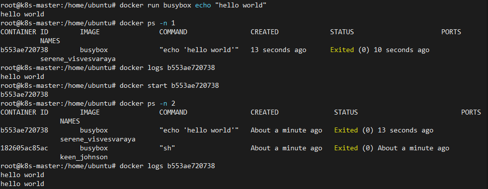
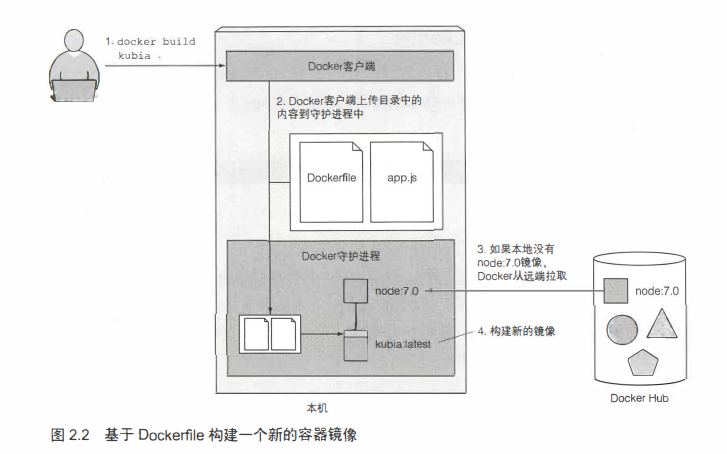
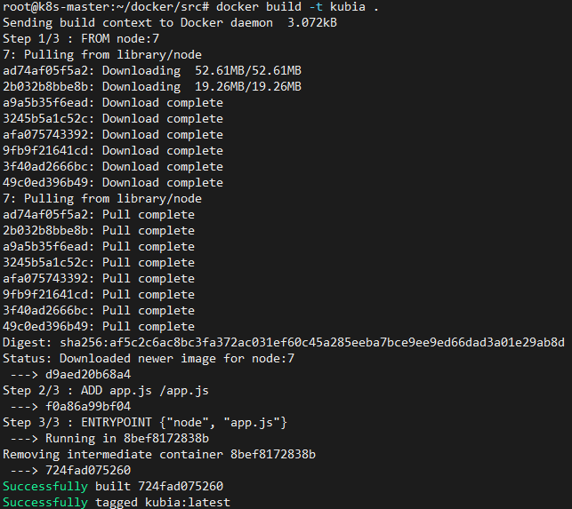
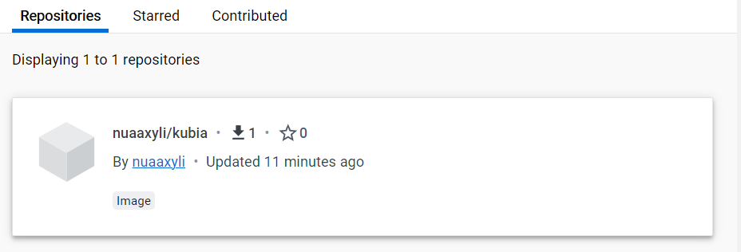
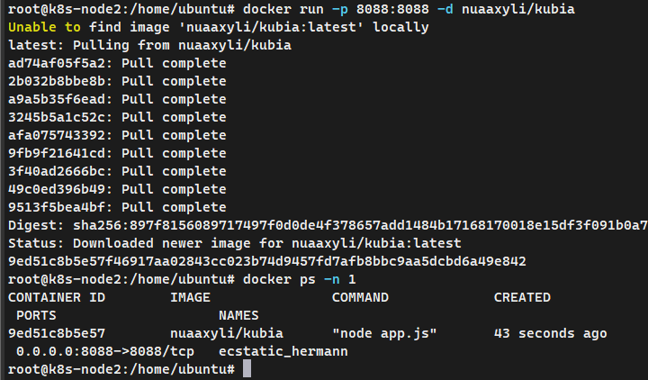

# 容器的创建和启动

## 创建并启动
```shell
docker run <image>:<tag>
```
此时容器状态为up

## 重新启动
停止容器：
```shell
docekr stop <container ID>
```
此时容器状态为exit  
重启一个状态为exit的容器（exit状态有可能是容器自行终止的，也可能是stop的）
```shell
docekr start <container ID>
```
container ID使用这个命令查看：
```shell
docker ps
```


# 停止容器、删除容器

删除镜像前先要停止容器、删除容器
```shell
docker stop <container-name>
docker rm <container-name>
```
然后删除镜像
```shell
docker rmi <image-name>
```

# 手动构建镜像

## 镜像创建

镜像创建需要文件Dockerfile
```shell
FROM node:7
ADD app.js /app.js
ENTRYPOINT ["node", "app.js"]
```
FROM 后跟的是基础镜像  
ADD <src> <dst> :把宿主机上的src文件挂载到镜像的dst目录下  
ENTRYPOINT 后跟在容器启动后，需要运行哪条指令  

这里的app.js文件如下，具体作用是阻塞监听8088端口，当监听到访问时会返回容器的主机号（注意这里不是宿主机号，因为两者都是隔离的）  
```js
const http = require('http');
const os = require('os');
console.log("Kubia server starting ... ");
var handler = function(request, response) {
        console.log("Received request from " + request.connection.remoteAddress);
        response.writeHead(200);
        response.end("You hit " + os.hostname() + " \ n ");
};
var www = http.createServer(handler);
www.listen(8088);
```

创建过程：

创建镜像时，docker客户端会在当前目录下寻找Dockerfile以及运行容器的必要程序（一般是将当前目录下的所有文件上传），并将两者都上传给docker-daemon守护线程，守护线程会根据Dockerfile指令逐层构建镜像。具体过程如图：



镜像由很多层组成，拉取镜像时，按层拉取（每一层pull complete）

多个不同的镜像可能拥有相同的层。所以只要某个镜像的某一层存储在本地，其他镜像都可以共享这一层。

构建镜像时，dockerfile的每一条指令都会创建一个新层。



## 镜像运行

创建一个名为kubia-container的新容器。-d代表容器运行在后台。本机上的8080端口会被映射到容器内的8080端口，等于说本机的8080端口给容器用了。
```shell
docker run --name kubia-container -p 8080:8080 -d kubia
```

可通过http://localhost:8080访问


## 容器内部探查

使用下述命令在容器内部运行命令行：
```shell
docker exec -it kubia-container bash

-d :分离模式: 在后台运行
-i :即使没有附加也保持STDIN 打开
-t :分配一个伪终端
```

发现容器内部运行着```ndoe app.js```命令，pid为1

使用```exit```命令退出容器bash

查看宿主的进程：

发现同样存在一个 node app.js 进程，但进程号与容器内部不同。

查看容器内的文件结构,发现app.js就挂载在容器的根目录下：


以上比较说明容器有独立的**进程系统、文件系统、主机号以及网络接口**等等。

## 推送镜像

镜像中心：
- Docker Hub
- Quay.io
- Google Container Registry

根据docker hub的用户id，给镜像打上标签，此时查看镜像，可以看到两个不同名字的镜像，但是image id相同。
```shell
docker tag kubia xxx/kubia
```


推送之前需要用户登录推送的镜像仓库，默认情况下登录docker hub。


进行推送


查看docker hub中的仓库可以发现推送的镜像



启动另一个服务器，拉取镜像




# Dockerfile

FROM 镜像源

RUN **镜像创建时**需要执行的shell语句

ADD 源文件 需要放入的镜像目录

ENTRYPOINT **容器创建时**需要执行的可执行命令  即 docker run container-name 时，会执行ENTRYPOINT的语句

CMD 传给可执行命令的参数 docker run container-name [args]

