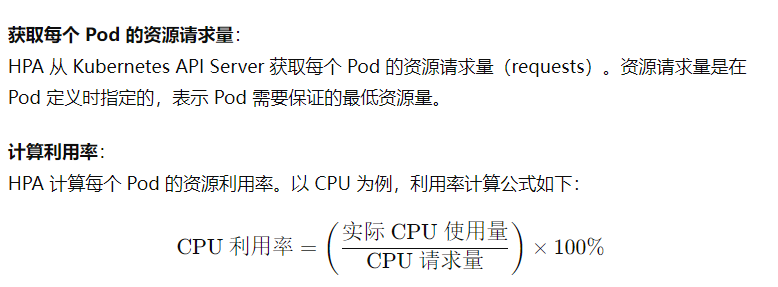
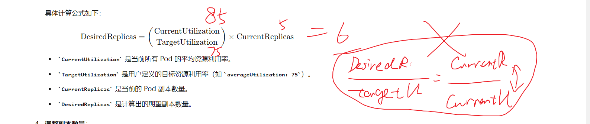

# 水平扩缩容
## 一、资源 request/limit

request是对资源需求的最小值，limit是对资源使用的最大值

当未设置limit时，资源使用无上限

当未设置request时，request==limit

### 超过limit参数
当容器的request大于节点剩余资源，那么该容器不会被启动

当容器运行过程当中资源申请量大于limit时，节点对于不同资源对象的处理不同：
1. cpu使用率：cpu使用率是可以压缩的，即分配给某个进程的cpu时间可以缩短。那么一旦超过limit，cpu可以通过压缩cpu时间来使该容器的cpu使用率下降到limit以下。而不需要将容器杀掉。
2. 内存占用：一旦超过，就会报out of memory，并且杀掉容器。容器根据spec.containers.restartpolicy来决定是否重启以及如何重启。重启时间是倍增。

### 超过节点实际可用总量
当节点的总资源使用量大于100%（同样的，这里的资源指内存占用），节点会按照一定的规则（pod QOS等级）杀掉部分容器。**注意节点只能通过kill pod来kill容器，所有QOS也是针对pod划分的。**

根据**pod QOS**等级来对**单容器pod**进行划分：
- BestEffort 最低优先级：不设置request 和 limit
- Burstable
- Guaranteed 最高优先级：设置request limit，并且request == limit

多容器pod的QOS等级根据每个容器的QOS来划分：
- 每个容器都为同一个等级，那么该pod就为该等级
- 反之，取最高的那个容器等级作为pod等级

有了QOS等级，那么QOS越低的pod就会被kill掉，当有相同的QOS等级时，会kill内存实际使用量占内存申请量比例更高的pod

## 二、hpa流程：
1. hpa根据指定的度量，请求获取metric-server上的该度量信息
2. hpa计算某个微服务的所有pod的metric（cpu、mem、custmon_metric）平均值或总值，比较平均值(总值)和目标值，得出副本数
3. hpa请求apiserver更新扩缩容资源对象的副本数
4. 接下来就交给资源对象的控制器

**使用率（占用率）= 实际使用量/请求量**

## 三、hpa使用实例：
```yaml
apiVersion: autoscaling/v2beta2
kind: HorizontalPodAutoscaler
metadata:
  name: my-hpa
spec:
  scaleTargetRef:
    apiVersion: apps/v1
    kind: Deployment
    name: my-deployment
  minReplicas: 1
  maxReplicas: 10
  metrics:
  - type: Resource
    resource:
      name: cpu
      target:
        type: Utilization
        averageUtilization: 80
  - type: Resource
    resource:
      name: memory
      target:
        type: Utilization
        averageUtilization: 75
  - type: Pods
    pods:
      metric:
        name: custom_metric
      target:
        type: AverageValue
        averageValue: 100m
```
解释配置
- `metrics`: 定义HPA使用的扩缩容指标。
  - `type: Resource`: 基于资源的指标（如 CPU 和内存）。
    - `resource`: 资源指标配置。
      - `name`: 资源名称（如 CPU 或 memory）。
      - `target`: 目标值。
        - `type`: 目标类型（Utilization 或 AverageValue）。
        - `averageUtilization`: 平均利用率（百分比）。
        - `averageValue`: 平均值（具体数值）。
  - `type: Pods`: 基于Pod自定义指标。
    - `pods`: Pod自定义指标配置。
      - `metric`: 指标名称。
      - `target`: 目标值。


scaleTargetRef对象：
1. rs
2. rc
3. deploy
4. statefulset

metric类型：
1. Resource: 使用Pod的资源使用情况（如CPU和内存）作为度量标准。
3. custom metrics:pod型（pod级别的自定义指标），object型（服务级别的自定义指标）
4. External: 使用集群外部的自定义指标

metric target value type:
1. Utilization: 使用资源的利用率，例如CPU或内存的使用百分比。对应averageUtilization字段。**如果服务的所有 Pod 的 metric 平均使用率达到了 averageUtilization ，那么 HPA 可能会认为这个 服务 已经达到负载上限，从而触发扩容操作。**
2. Value: 使用绝对值，例如CPU或内存的具体数量。对应value字段。**如果某个 Pod 的 metric 使用量达到了 value，那么 HPA 可能会认为这个 Pod 已经达到负载上限，从而触发扩容操作。**
3. AverageValue: 使用平均值，例如多个Pod的平均CPU或内存使用量。对应averageValue字段。**如果服务的所有 Pod 的 metric 平均使用量达到了 averageValue ，那么 HPA 可能会认为这个 服务 已经达到负载上限，从而触发扩容操作。**
 
## 四、具体使用实例 
### 1. Resource metric

hpa，扩缩容对象（deployment）以及一个用来发起请求的pod
```yaml
---
apiVersion: v1
kind: Namespace
metadata:
  name: hpa
---
apiVersion: autoscaling/v1 
kind: HorizontalPodAutoscaler
metadata:
  name: kubia-hpa
  namespace: hpa
spec:
  maxReplicas: 5
  minReplicas: 1
  scaleTargetRef:
    apiVersion: apps/v1
    kind: Deployment
    name: kubia-deployment
  targetCPUUtilizationPercentage: 30   # 现在hpa只能使用cpu使用率
---
apiVersion: apps/v1
kind: Deployment
metadata:
  name: kubia-deployment
  namespace: hpa
spec:
  replicas: 3
  selector: 
    matchLabels:
      app: kubia
  template:
    metadata:
      name: kubia
      labels:
        app: kubia
    spec:
      containers:
      - image: luksa/kubia:v1
        name: nodejs
        resources:
          requests:    # 必须要设定
            cpu: 100m
---
apiVersion: v1
kind: Pod
metadata:
  name: loadgenerator
  namespace: hpa
spec:
  containers:
  - image: busybox
    name: main
    command: ["/bin/sleep", "9999999"]
  restartPolicy: Never
```

其中要注意的是，资源使用率=资源实际使用量/资源请求，资源请求即containers.resources.requests资源设置的资源以及值，所以该字段必须设定，否则hpa就无法计算资源使用率。

把deployment作为服务暴露出来，在loadgenerator内部循环访问该服务：
```shell
while true; do wget -O - -q http://10.101.20.169; done
```
观察扩容过程：发现副本数是1-2-4-8倍增，最后的实际平均值为44%，已经较为接近30%，要想达到30需要扩大最大副本数。


Kubernetes的Metric资源类型主要分为三类：Resource Metrics、Custom Metrics和External Metrics。这些不同的资源类型允许用户基于不同的监控数据来进行自动化扩缩容操作。

### 2. Custom Metrics
Custom Metrics允许用户定义和使用自定义的业务指标来进行扩缩容。这些指标通常由Prometheus等监控系统提供，用户可以定义任何他们关心的指标，例如请求数、延迟时间等。

#### 例子
- 每秒请求数（QPS）
- 应用程序响应时间

#### 示例
```yaml
apiVersion: autoscaling/v2beta2
kind: HorizontalPodAutoscaler
metadata:
  name: my-app-hpa
spec:
  scaleTargetRef:
    apiVersion: apps/v1
    kind: Deployment
    name: my-app
  minReplicas: 1
  maxReplicas: 10
  metrics:
  - type: Pods
    pods:
      metric:
        name: requests_per_second
      target:
        type: AverageValue
        averageValue: 100
```

### 3. External Metrics
External Metrics允许用户基于外部服务的指标来进行扩缩容。这些指标可以是任何Kubernetes集群外部的服务，例如云服务的队列长度、外部API的响应时间等。

#### 例子
- 外部消息队列的长度
- 外部API的请求速率

#### 示例
```yaml
apiVersion: autoscaling/v2beta2
kind: HorizontalPodAutoscaler
metadata:
  name: external-metric-hpa
spec:
  scaleTargetRef:
    apiVersion: apps/v1
    kind: Deployment
    name: my-app
  minReplicas: 1
  maxReplicas: 10
  metrics:
  - type: External
    external:
      metric:
        name: queue_length
        selector:
          matchLabels:
            queue: my-queue
      target:
        type: AverageValue
        averageValue: 30
```


## 五、修改HPA运行时间间隔

Kubernetes的HPA（Horizontal Pod Autoscaler）资源运行的间隔默认是每30秒进行一次评估和扩缩容决策。不过，这个间隔是可配置的，你可以通过修改HPA控制器的配置来改变这个默认值。

### 配置HPA评估间隔

要更改HPA的评估间隔，你需要修改`kube-controller-manager`中的相关参数。这可以通过修改控制器管理器的启动参数来实现。

#### 修改`kube-controller-manager`参数

你可以在`kube-controller-manager`的启动命令中添加以下参数来调整HPA的评估间隔：

- `--horizontal-pod-autoscaler-sync-period`：用于设置HPA评估和同步的时间间隔。

例如，将HPA的评估间隔设置为15秒：

```sh
--horizontal-pod-autoscaler-sync-period=15s
```

### 示例：通过修改控制器管理器清单文件来配置

如果你的Kubernetes集群使用的是静态Pod或通过配置文件管理控制器管理器，可以找到控制器管理器的配置文件（例如在`/etc/kubernetes/manifests/kube-controller-manager.yaml`），并添加或修改相应的参数：

```yaml
apiVersion: v1
kind: Pod
metadata:
  name: kube-controller-manager
  namespace: kube-system
spec:
  containers:
  - name: kube-controller-manager
    image: k8s.gcr.io/kube-controller-manager:v1.20.0
    command:
    - kube-controller-manager
    - --horizontal-pod-autoscaler-sync-period=15s
    # 其他参数...
```

修改完成后，保存文件并重启`kube-controller-manager`。

### 通过ConfigMap配置

在某些高级配置场景中，可能会使用ConfigMap来管理这些参数。确保你的集群支持并使用这种配置方式。

## HPA扩缩容原理

Horizontal Pod Autoscaler (HPA) 是 Kubernetes 中的一种机制，用于根据资源的使用情况（如 CPU 和内存）自动调整 Pod 的副本数量。HPA 通过以下步骤来计算并得出扩缩容的决定：

以type: Utilization averageUtilization: 75 来举例如何运行HPA

1. **采集指标数据**：
   HPA 定期从 Metrics Server 或自定义的 metrics 源采集指标数据。对于 CPU 和内存使用情况，HPA 会收集每个 Pod 的 CPU 和内存使用量。

2. **计算当前利用率**：
   HPA 计算所有目标 Pods 的当前资源利用率。例如，如果目标是 CPU 利用率，HPA 会计算每个 Pod 的 CPU 使用量，并将其与 Pod 分配的 CPU 资源量（requests 或 limits）进行比较，得出利用率。
   

3. **计算期望的副本数量**：
   HPA 根据定义的目标利用率（如 `averageUtilization`）计算期望的副本数量。假设目标是所有 Pods 的平均 CPU 利用率应为 75%，HPA 会根据当前的利用率计算需要多少个 Pod 才能达到这个目标。
   
   具体计算公式如下：
   
   \[
   \text{DesiredReplicas} = \left( \frac{\text{CurrentUtilization}}{\text{TargetUtilization}} \right) \times \text{CurrentReplicas}
   \]

   - `CurrentUtilization` 是当前所有 Pod 的平均资源利用率。
   - `TargetUtilization` 是用户定义的目标资源利用率（如 `averageUtilization: 75`）。
   - `CurrentReplicas` 是当前的 Pod 副本数量。
   - `DesiredReplicas` 是计算出的期望副本数量。
  
   

   注意，越是当前资源利用率大，就越要扩容，所以手写的等式应该把currentReplicas和currentUtilization位置对调

4. **调整副本数量**：
   根据计算出的 `DesiredReplicas`，HPA 会决定是扩容还是缩容。如果 `DesiredReplicas` 大于 `CurrentReplicas`，则扩容；如果 `DesiredReplicas` 小于 `CurrentReplicas`，则缩容。HPA 会更新目标 Deployment 或 ReplicaSet 的副本数量，以匹配 `DesiredReplicas`。

