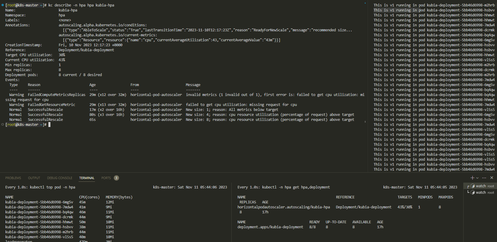

# 水平扩缩容
## 资源 request/limit

request是对资源需求的最小值，limit是对资源使用的最大值

当未设置limit时，资源使用无上限

当未设置request时，request==limit

## 资源的超卖
### 超过limit参数
当容器的request大于节点剩余资源，那么该容器不会被启动

当容器运行过程当中资源申请量大于limit时，节点对于不同资源对象的处理不同：
1. cpu使用率：cpu使用率是可以压缩的，即分配给某个进程的cpu时间可以缩短。那么一旦超过limit，cpu可以通过压缩cpu时间来使该容器的cpu使用率下降到limit以下。而不需要将容器杀掉。
2. 内存占用：一旦超过，就会报out of memory，并且杀掉容器。容器根据spec.containers.restartpolicy来决定是否重启以及如何重启。重启时间是倍增。

### 超过节点实际可用总量
当节点的总资源使用量大于100%（同样的，这里的资源指内存占用），节点会按照一定的规则（pod QOS等级）杀掉部分容器。**注意节点只能通过kill pod来kill容器，所有QOS也是针对pod划分的。**

根据**pod QOS**等级来对**单容器pod**进行划分：
- BestEffort 最低优先级：不设置request 和 limit
- Burstable
- Guaranteed 最高优先级：设置request limit，并且request == limit

多容器pod的QOS等级根据每个容器的QOS来划分：
- 每个容器都为同一个等级，那么该pod就为该等级
- 反之，取最高的那个容器等级作为pod等级

有了QOS等级，那么QOS越低的pod就会被kill掉，当有相同的QOS等级时，会kill内存实际使用量占内存申请量比例更高的pod

## limitRange对象


## hpa水平扩缩容流程：
1. hpa根据指定的度量，请求获取metric-server上的该度量信息
2. hpa计算所有pod度量（cpu使用率、内存占用率）平均值，比较平均值和目标值，得出副本数
3. hpa请求apiserver更新扩缩容资源对象的副本数
4. 接下来就交给资源对象的控制器

**使用率（占用率）= 实际使用量/请求量**

可扩缩容的资源对象：
1. rs
2. rc
3. deploy
4. statefulset

度量类型：
1. 资源的目标使用率
2. 资源的目标使用量
3. custom metrics:pod型，object型

## 基于cpu使用率的hpa声明

hpa，扩缩容对象（deployment）以及一个用来发起请求的pod
```yaml
---
apiVersion: v1
kind: Namespace
metadata:
  name: hpa
---
apiVersion: autoscaling/v1 
kind: HorizontalPodAutoscaler
metadata:
  name: kubia-hpa
  namespace: hpa
spec:
  maxReplicas: 5
  minReplicas: 1
  scaleTargetRef:
    apiVersion: apps/v1
    kind: Deployment
    name: kubia-deployment
  targetCPUUtilizationPercentage: 30   # 现在hpa只能使用cpu使用率
---
apiVersion: apps/v1
kind: Deployment
metadata:
  name: kubia-deployment
  namespace: hpa
spec:
  replicas: 3
  selector: 
    matchLabels:
      app: kubia
  template:
    metadata:
      name: kubia
      labels:
        app: kubia
    spec:
      containers:
      - image: luksa/kubia:v1
        name: nodejs
        resources:
          requests:    # 必须要设定
            cpu: 100m
---
apiVersion: v1
kind: Pod
metadata:
  name: loadgenerator
  namespace: hpa
spec:
  containers:
  - image: busybox
    name: main
    command: ["/bin/sleep", "9999999"]
  restartPolicy: Never
```

其中要注意的是，资源使用率=资源实际使用量/资源请求，资源请求即containers.resources.requests资源设置的资源以及值，所以该字段必须设定，否则hpa就无法计算资源使用率。

把deployment作为服务暴露出来，在loadgenerator内部循环访问该服务：
```shell
while true; do wget -O - -q http://10.101.20.169; done
```
观察扩容过程：发现副本数是1-2-4-8倍增，最后的实际平均值为44%，已经较为接近30%，要想达到30需要扩大最大副本数。



扩容3分钟触发一次，缩容5分钟触发一次

## 自定义度量

