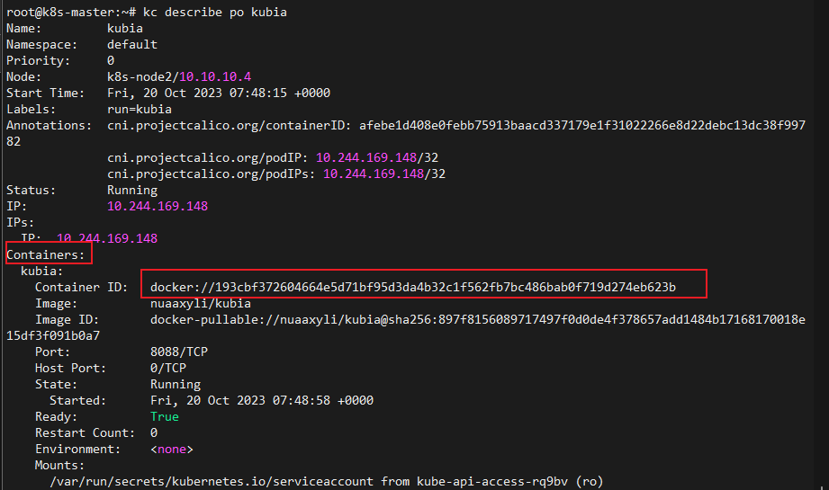

# pod 

运行容器的过程以及主节点内部的流程：


主节点内部的流程如下：
1) 用户通过 kubectl 或其他 API 客户端提交 Pod Spec 给 API Server。

2) API Server 尝试着将 Pod 对象的相关信息存入 etcd 中，待写入操作执行完成，API Server 即会返回确认信息至客户端。

3) API Server 开发反映 etcd 中的状态变化。

4) 所有的 Kubernetes 组件均使用 “watch” 机制来跟踪检查 API Server 上的相关的变动。

5) kube-scheduler（调度器）通过其 “watcher” 觉察到 API Server 创建了新的 Pod 对象但尚未绑定至任何工作节点。

6) kube-scheduler 为 Pod 对象挑选一个工作节点并将结果信息更新至 API Server。

7) 调度结果信息由 API Server 更新至 etcd 存储系统，而且 API Server 也开始反映此 Pod 的调度结果。

8) Pod 被调度到目标工作节点上的 kubelet 尝试在当前节点上调用 Docker 启动容器，并将容器的结果状态回送值 API Server。

9) API Server 将 Pod 状态信息存入 etcd 系统中。

10) 在 etcd 确认写入操作完成后，API Server 将确认信息发送至相关的 kubelet，事件将通过它被接受。


## pod内容器的隔离与共享

同一个pod内部共享网络、uts命名空间以及IPC命名空间

默认不共享PID和文件系统

## 查看pod的yaml文件
包含元数据、配置信息、状态信息三块内容


## 查看pod中应用（容器）的日志

### 使用docker查看容器日志（容器在哪个节点就得在哪找）

首先定位该应用所在的pod在哪个node  
```shell
kubectl get pods -o wide
```


再通过查看pod详细信息(每个pod都有一个容器列表)，获取容器id
```shell
kubectl describe po <pod name>
```


知道了在哪个node运行，知道了container id，就可以去对应节点查找docker 容器的日志了


### 使用kubectl logs查看（在主节点上查看）
当pod中只有一个容器时，即可直接查看pod的日志
```shell
kubectl logs <pod name>
```

同样也可以指定容器

```shell
kubectl logs <pod name> -c <container id>
```

当pod被删除后，一般情况下集群也会删除其日志

## 外部绕过服务连接pod

通过端口转发的方式。本质上是将宿主机的某个端口映射到pod的某个端口，那么外部访问宿主机的这个端口，也就可以访问pod的某个端口


端口转发的误区，不是pod所有的端口都能通过这种形式进行连接，而是pod内部需要有进程在监听这个端口才行（实质是容器内的进程在监听），若没有进程在监听，也就没有容器应用会响应这个请求。pod创建时（一般一个pod运行一个应用）就会指定pod会监听的端口（这个端口是pod的端口，pod内部所有容器共享网络接口）。

端口转发是一个不暴露服务就可以测试应用的方法

## 标签

标签附加在资源上

存在于资源yaml文件的metadata.labels中，以键值对形式存在。可以针对标签对资源进行分类管理。

以pod资源kubia为例：

添加标签creation_method=manual：

```shell
kubectl label po kubia creation_method=manual
```

修改标签env=prod 为env=debug:
```shell
kubectl label po kubia-v2 env=debug --overwrite
```

查看pod并附带所有标签信息：
```shell
kubectl get po --show-label
```

查看pod并附带指定标签信息：
```shell
kubectl get po -L creation_method,env
```

## 标签选择器：对资源进行分类管理

标签选择器根据资源的以下条件来选择资源：
- 包含（或不包含）使用特定键的标签
- 包含具有特定键和值的标签
- 包含具有特定键的标签， 但其值与我们指定的不同

使用kubectl get pods的-l参数即可对标签进行选择,-l后跟的表达式可以是以下几种的组合（多种选择标准）：
- labelname
- labelname=labelval
- labelname!=labelval
- labelname in (labelval1, labelval2)
- labelname notin (labelval1, labelval2)


kubectl get pods -L 与 -l的区别：


## 通过 nodeSelector 来调度 pod 到 node

```yaml
pod.spec.nodeSelector:
    labelname:labelval
```
其中该字段下的label对是node节点的标签

## 注解
对资源对象的一些描述
```yaml
pod.metadata.annotate:
    key:val
```

添加与修改注解的方式与标签一致：
```shell
kubectl annotate po podname key=val
```

## 命名空间

命名空间提供逻辑上的隔离

不一定提供很严格的隔离，包括网络接口。某个节点上的命名空间1上的pod1可以在已知该节点上命名空间2上的pod2的IP情况下，给pod2转发流量。

## 存活探针

为pod内的各个容器指定探针

- http GET探针：探查pod的端口和路径，如果探测器收到响应，并且响应状态码不代表错误（换句话说，如果HTTP
响应状态码是2xx或3xx), 则认为探测成功。如果服务器返回错误响应状态
码或者根本没有响应，那么探测就被认为是失败的，容器将被重新启动。
- TCP套接字探针：尝试与容器指定端口建立TCP连接。如果连接成功建立，则
探测成功。否则，容器重新启动。
- Exec 探针：在容器内执行任意命令，并检查命令的退出状态码。如果状态码
是 o, 则探测成功。所有其他状态码都被认为失败。

检测pod是否正在运行，

```yaml
apiVersion: v1
kind: Pod
metadata:
    name: kubia-liveness
spec:
    containers:
    - image: luksa/kubia-unhealthy
      name: kubia
      livenessProbe:
        httpGet:
          path: /
          port: 8089
    - image: luksa/kubia
      name: kubia2
      livenessProbe:
        httpGet:
          path: /
          port: 8090
```
检测到容器失败，则会重启容器


## 就绪探针

若是一个匹配服务中的selector的pod被创建，不管是否已准备就绪，其都会被加入服务的endpoint中。而一旦加入了endpoint，服务就会把请求重定向到endpoint中的任意一个pod中，这就会产生问题。

就绪探针检查机制与存活探针一样，但是如果检测失败，会将某个pod直接从服务的endpoint中移去，说明其还未就绪，无法接受请求。当这个容器准备就绪后，就会把该pod重新加入到endpoint中。**这是存活探针和就绪探针的重要区别**

注意：
- 就绪探针非常必要，生产实践中必须定义
- 不能将停止pod的逻辑纳入就绪探针中

### 实践过程

创建rs，使用exec型探针，将在容器内运行ls，查看是否有/var/ready文件
```yaml
apiVersion: apps/v1
kind: ReplicaSet
metadata:
   name: kubia
   namespace: testready
spec:
   replicas: 3
   selector:
     matchExpressions:
       - key: app
         operator: In
         values:
           - kubia
   template:
     metadata:
       labels:
           app: kubia
     spec:
       containers:
       - name: kubia
         image: luksa/kubia
         readinessProbe:
           exec:     
             command:
             - ls
             - /var/ready
```

创建nodeport
```yaml
apiVersion: v1
kind: Service
metadata:
   name: kubia-nodeport
   namespace: testready
spec:
   type: NodePort
   ports:
   - port: 80
     targetPort: 8080
     nodePort: 30125
   selector:
      app: kubia
```

创建完毕后查看pod情况，因为容器内无/var/ready文件，所以READY都为0/1：


在某个容器内创建该文件：


最后通过访问查看流量去向：


# pod 元数据如何暴露给应用

## 通过环境变量将metadata暴露给应用

使用containers.env暴露
```yaml
apiVersion: v1
kind: Pod
metadata:
  name: downward
spec:
  containers:
  - name: main
    image: busybox
    command: ["sleep", "9999999"]
    resources:
      requests:
        cpu: 15m
        memory: 100Ki
      limits:
        cpu: 100m
        memory: 4Mi
    env:
    - name: POD_NAME
      valueFrom:
        fieldRef:
          fieldPath: metadata.name
    - name: POD_NAMESPACE
      valueFrom:
        fieldRef:
          fieldPath: metadata.namespace
    - name: POD_IP
      valueFrom:
        fieldRef:
          fieldPath: status.podIP
    - name: NODE_NAME
      valueFrom:
        fieldRef:
          fieldPath: spec.nodeName
    - name: SERVICE_ACCOUNT
      valueFrom:
        fieldRef:
          fieldPath: spec.serviceAccountName
    - name: CONTAINER_CPU_REQUEST_MILLICORES
      valueFrom:
        resourceFieldRef:
          resource: requests.cpu
          divisor: 1m
    - name: CONTAINER_MEMORY_LIMIT_KIBIBYTES
      valueFrom:
        resourceFieldRef:
          resource: limits.memory
          divisor: 1Ki
```

## 通过downwardAPI卷来传递元数据
downwardAPI会在pod.manifest容器中搜寻pod的元数据

定义了 一个叫作 downward 的卷， 并且通过 /etc/downward 目录挂载到我们的容器中。 卷所包含的文件会通过卷定义中的 downwardAPI.iterns 属性来定义（每个items.name都是一个卷目录下的一个文件）

```yaml
apiVersion: v1
kind: Pod
metadata:
  name: downward
  labels:
    foo: bar
  annotations:
    key1: value1
    key2: |
      multi
      line
      value
spec:
  containers:
  - name: main
    image: busybox
    command: ["sleep", "9999999"]
    resources:
      requests:
        cpu: 15m
        memory: 100Ki
      limits:
        cpu: 100m
        memory: 4Mi
    volumeMounts:
    - name: downward
      mountPath: /etc/downward
  volumes:
  - name: downward
    downwardAPI:
      items:
      - path: "podName"
        fieldRef:
          fieldPath: metadata.name
      - path: "podNamespace"
        fieldRef:
          fieldPath: metadata.namespace
      - path: "labels"
        fieldRef:
          fieldPath: metadata.labels
      - path: "annotations"
        fieldRef:
          fieldPath: metadata.annotations 
      - path: "containerCpuRequestMilliCores"
        resourceFieldRef:   
          containerName: main     //暴露容器级的元数据，需要填入容器名
          resource: requests.cpu 
          divisor: 1m
      - path: "containerMemoryLimitBytes"
        resourceFieldRef:
          containerName: main     //暴露容器级的元数据
          resource: limits.memory
          divisor: 1 
```

注意当暴露容器级的元数据时，可以做到容器A挂载指定容器B元数据的卷，所以可以做到同pod内不同容器之间传递元数据


# pod 的实质

## 同一个pod内部：
1. 不同的容器共享Linux命名空间
2. 不同的容器共享卷
3. 不同的容器共享IP+port
4. 不同的容器有不同的文件系统
5. 不同的容器有不同的进程命名空间

每个pod内部都有一个pause容器。用来存放所有命名空间以及所有容器的IP地址。

## pod 之间的通信

**相同节点之间**：

每个pod都有一个虚拟网络接口，然后这个接口是在节点的IP网段上分出来的，然后各pod之间可以进行通信


**不同节点之间**：

类似的每个节点都有一个虚拟网络接口，在集群的网段上


### Container Network Interface (CNI)

启动kubelet时，添加--network-plugin=cni参数可以使用cni

一般是创建一个daemonset，在每个节点上运行一个cni插件（pod）

## 客户端pod与服务之间的通信 

请求的流向：

