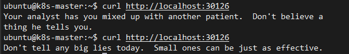
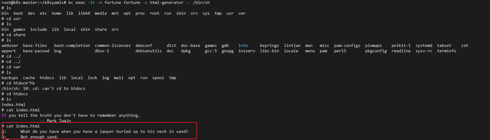
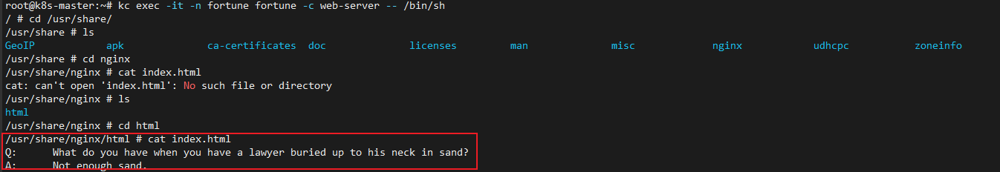

# volume

## 基础概念

卷是pod的组成部分，同一个pod内的容器可以共享卷，即可将某个卷同时挂载在多个容器的文件系统里

**挂载卷会使挂载目录下的源文件对应用程序不可见**，所以挂载目录的选择很重要。

## 卷的类别

1. emptyDir
2. gitRepo
3. hostPath
4. nfs
5. configMap
6. secret
7. downwardAPI

## emptyDir卷 使用

1. 使用一个pod创建一个简单的http响应服务，分成两部分组成（两个容器）：一个nginx-web-server（容器web-server）和一个处理请求的脚本fortuneloop.sh（容器html-generator）

2. 脚本每10s调用一次fortune可执行文件并把输出写入/var/htdocs/index.html文件

3. nginx总是会将/usr/share/nginx/html目录下的html文件返回给客户端

4. 在pod内创建卷，命名为html。将卷同时挂载在html-generator的/var/htdocs目录以及web-server的/usr/share/nginx/html目录下，此时两个容器就可以通过卷进行交流了。web-server会返回由html-generator生成的index.html文件

5. 暴露服务

pod创建：
```yaml
apiVersion: v1
kind: Pod
metadata:
   name: fortune
   namespace: fortune
   labels:
      app: fortune
spec:
   containers:
   - image: luksa/fortune
     name: html-generator
     volumeMounts:
     - name: html
       mountPath: /var/htdocs
   - image: nginx:alpine
     name: web-server
     volumeMounts:
     - name: html
       mountPath: /usr/share/nginx/html
       readOnly: true
     ports:
     - containerPort: 80
       protocol: TCP
   volumes:
   - name: html
     emptyDir: {}
```

服务创建：
```yaml
apiVersion: v1
kind: Service
metadata:
   name: fortune
   namespace: fortune
spec:
   type: NodePort
   ports:
   - port: 80
     targetPort: 8080
     nodePort: 30126
   selector:
     app: fortune
```

访问服务：


返回值总是在变化，说明index.html不断在变化

如果返回值一直是nginx默认返回的nginx successfully页面，说明文件共享失败。查看是否挂载位置出错。

**同一时刻**进入容器查看各自的目录下的index.html



因为整个卷挂载会使应用程序无法访问挂载目录下其他文件，所以有subPath属性可以使卷中的某个文件挂载到挂载目录下的某个指定文件。subPath属性为需要挂载的卷中的某个配置文件，mountPath为对应的挂载路径（文件名）

```yaml
spec:
  containers:
  - image: some/iamge
    volumeMounts:
    - name: myvolume
      mountPath: /etc/someconfig.conf
      subPath: myconfig.conf  
      defaultMode: "6600"  // -rw-rw-------
```

挂载时还可以指定挂载文件的rwx权限，用defaultMode属性
## gitRepo