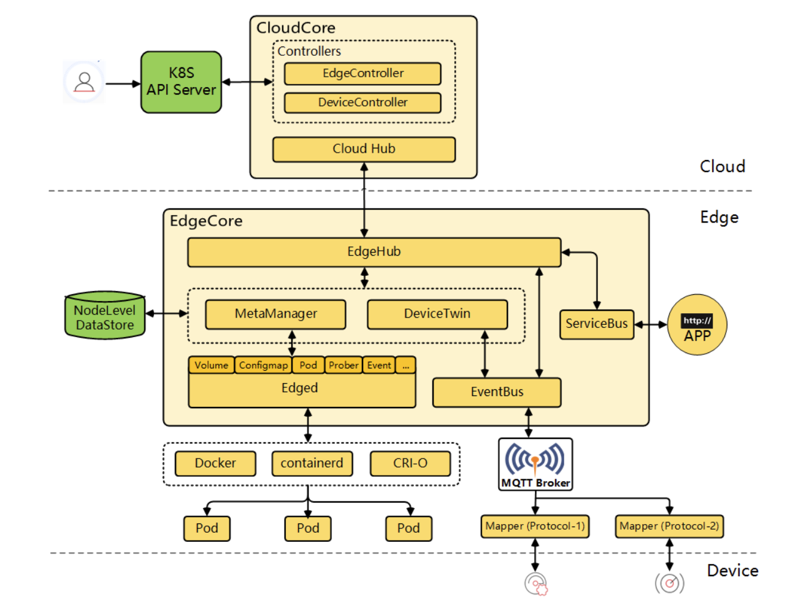
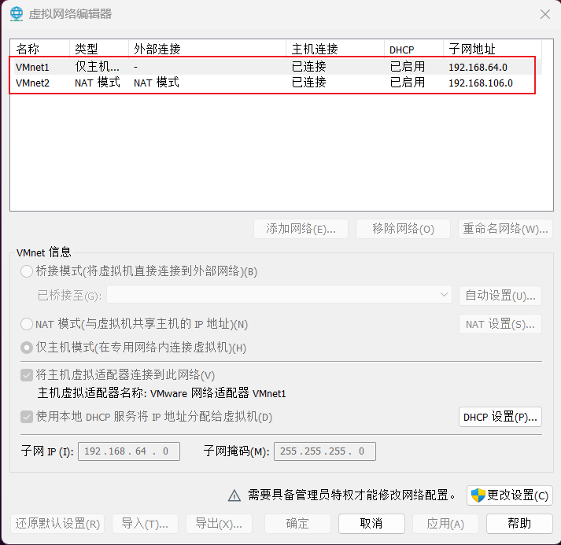
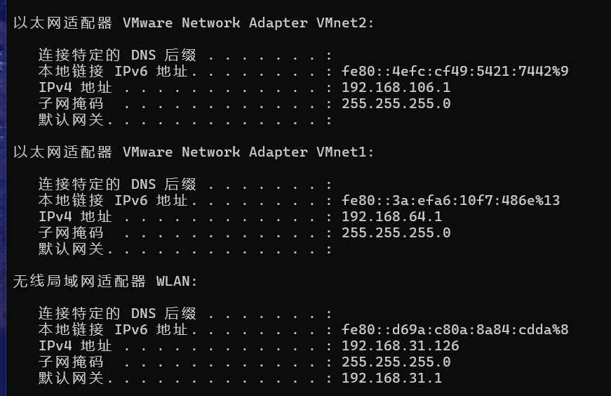
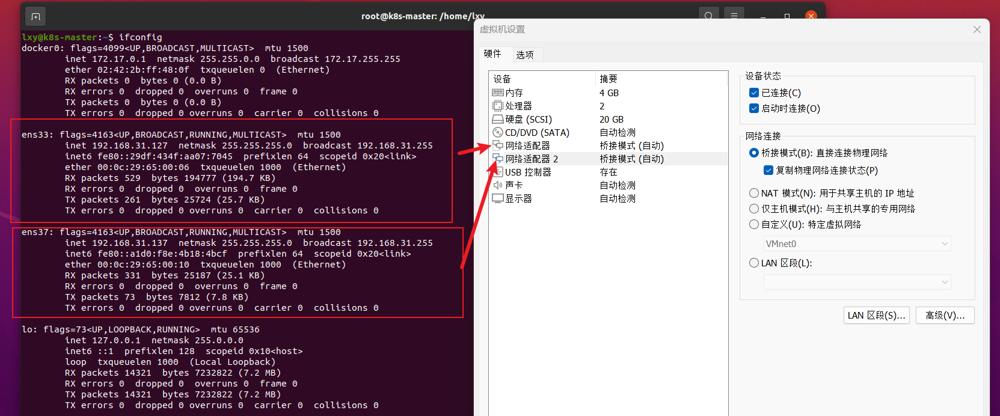
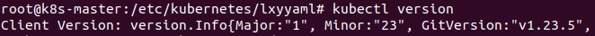
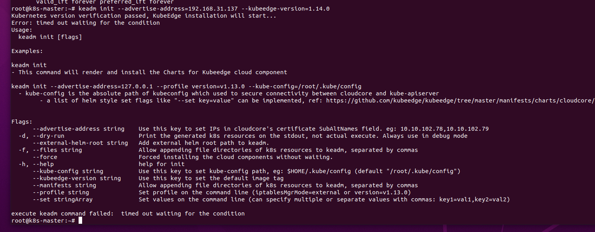
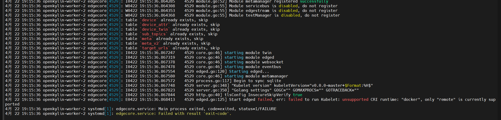
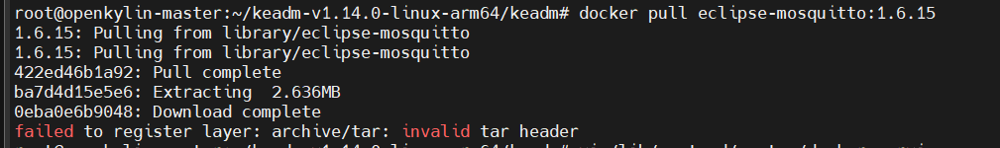
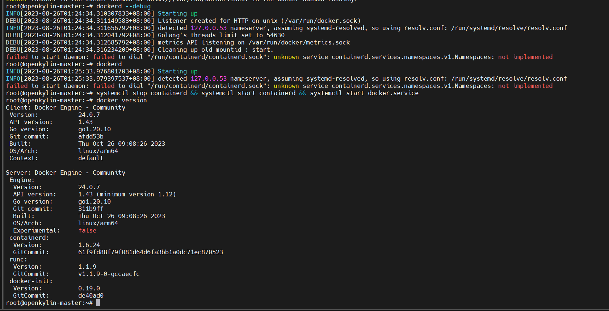
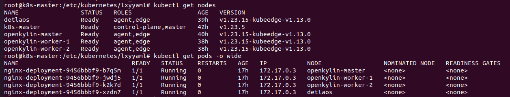

# 通过k8s+kubeedge搭建云边协同系统

## kubeedge介绍
kubeedge不是一个独立的平台，可以理解为k8s的边端实现，架构如图：


kubeedge各组件作用：
1. edged: 在边缘节点上运行并管理容器化应用程序的代理。
2. edgehub: Web 套接字客户端，负责与 Cloud Service 进行交互以进行边缘计算。这包括将云侧资源更新同步到边缘，并将边缘侧主机和设备状态变更报告给云。
3. cloudhub: Web 套接字服务器，负责在云端缓存信息、监视变更，并向 EdgeHub 端发送消息
4. edgecontroller: kubernetes 的扩展控制器，用于管理边缘节点和 pod 的元数据，以便可以将数据定位到对应的边缘节点。
5. eventbus: 一个与 MQTT 服务器（mosquitto）进行交互的 MQTT 客户端，为其他组件提供发布和订阅功能
6. devicetwin: 负责存储设备状态并将设备状态同步到云端。它还为应用程序提供查询接口
7. MetaManager: Edged 端和 Edgehub 端之间的消息处理器。它还负责将元数据存储到轻量级数据库（SQLite）或从轻量级数据库（SQLite）检索元数据。

## 场景
场景描述：云端搭建k8s集群(只需要一个master节点)+kubeedge(cloudcore)，边缘搭建kubeedge(edgecore)，实现云端下发pod，边端接受并创建pod执行。

云端设备：虚拟机ubuntu20.04

边端设备：RK3000开发板 4块

## 网络配置

虚拟机和开发板位于同一个局域网段，可以用网线把虚拟机(电脑)和开发板都接到一个集线器上，集线器再连路由器

**坑！！！**: 因为VM在创建虚拟机时，默认虚拟机共用本机网络的模式是如下两个：


而实际本机的网络状况如下：


可以看到虚拟机上被分配的子网网段有两个，第一个类型不太清楚，第二个类型通过NAT协议获取的IP地址，NAT协议是用于IP地址转换的协议，为了将一个公网IP映射成多个私网IP，那么多个私网IP就可以访问公网

简单讲，**这里分配到的192.168.106.0网段，是一大堆由192.168.31.0这个公网IP映射出来的，内网（虚拟机）可以ping通公网，但是公网无法ping通内网，也就是说如果使用该模式下的IP作为K8S的组件IP，那么位于边缘的设备就无法访问虚拟机了。**

而桥接模式类似
所以要给虚拟机增加一个网卡（使用桥接模式），并且去掉用NAT协议获取的网卡，使用[这个博客介绍的](https://blog.csdn.net/weixin_43379478/article/details/86099111)方法

这样就可以把集群建在**192.168.31.0**这个网段上

索性把两个网卡都改为桥接模式了，改完之后：


## 1. 部署cloudcore
前置：
- docker 
- k8s 
版本对应的话可能需要自己试一下，这里装的是：



推荐用[这个教程](https://blog.csdn.net/weixin_44559544/article/details/123381441)装k8s

### 1.1 通过keadm安装kubeedge(cloudcore)
下载keadm，注意对应k8s版本和边端架构，这里用的是1.13.0版本和arm64架构

使用```uname -a```查看本机架构，一共两种架构：arm64(aarch64) 或 amd64(x86_64)

每个边缘端不需要有相同的架构，kubeedge支持异构边缘

k8s和keadm版本对应去[官方仓库](https://github.com/kubeedge/kubeedge)看


```shell
wget https://github.com/kubeedge/kubeedge/releases/download/v1.13.0/keadm-v1.13.0-linux-arm64.tar.gz 
```

下载完解压并添加环境变量：
```shell
tar -zxvf keadm-v1.13.0-linux-arm64.tar.gz # 解压keadm的tar.gz的包
cd keadm-v1.13.0-linux-arm64/keadm/
cp keadm /usr/bin/ #将其配置进入环境变量，方便使用
```

然后初始化cloudcore：

```shell
keadm init --advertise-address=192.168.31.137 --kubeedge-version=1.13.0
```

advertise-address需要和K8S暴露的地址一样（直接用的虚拟机ens37网卡的ip）

### 1.2 遇到的问题总结：

1. ```keadm init```报错```execute keadm command failed: timed out waiting for the condition```，因为cloudcore以deployment形式部署在k8s-master上，但是deployment的template里没有添加k8s-master污点容忍，允许该deployment在k8s-master部署。具体解决办法参考[这个博客](https://blog.csdn.net/weixin_45566487/article/details/127184033)
   
2. 每次```keadm init```失败都要进行```keadm reset```，使用下面这个脚本能够彻底重置：
    ```shell
    keadm reset --remote-runtime-endpoint=unix:///var/run/cri-dockerd.sock --kube-config=$HOME/.kube/config
    ```
3. 这个[博客里](https://blog.csdn.net/weixin_38159695/article/details/118486461)有一些其他报错的处理，教你怎么用二进制的方式安装cloudcore
   
## 2. 部署edgecore

主节点运行```keadm gettoken```获得加入集群的token

和安装cloudcore相同的步骤：
```shell
wget https://github.com/kubeedge/kubeedge/releases/download/v1.13.0/keadm-v1.13.0-linux-arm64.tar.gz 
tar -zxvf keadm-v1.13.0-linux-arm64.tar.gz 
cd keadm-v1.13.0-linux-arm64/keadm
./keadm join --cloudcore-ipport=192.168.31.137:10000 --edgenode-name=node1 --kubeedge-version=1.13.0 --token=<获得token> --runtimetype=docker --cgroupdriver=systemd
```


### 2.2 遇到的问题总结
查看日志是必须要会的:
```shell
    journalctl -u edgecore.service -xe
    journalctl -u docker.service -xe
    journalctl -u kubelet.service -xe

    # keadm 的 简易bug定位工具
    keadm debug 
    keadm debug check all
```
1. kubeedge>=1.14.0版本的cni不支持docker，改用1.13.0版本，并在```kedam join```时添加参数```--runtimetype=docker```
   
2. 会遇到kubeedge的cgroupfs和docker的cgroupfs不匹配的问题，可以通过编辑```/etc/docker/daemon.json```文件添加下述内容，也可以直接添加参数```--cgroupdriver=systemd```，使用前者时记得```systemctl daemon-load && systemctl restart docker```，一般修改了有关service xxx的配置文件时，都要使用```systemctl daemon-load && systemctl restart xxx```
    ```shell
    {
        "exec-opts": ["native.cgroupdriver=systemd"]
    }
    ```
3. 系统时间错误，证书过期问题```Docker报错：x509: certificate has expired or is not yet valid```，使用```ntpdate cn.pool.ntp.org```重置系统时间，如果还不行检查一下是不是token输错了
4. 重置edgecore时，执行下述脚本，否则会出现各种问题。
    ```shell
        # k8s主节点
        kubectl delete node <node-name>
        
        # 边缘节点
        systemctl stop edgecore
        rm -rf /etc/kubeedge
        docker stop $(docker ps -a -q)
        docker rm $(docker ps -a -q)  # 删除所有正在运行的容器
        docker rm $(sudo docker ps -qf status=exited)  # 删除所有已退出的容器
        keadm reset
        rm -rf /var/lib/edged
        rm -rf /var/lib/kubeedge
    ```
5. 部署edgecore时，会拉取三个镜像，eclipse-mosquitto:1.6.15，kubeedge/installation-package:v1.13.0，pause，拉不下来就手动用docker pull拉，这个考虑到网络的因素，确实很难一次就拉取成功，在拉取eclipse-mosquitto:1.6.15时，还遇到了如下问题：
   
   使用[这个方法](https://stackoverflow.com/questions/75710177/docker-pull-error-failed-to-register-layer-error-processing-tar-fileexit-sta)可以解决

   拉镜像时记得修改docker的镜像源，还有就是好像听说```docker login```之后拉可能更快，这个算偏门左道了。
   ```shell
    {
        "registry-mirrors": [
            "https://hub-mirror.c.163.com",
            "https://ustc-edu-cn.mirror.aliyuncs.com",
            "https://ghcr.io",
            "https://mirror.baidubce.com"
        ]
    }
   ```
6. 遇到docker无法restart的问题，比如无法联通docker的daemon，一般可以等一会可能自己就会好。有些时候docker启动不了，但是dockerd（docker最上层封装服务）可以启动，类似如下：
   
   可以通过```dockerd --debug```来定位错误，并修复
   如果还是不行，就重装docker吧，挺方便的```apt install docker-ce docker```。
7. **终极bug**：在某一块rk3000上，部署pod一直显示Path does not exist" path="/var/lib/edged/pods，通俗的讲就是部署不上去，其他板子都部署成功了。最后发现是这个板子上另外装了k8s和k3s，导致冲突了。
## 3. 部署完毕，下发pod
简单的deployment:
```yaml
apiVersion: apps/v1
kind: Deployment
metadata:
  name: nginx-deployment
  labels:
    app: nginx
spec:
  replicas: 4
  selector:
    matchLabels:
      app: nginx
  template:
    metadata:
      labels:
        app: nginx
    spec:
      containers:
      - name: nginx
        image: nginx:1.14.2
        ports:
        - containerPort: 80
```

结果显示：



系统搭建成功
