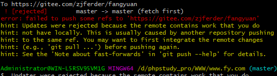
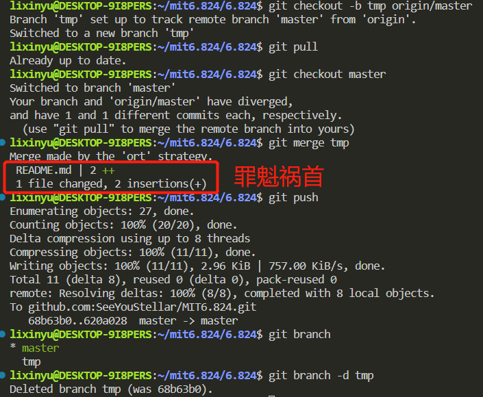

### 1. 远程分支有不是在本地分支上提交的更新
**报错情况：**

**提示信息：**
远程分支的部分更新未同步到本地分支上，可能原因是有其他工作者从他们的本地仓库提交到了这个远程分支上，也可能是在github上有一个可编辑仓库md的功能，自己在上面加了点内容并保存提交了，这不是本地仓库的提交。
**解决办法：**
新建本地临时分支，并将远程分支拉去到临时分支上，最后将临时分支与本地master主分支合并。然后把临时分支删了
**具体操作：**
```
git checkout -b tmp origin/master
```
-b参数：自动切换本地分支
tmp：新分支名
origin/master：远程分支与本地分支的连接名/远程分支

```
git pull
git checkout master
```
拉去远程分支

```
git merge tmp
git branch -d tmp
```
合并临时分支，并删除

