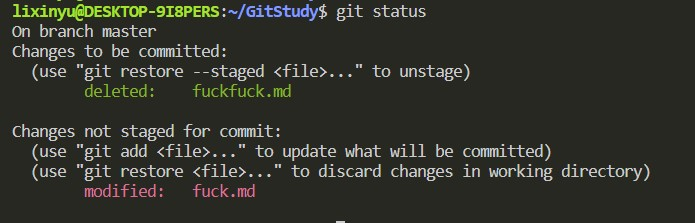

## 创建本地仓库
```
git init 
```


出现了.git文件


## 工作区添加新文件

```
echo "hello world" > fuck.md
```


查看追踪情况

```
git status
```


git status会显示
1. 当前本地仓库处于哪一个分支
2. 当前暂存区是否有提交记录
3. 当前工作区是否有未追踪的更新
   
git status -s展示简单模式

## 将工作区的更新提交到暂存区
```
git add .
```


调用git status显示更新未提交到本地仓库区，但已经提交到了暂存区，所以已经追踪到了changes

删除提交到缓存区的某个文件：
1. git rm --cached \<file name\> 将提交到暂存区的文件删除，但不会删除工作区文件（即撤出被追踪状态）。
2. git rm --f \<file name> 将工作区和提交到缓存区的文件都删除


## 添加到本地仓库


## 对工作区进行多次更新

新创建一个文件fuckfuck.md，将其commit后将其删除；修改fuck.md



**针对未push到远程仓库的任何更新，只需要按照add->commit提交即可，因为之前在暂存区的更新会和本次更新一起合并提交（在暂存区的所有更新提交后认定为一个版本），而之前已经在本地仓库中的提交属于之前的版本了，这次的更新又是一个新版本，调用git log会出现新的commit-id**

## 查看提交日志（本地仓库）


commit后跟着的一长串string就是commit-id，共40个字符

**head->master：**

head代表最后一次提交

master代表提交到本地仓库的master分支

## 禁止某些文件的提交
创建.gitignore文件，并将不想提交的文件名写入该文件


## 创建本地仓库的新分支

```
git branch newbranch
git checkout newbranch  //切换分支
```
或者
```
git checkout -b newbranch 
```


修改test分支中的fuck.md的文件内容，并查看两个分支中该文件的区别


## 分支合并

```
git checkout master
git merge test
```


