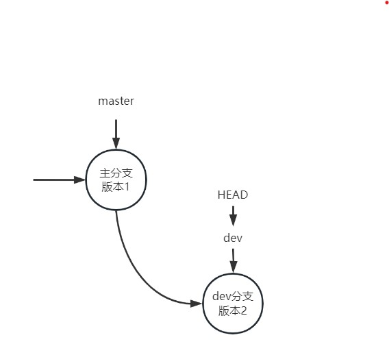

## 分支管理1

1. git branch
2. git checkout
3. git merge
4. git rebase
5. git reset

## 步骤1：产生主分支版本1

查看提交日志

HEAD指针指向当前分支指针(master)，master分支指针指向版本1

此时版本流如图：

## 步骤2：创建新分支dev

查看提交日志

dev指向版本2，HEAD指向当前分支指针dev，master仍然指向版本1

此时版本流如图：

## 步骤3：合并分支dev

因为主分支未更新，所以分支合并时直接采用**fast-forward**(ff)模式，所以分支合并实际就是将主分支master指针指向dev指针所指的版本。

这里因为在合并前从dev分支切换到了master分支，所以HEAD自然指向了master。

**HEAD只会指向当前分支指针。**

分支流图如下：

以上从步骤1-3分支合并是在master分支未更新情况下发生的，所以不会产生冲突

## 步骤4：修改主分支

修改主分支的fuck.md并提交，产生版本3

## 步骤5：修改dev分支

修改dev分支的fuck.md并提交，产生版本4

分支流如图：

## 步骤6：合并dev分支

将dev分支合并到master上

产生冲突，因为两个分支的fuck.md相同行上有不同的内容，所以git自动合并失败。需要修改主分支上的fuck.md，并重新提交

## 步骤7：解决冲突

在主分支上修改fuck.md，然后重新提交即可

此时HEAD指向master，master指向版本5，dev仍指向版本4。版本5是分支冲突产生后的第一个版本。

分支流如图：

## tip

使用git merge时默认合并模式为ff模式，这样就会产生上述的冲突。但是若指定为non fast-forward模式，则就算是没有分支冲突，也会产生新的版本（合并后分支流和上述分支解决后一样）。如下如所示：

