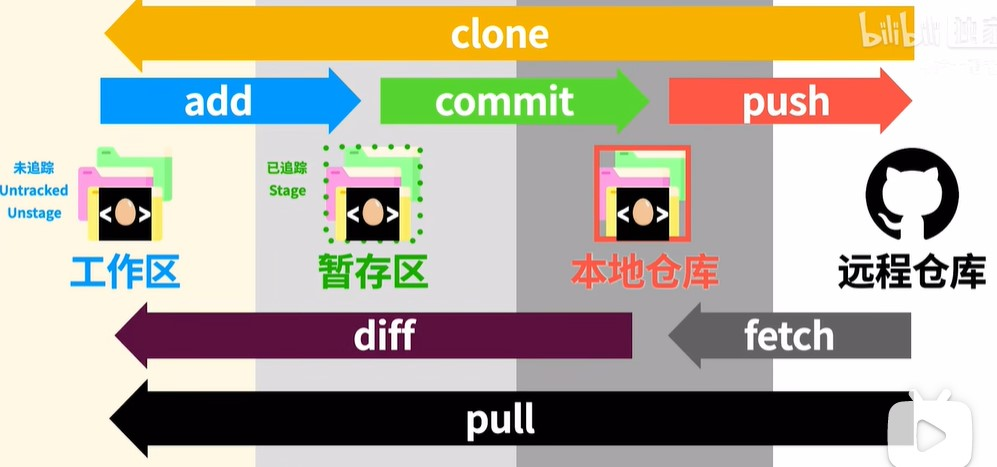
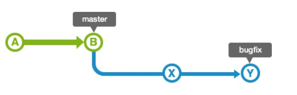
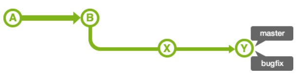
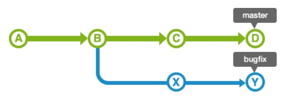
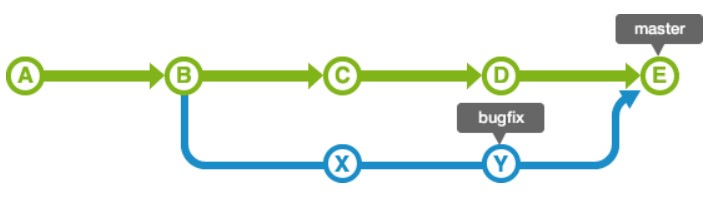
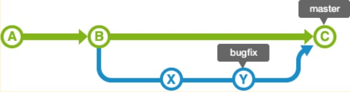

# git 
分布式版本控制系统， 每一次提交会赋予一个commit-id(使用hash算法SHA1得出)

**为什么用hash算法来定义版本号，而不是用递增的有规律的数字来定义？**
 
因为git是分布式系统，多台服务器之间，如果同时提交，那么如果按照递增定义版本号则这些提交都会得到相同的版本号，显然没有做到并发控制。

git命令基础框架如下：

## 四个代码储存区

工作区：本地代码目录（.git文件夹所在的文件夹）。不可被git追踪

暂存区：通过git add将本地代码上传到暂存区。可被git追踪

本地仓库：通过git commit将暂存区代码上传到本地仓库。可被git追踪

远程仓库：github, gitlab这样的代码仓库，通过git push将代码从本地仓库上传到远程仓库。可被git追踪

## 分支管理

### git merge分支合并

有两种合并模式

1. fast-forward模式
2. non fast-forward模式

分支合并时使用ff模式（默认模式）：

1. 没有冲突时

    

    

2. 有冲突时
   
    

    

分支合并时使用nff模式：

### git rebase分支合并