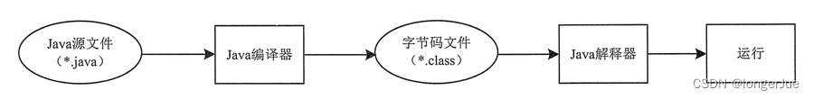
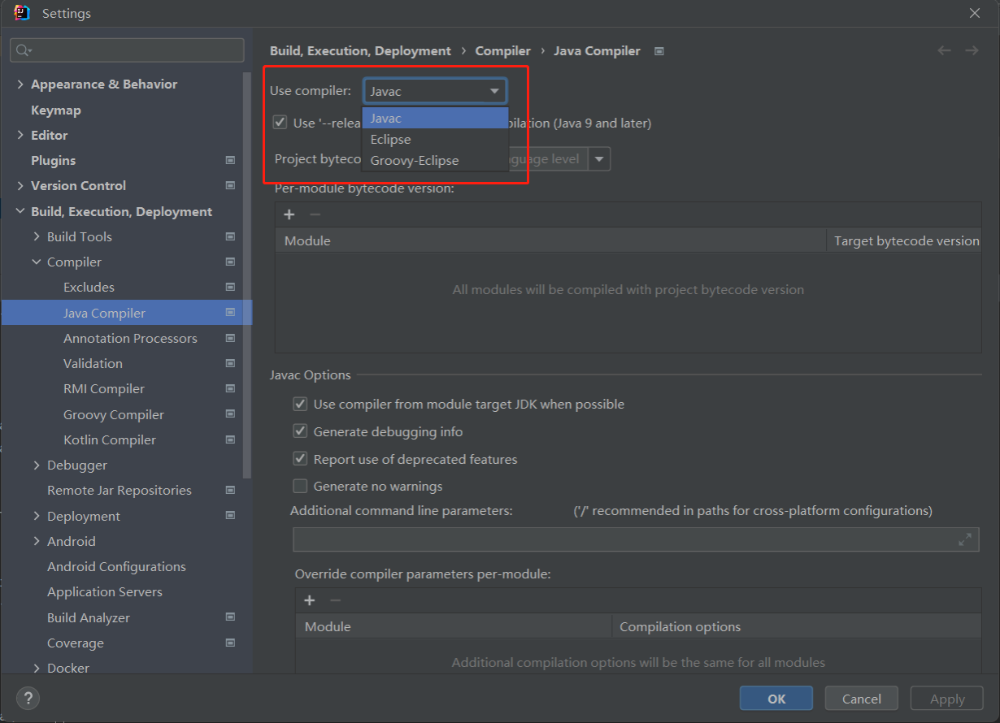
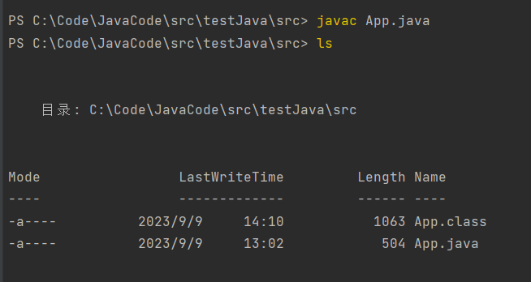
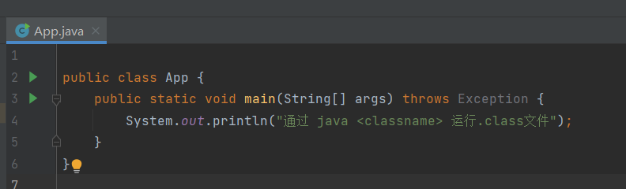
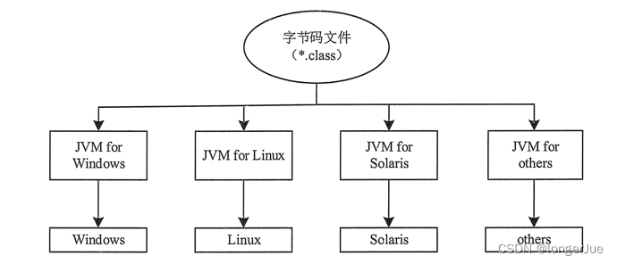

## 运行过程 

1. 程序员编写完.java文件
2. 由编译器来编译.java文件，生成字节码文件.class（字节码文件）  
   IDEA使用的java编译器默认为javac
   
   使用javac编译.java文件，当前目录下生成.class文件
   
3. java解释器包含在JVM中，用来解释并执行.class文件
   
   

## 一次编写，到处执行

不同操作系统有不同的JVM，JVM运行在操作系统与java程序之间，相同的代码可以通过在不同的JVM虚拟机上执行，起到在不同系统上执行的效果。

