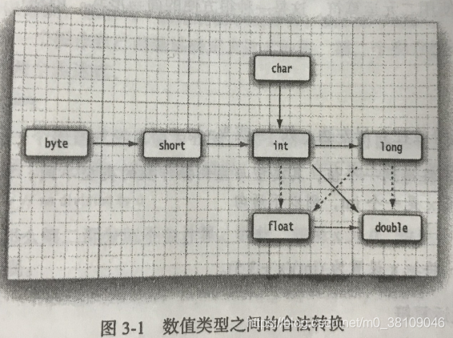
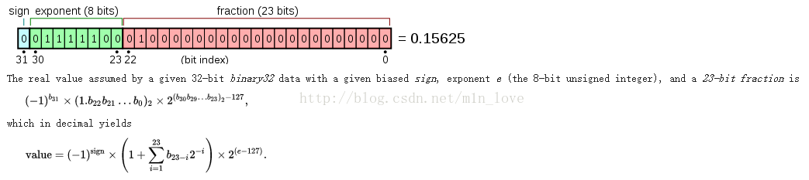

## 基本数据类型

1. 内置数据类型
   1. 整型类型（数值的字节数在每个系统中都是固定的）
      1. byte：大小为1字节的有符号整数，数据范围$-2^7\sim2^7-1$（无法表示$2^7$是因为原码00000000表示数值0，并且原码、反码中0的表示有两种）
      2. short：大小为2字节的有符号整数，数据范围$-2^15\sim2^15-1$
      3. int：大小为4字节的有符号整数，数据范围$-2^31\sim2^31-1$
      4. long：大小为8字节的有符号整数，数据范围$-2^63\sim2^63-1$。表示时需要在数值末尾加'L'或'l'。
   2. 浮点型（都无法精确表示浮点数）
      1. float：大小为4字节的有符号浮点数。表示时需要在数值末尾加'F'或'f'。
      2. double：大小为8字节的有符号浮点数
   3. 布尔型
      1. boolean：大小为1比特的数据类型
   4. 字符型
      1. char：大小为2字节的unicode字符，也可以理解为2字节的无符号整型，数据范围$0\sim2^{16}-1$
2. 引用数据类型
   1. 类
   2. 数组
   3. 枚举
   4. String

## 类型升级

指从**表示范围更小（精度）**的数据类型自动升级为**表示范围更大（精度）**的数据类型，不需要程序员手动转换。  

根据数据类型的表示范围可以有如下升级顺序：



说明：
1. 实线转换不会有精度损失，虚线转换会有精度损失
2. 整型转换时统一把符号位对齐，然后把小精度类型的剩余位从小到大放置在大精度数的相同位上
3. 转换顺序与内存占用大小无关，与数据精度有关。
4. 整型转到浮点型时都会有精度损失，因为整型和浮点型的存储结构是不同的（虽然字节数相同），这是浮点型的存储结构，第一位为符号位，中间8位为指数位，后23位才是为小数点后的数值。实际int转为float时，系统会将int与float的后23位与符号位弄成相同的，而float的中间8位需要用来表示指数大小，所以int的中间8位数据会被舍弃掉。
    
5. char运算规律与整型一致，但是因为其是无符号整型，要注意范围越界问题。
6. **内置类型与引用类型之间无法类型升级。**
   
## 类型转换

强制转换会有精度损失。

内置类型之间强制转换：强制对齐符号位，并且对多出来的位进行截断

一般来说，内置与引用类型之间无法进行强制转换。但是如果是内置类型的相应包装类型（比如int-Integer），会进行自动装箱与自动拆箱：
```java
Integer a = 10; // 自动装箱
int b = a;  // 自动拆箱
```

java的类库也会有相应的函数能起到强制转换的功能，比如：
```java
int a = Integer.parseInt("5"); //String->int 
```

## 类型间运算

运算统一遵循左结合性（从左往右计算）

1. byte,short,char类型，不管是同类型计算还是不同类型计算，计算结果都要用int型

2. 其他类型，相同类型之间计算，计算结果仍为原类型

3. 其他类型，不同类型之间计算，小精度类型按照自动升级顺序升级为大精度类型

## String 类型

String与内置类型之间可以进行运算，但只限于字符串拼接（**拼接时不会有类型升级，因为内置类无法自动升级为引用类**），与char拼接时会拼接char的unicode字符形式，与整型拼接时会直接拼接整型的字符串形式：
```java
int b = 5;
char d = 'a';
String a = "abc"+b+1; //abc51
a = b+1+"abc";        //6abc
String c = "abc"+d+1; //abca1 
c = d+1+"abc";        //98abc 注意与上面的区别，d+1会先发生d类型升级变为int，然后进行int运算，最后与"abc"拼接
String f = 'a';       //报错，没有char自动升级为String的方式
f = b;                //报错，没有int自动升级为String的方式
String e = 'a'+'b'+'c'+""; //294
e = "a"+"b"+"c";           //abc
e = ""+'a'+'b'+'c';        //abc
e = 'a'+"b"+'c';           //abc
```

### char-String间相互转换

#### char->String
```java
String s = String.valueOf('c');
```
#### String->char
```java
char a = String.charAt(index); //得到String中某一指定位置的char
char[] arr = String.toCharArray(); //可以得到将包含整个String的char数组
```
## 包装类

参考：https://www.cnblogs.com/dolphin0520/p/3780005.html

每种内置类型都有其包装类型： 
|内置类型|包装类型| 
| ----------- | ----------- |
|int（4字节）|Integer|  
|byte（1字节）|Byte|
|short（2字节）|Short|
|long（8字节）	|Long|
|float（4字节）|Float|
|double（8字节）|Double|
|char（2字节）	|Character|
|boolean（未定）|Boolean|

包装类与其内置类之间会发生装箱与拆箱。

### 自动装箱与自动拆箱

装箱：指的是把内置类型包装成包装类的过程  
拆箱：指的是把包装类型转换为内置类的过程  

```java
Integer a = 10; // 自动装箱，调用valueOf(int)
int b = a;  // 自动拆箱，调用intValue()
```

每个包装类都实现了valueOf()和方法，而装箱的过程就是调用包装类的xxxValue()方法（该方法就是个取值的过程）。

### valueOf()方法

以Integer类为例，如果int值在缓存池IntegerCache范围内的，则从缓存池中返回该值的Integer类引用；如果不在范围内，则新建一个Integer类引用。
```java
public static Integer valueOf(int i) {
    if (i >= IntegerCache.low && i <= IntegerCache.high)
        return IntegerCache.cache[i + (-IntegerCache.low)];
    return new Integer(i);
}
```
Short,Byte,Long类型的valueOf方法设计于Integer类似，装箱时有部分值可以从缓存池中取出引用。

浮点类型的valueOf方法于整型不同，任何值在装箱过程中都是直接新建一个对象。因为在某个范围内的整型数值的个数是有限的，而浮点数却不是。Double与float类似。

Boolean类型valueOf方法：
```java
public static Boolean valueOf(boolean b) {
    return (b ? TRUE : FALSE);
}
public static final Boolean TRUE = new Boolean(true);
public static final Boolean FALSE = new Boolean(false);
```
TRUE和FALSE是类型静态成员，故每次装箱时都会返回这两个成员变量中的一个，自然有如下情况：
```java
public class Main {
    public static void main(String[] args) {
         
        Boolean i1 = false;
        Boolean i2 = false;
        Boolean i3 = true;
        Boolean i4 = true;
         
        System.out.println(i1==i2); // true
        System.out.println(i3==i4); // true
    }
}
```
### 缓存池

以IntegerCache类举例，缓存池中Integer类的值范围在-128-127
```java
private static class IntegerCache {
    static final int low = -128;
    static final int high;
    static final Integer cache[];
    static {
        // high value may be configured by property
        int h = 127;
        String integerCacheHighPropValue =
            sun.misc.VM.getSavedProperty("java.lang.Integer.IntegerCache.high");
        if (integerCacheHighPropValue != null) {
            try {
                int i = parseInt(integerCacheHighPropValue);
                i = Math.max(i, 127);
                // Maximum array size is Integer.MAX_VALUE
                h = Math.min(i, Integer.MAX_VALUE - (-low) -1);
            } catch( NumberFormatException nfe) {
                // If the property cannot be parsed into an int, ignore it.
            }
        }
        high = h;

        cache = new Integer[(high - low) + 1];
        int j = low;
        for(int k = 0; k < cache.length; k++)
            cache[k] = new Integer(j++);
        // range [-128, 127] must be interned (JLS7 5.1.7)
        assert IntegerCache.high >= 127;
    }
    private IntegerCache() {}
}
```

### equals与”==“

1. **equals** 方法是 java.lang.Object 类的方法。所有继承于该类的类都有equals方法。

    在Object类中的equals用来比较内存首地址是否相同。

    Object的继承类中，重载了该方法的类基本上将equals用来比较类的实际内容是否相同。

    因为包装类和内置类之间存在自动装箱和自动拆箱，所以如果equals(a)中a为内置类型,则其会自动装箱成包装类，然后比较内容。

2. **==** 用来比较首地址是否相同。 

   因为包装类和内置类之间存在自动装箱和自动拆箱，所以==的两侧如果一个是包装类一个是内置类，则包装类会自动拆箱，比较内容。

|类型|能否进行==运算|==作用|是否了重载了equals方法|equals作用|
| ----------- | ----------- | ----------- | ----------- | ----------- |
|内置类型|&#10004;|比较内容是否相同|不是类型，无法重载|无|
|重载了equals方法的类（比如String类）|&#10004;|比较存储在内存中的首地址是否相同|&#10004;|比较内容是否相同|
|未重载了equals方法的类（只是继承）|&#10004;|比较存储在内存中的首地址是否相同|&#10005;|比较存储在内存中的首地址是否相同|

### 总结

至此，可以判断下述情况的区别：

```java
// 通过new新建对象
Integer x = new Integer(123);
Integer y = new Integer(123);
System.out.println(x == y);    // false

// 通过valueOf新建对象
Integer z = Integer.valueOf(123);
Integer k = Integer.valueOf(123);
System.out.println(z == k);   // true

// 通过自动装箱新建对象(超过缓存池int值范围)
Integer a = 130;
Integer b = 130;
System.out.println(a == b);   // false

// 通过自动装箱新建对象(未超过缓存池int值范围)，c,d均获取到缓存池中值为123的Integer对象引用。
Integer c = 123;
Integer d = 123;
System.out.println(c == d);   // true

// 判断equals的两边是否相等，就看其是否重载了该方法，如果没重载仍然是比较内存地址是否相同
```