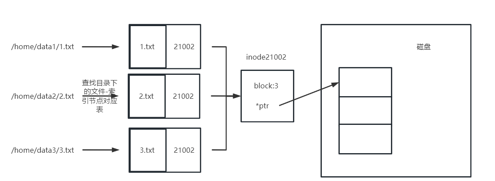

### 进程管理命令

https://sites.google.com/site/linuxxuexi/rhel-xi-tong-guan-li/di7zhanglinux-xi-tong-jin-cheng-guan-li

### Linux进程空间分布概述

参考博客https://blog.csdn.net/jinking01/article/details/106825769

1. BSS段：BSS段（bss segment）通常是指用来存放程序中**未初始化的全局变量**的一块内存区域。BSS是英文Block Started by Symbol的简称。BSS段属于静态内存分配。
2. 数据段：数据段（data segment）通常是指用来存放程序中**已初始化的全局变量**的一块内存区域。数据段属于静态内存分配。
3. 代码段：代码段（code segment/text segment）通常是指用来存放**程序执行代码**的一块内存区域。这部分区域的大小在程序运行前就已经确定，并且内存区域通常属于只读, 某些架构也允许代码段为可写，即允许修改程序。在代码段中，也有可能包含一些**只读的常数变量**，例如字符串常量等。
4. 堆（heap）：堆是用于存放进程运行中被动态分配的内存段，它的大小并不固定，可动态扩张或缩减。当进程调用**malloc**等函数分配内存时，新分配的内存就被动态添加到堆上（堆被扩张）；当利用**free**等函数释放内存时，被释放的内存从堆中被剔除（堆被缩减）
5. 栈(stack)：栈又称堆栈， 是用户存放程序临时创建的局部变量，也就是说我们函数括弧“{}”中定义的变量（但不包括static声明的变量，static意味着在数据段中存放变量）。除此以外，在函数被调用时，其参数也会被压入发起调用的进程栈中，并且待到调用结束后，函数的返回值也会被存放回栈中。由于栈的先进后出特点，所以栈特别方便用来保存/恢复调用现场。从这个意义上讲，我们可以把堆栈看成一个寄存、交换临时数据的内存区。
6. 内存映射段：在栈的下方是内存映射段，内核将文件的内容直接映射到内存。任何应用程序都可以通过Linux的mmap()系统调用或者Windows的CreateFileMapping()/MapViewOfFile()请求这种映射。内存映射是一种方便高效的文件I/O方式，所以它被用来加载动态库。创建一个不对应于任何文件的匿名内存映射也是可能的，此方法用于存放程序的数据。在Linux中，如果你通过malloc()请求一大块内存，C运行库将会创建这样一个匿名映射而不是使用堆内存。“大块”意味着比MMAP_THRESHOLD还大，缺省128KB，可以通过mallocp()调整。


注意图中地址方向，地址从小到大，依次是代码段，数据段，BSS段，堆，栈（堆顶小地址，类似大端存储）

**堆和栈区别**


### 内核空间和用户空间

内核空间中存放的是内核代码和数据，而进程的用户空间中存放的是用户程序的代码和数据。

通常32位Linux内核地址空间划分0~3G为用户空间，3~4G为内核空间

### 挂载mount

因为Linux系统将所有的硬件设备都当做文件来处理，当使用光驱等硬件设备时，就必须将其挂载到系统中，只有这样Linux才能识别。也就是所谓的Linux系统“一切皆文件”，所有文件都放置在以根目录为树根的树形目录结构中。在 Linux 看来，任何硬件设备也都是文件，它们各有自己的一套文件系统（文件目录结构）。
当在 Linux 系统中使用这些硬件设备时，只有将Linux本身的文件目录与硬件设备的文件目录合二为一，硬件设备才能为我们所用。合二为一的过程称为“挂载”。

### Linux 文件系统 

1. inode索引节点：存储文件元数据，包括索引节点编号、字节数、属主UserID、属组GroupID、读写执行（rwx）权限、时间戳（change time/modify time/access time）、文件类型（普通文件，目录，管道）、链接到该inode的硬链接数、block占用数、指向block的指针。但是**inode不记录文件名**，实际上文件名对于文件的读取访问查找没有任何用，Linux系统通过查找文件inode再查找文件block来获取文件。通过 stat filename 来查看该文件的inode信息
2. sector扇区：**硬盘的最小存储单位**，每个扇区512字节
3. block区块：连续的几个扇区是一个block，硬盘读取时不会单独读一个sector，而是读一个block。**block是文件的最小存储单位**，文件至少占用一个block

#### 文件查找过程：
文件名->目录（目录文件中有一种map，保存着该目录下文件名到文件inode的映射）->inode->block

#### 磁盘容量
系统初始化时，磁盘被分成两部分，一部分储存inode，一部分储存文件。每个inode节点大小固定，故inode总数也固定
判断磁盘是否已满：
1. df -h 查看磁盘存放文件区是否满
2. df -i inode是否用完

### 硬链接-软连接

#### 硬链接（Hard Link）
不产生新的文件。每个新的硬链接都只是一个新的文件路径名。根据inode-block原理在访问其中某个文件路径时，只是去对应目录找inode，而每个硬链接的inode号都与源文件的inode号相同，也就是一个inode号对应多个文件。那么无论如何查找到的都是同一个inode，那么找到的block也只会是同一个。



显示inode信息时，会看到链接数大于1，每生成一个硬链接 链接数就+1，反之-1，当链接数大于等于1时，这个文件都被看做存在，等于0时说明该文件被彻底删除。

硬连接的作用是允许一个文件拥有多个有效路径名，这样用户就可以建立硬连接到重要文件，以防止**误删**的功能。

创建硬链接
```shell
ln 源文件 目标 
```

#### 软链接（Symbolic Link）

又称符号链接。类似于创建快捷方式，将源文件发送到不同的目录下，产生多个新的文件。

软链接就是再创建一个独立的文件，而这个文件会让数据的读取指向它连接的那个文件的文件名。例如，文件A和文件B的inode号码虽然不一样，**但是文件A的内容是文件B的路径**。读取文件A时，系统会自动将访问者导向文件B。这时，文件A就称为文件B的软链接soft link或者符号链接symbolic link。

这意味着，文件A依赖于文件B而存在，如果删除了文件B，打开文件A就会报错。这是软链接与硬链接最大的不同：文件A指向文件B的文件名，而不是文件B的inode号码，文件B的inode链接数不会因此发生变化。

创建软链接
```shell
ln -s 源文件 目标
```
