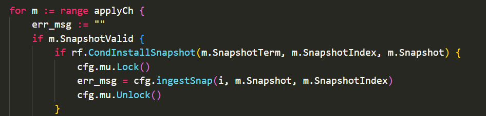
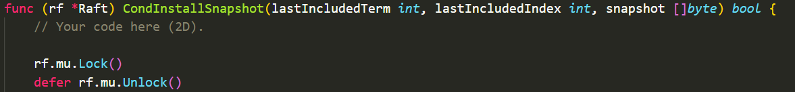
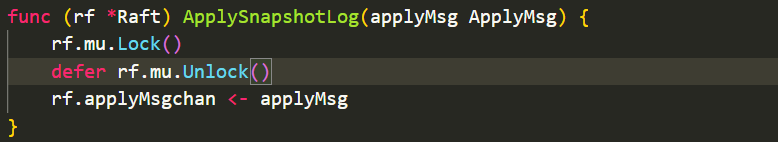

## lab2D Log compaction

看懂下图即可以实现2D


主要实现SnapShot,CondInstallSnapshot,InstallSnapshot rpc。

一个完整的基于raft的应用是由硬盘、raft实例、状态机以及应用层组成。

### SnapShot

由应用层发起，一般是根据已apply的日志数目来决定何时进行快照。

一旦经过判断快照请求合法，那么即刻进行快照，更新raft的logs,snapshot,lastIncludedIndex,lastIncludedTerm等等

**合法性判断**
```go
if index <= rf.lastIncludedIndex || index > rf.lastApplied || index > lastIndex {
		return
}
```

注意这里的合法性中有一个$index > rf.lastApplied$，为什么是lastApplied？因为应用层只会看到应用到状态机的日志状态，而这些日志的index理论上应该小于lastApplied。

在每次快照结束后，都需要将快照信息持久化，调用SaveStateAndSnapshot函数。持久化的快照信息会在server宕机恢复后由状态机读取而raft不需要读取（raft只需要恢复raft状态-ReadPersist），所以才有了图中的ReadSnapshot这条绿线。因为快照本质上是状态机的一个时间截面上的状态，记录的是x等于几，y等于几，raft不需要记住这些数据的状态，raft只处理日志。

raft中保存的snapshot是为了方便快照持久化然后给状态机读。

### InstallSnapshot rpc

leader发现某个server的nextIndex小于了lastIncludedIndex。即该条日志已经被snapshot了，那么此时就不能发AppendEntries了，而是要发InstallSnapshot。但InstallSnapshot同样有心跳的功能。所以需要重新调整一下leader发心跳的逻辑。

```go
case STATE_LEADER:
				rf.timer.Reset(HeartBeatTimeout)
				for j := range rf.peers {
					if j == rf.me {
						continue
					}
					if rf.nextIndex[j] > rf.lastIncludedIndex {
						// 发日志增量
						LastIndex, LastTerm := rf.LastLog()
						reply := AppendEntriesReply{}
						args := AppendEntriesArgs{
							Term:         rf.currentTerm,
							LeaderId:     rf.me,
							PrevLogIndex: 0,
							PrevLogTerm:  0,
							Entries:      nil,
							LeaderCommit: rf.commitIndex,
						}
						if len(rf.logs) > 1 {
							// 心跳+日志增量
							if rf.nextIndex[j]-rf.lastIncludedIndex >= 1 && rf.nextIndex[j] <= LastIndex+1 {
								args.PrevLogIndex = rf.nextIndex[j] - 1
								args.PrevLogTerm = rf.logs[args.PrevLogIndex-rf.lastIncludedIndex].Term
								if rf.nextIndex[j] < LastIndex+1 {
									args.Entries = rf.logs[rf.nextIndex[j]-rf.lastIncludedIndex:]
								} else {
									args.Entries = nil
								}
							} else if rf.nextIndex[j]-rf.lastIncludedIndex < 1 {
								// 有了快照之后这个分支不可能进入了
								args.PrevLogIndex = 0
								args.PrevLogTerm = 0
								args.Entries = rf.logs
							} else if rf.nextIndex[j] > LastIndex+1 {
								// 这个分支应该是不可能发生的
								args.PrevLogIndex = LastIndex
								args.PrevLogTerm = LastTerm
								args.Entries = nil
							}
						} else {
							// 单纯的心跳
							args.PrevLogIndex = rf.nextIndex[j] - 1
							args.PrevLogTerm = rf.logs[args.PrevLogIndex-rf.lastIncludedIndex].Term
							args.Entries = nil
                        }
						go rf.sendAppendEntries(j, &args, &reply)
					} else {
						// 发快照
						reply := InstallSnapshotReply{}
						args := InstallSnapshotArgs{
							Term:              rf.currentTerm,
							LeaderId:          rf.me,
							LastIncludedIndex: rf.lastIncludedIndex,
							LastIncludedTerm:  rf.lastIncludedTerm,
							Data:              rf.snapshot,
						}
						go rf.sendInstallSnapshot(j, &args, &reply)
					}

```

合法性判断是$rf.commitIndex >= args.LastIncludedIndex$，为何是commitIndex，因为论文里这么写的（笔者不想去深究了，之后有空再想想）。

但是server接收到InstallSnapshot时不能立刻将快照应用，而是需要将InstallSnapshot中包含的快照下标等等通过之前传递日志应用信息的applyMsgchan传给应用层，让应用层调用CondInstallSnapshot来判断是否可以将快照应用。

这一步操作其实笔者没搞懂。为什么要绕一圈不能直接判断是否可应用。

### CondInstallSnapshot

确认InstallSnapshot rpc请求是否可被应用，若可被应用则将leader的快照应用到server中。

### 死锁问题

applyMsgchan接受日志信息以及快照信息

golang的管道是阻塞制的，管道大小可以设置，笔者实现时设置的管道大小为0，即当接受方没有就绪时，发送方就会阻塞。若是设置大小为1，则只要管道该有一个空位，发送方就不会阻塞。

假设applyMsgchan在使用时(ApplySnapshotLog)都占有rf.mu，应用层接受管道内的快照信息时(config.go里的applierSnap，并且是周期调用)。applierSnap会调用CondInstallSnapshot，而CondInstallSnapshot里又必须占有锁。

applierSnap函数部分：



CondInstallSnapshot函数部分：



假设ApplySnapshotLog快照信息提交时占有了锁：



设想应用层发起快照请求，调用了applierSnap，此时管道内有一条快照信息，那么调用CondInstallSnapshot，在开始调用CondInstallSnapshot到占有锁的过程中，有有一条快照信息需要写入管道，占有了锁，随后CondInstallSnapshot运行到需要占有锁的代码，试图占有锁。**此时就出现了死锁**，因为此时applierSnap阻塞在了CondInstallSnapshot处，无法接受管道信息，所以ApplySnapshotLog里的管道会阻塞，这就导致了ApplySnapshotLog不会释放锁，而不释放锁CondInstallSnapshot就永远试图占有锁（阻塞了）。

### 数组越界问题

通过LastLog()获取当前日志的最后一条下标和任期

```Golang
func (rf *Raft) LastLog() (int, int) {
	if len(rf.logs) <= 1 {
		return rf.lastIncludedIndex, rf.lastIncludedTerm
	} else {
		return rf.logs[len(rf.logs)-1].Index, rf.logs[len(rf.logs)-1].Term
	}
}
```
从2C的代码到2D的代码，大部分情况下通过LastLog()获取的下标代替2C版本中的len(rf.logs)是不会出错的。偶尔出现的问题也可以通过if约束。

要特殊处理的包括，在都持久化信息时，commitIndex和lastApplied如果小于lastIncludedIndex，就要将其更新为lastIncludedIndex，在2C中理论上初始化为0是没事的，但2D中如果不将其改为lastIncludedIndex在提交日志时或者AppendEntries中更新commitIndex时就会出现数组越界。


----
### lab2终于告一段落了。