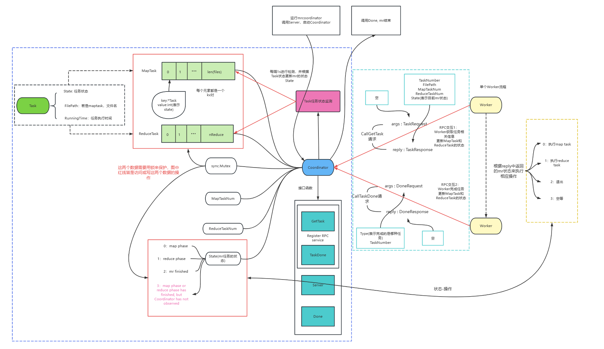
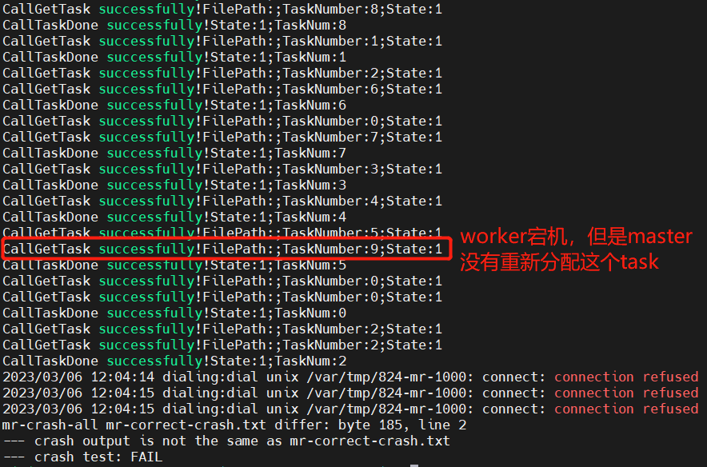

## lab1 MapReduce

### 前置信息：

1. 关于MapReduce框架，四个关键词——**Coordinator, Worker, Task, RPC**。整个 MR 框架由一个 Coordinator 进程及若干个 Worker 进程构成, Coordinator 进程与 Worker 进程间通过本地 Socket 进行 Golang RPC 通信（整个mr的流程在[MapReduce论文](http://research.google.com/archive/mapreduce-osdi04.pdf)里有，建议仔细看完 **section3.1 section3.3**，关注里面的细节）。整个框架由 Coordinator 协调整个 MR 计算的推进，并分配 Task 到 Worker 上运行，这里注意 Task 和 Worker 是两个不同的概念（初学时可能有误区）
2. 在启动 Coordinator 进程时指定 输入文件名 及 Reduce Task 数量，在启动 Worker 进程时指定所用的 MR APP 动态链接库文件， 如何启动mr框架、如何进行测试在[官方lab1指导](https://pdos.csail.mit.edu/6.824/labs/lab-mr.html)里有。Coordinator 进程的入口文件为 main/mrcoordinator.go，Worker 进程的入口文件为 main/mrworker.go，需要补充实现 mr/coordinator.go、mr/worker.go、mr/rpc.go 这三个文件
3. Coordinator 需要留意 Worker 可能无法在合理时间内完成收到的任务（Worker 卡死或宕机），在遇到此类问题时需要重新派发任务，Coordinator 如何对 Worker 进行检查是实验一个核心

### 实现思路

直接看图，图里就是我的全部思路



#### RPC调用

Coordinator 与 Worker 之间的交互通过 RPC 实现，RPC是什么我理解也不够深，感觉就是一个C/S模式的交互形式。只知道这个东西还挺重要的，以后有空再仔细研究。这里只要会使用RPC就行。

RPC交互流程是 Coordinator 在本地注册服务（函数），然后启用一个监听线程监听客户端的RPC请求（server()），使用的网络协议可以是 Unix 也可以是 TCP 或 UDP, 这里用的课程提供的代码里使用了Unix。

因为服务是在本地注册的，所以可以调用本地的一些变量（大概意思是这样，具体怎么解释我也不知道）。这就给我们提供了一个思路，类似通过一个本地的变量控制worker的工作，事实上也是这么做的，使用 mr 的 State 来控制 Worker 的工作状态。

RPC服务（函数）的定义是固定的：
```go

func (c *Coordinator) RPCservice(args *Request, reply *Response) error {
	return nil
} 
```

其中 args 和 reply 是灵活使用RPC的关键，他们的类型是定义在 rpc.go 文件中，**可以定义多个不同的类型针对不同的RPC请求**。可以通过这 args 将 Worker 的信息传给 Coordinator，也可以用 reply 从 Coordinator 给 Worker 带去信息。并且这两个参数为空也没事。

知道了RPC调用的机制，那么我们就可以先试着修改代码，使得 Worker 可以从 Coordinator 那获取task，或者说先实现获取一个简单的值。当这一步完成后，根据前面的图，就可以大致了解这个lab Coordinator 和 Worker 之间是如何交互的。

#### 心跳机制

Worker 需要**获取任务信息**（GetTask），才能执行任务，然后执行完任务后，自然也需要向 Coordinator **汇报已做完的信息**(TaskDone)，因为你要是不告诉 Coordinator 已做完，那 Coordinator 会以为这个任务一直没做完，那么mr就进行不下去了。

Worker 更新 task 完成信息后，Coordinator需要检查，这里采用每过1s遍历maptask 和 reducetask 的状态的方法，状态信息保存在 Coordinator 内（两个map，定义为map\[int]*task）。检查的同时也要更新每个正在执行的 task 的RunningTime（+1）。**检查时自然需要进行加锁处理。**。然后重要的点在于，当检测出某个 task 正在执行并且的 RunningTime 超过10s,自动将其归为未执行状态，重新分配。这是官方文档里要求的做法。

#### 临时文件

如果不使用 tmpfile， 执行 maptask 时若 Worker 宕机，则中间文件 mr-X-Y 里会保存下已完成的部分，后续重新做这个 task 时会发现已存在 mr-X-Y ，可能会出错（我没试过，因为官方hint给了临时文件这种处理方式，我就直接实现了，没去试错）。有了临时文件，只有完全做完时，Worker 才会把 list(k2,v2) 写到 mr-X-Y 中去，在这之前都是写入到临时文件中。

#### synchronization 的实现

既然设计了 map\[int]*task, 所以明显线程之间（Coordinator 和 Workers）是通过共享内存实现 synchronization，那么就直接用 sync.Mutex 对数据上锁就行了。

一开始我也试了 channel（Coordinator 把 task 放到chan中让 Worker 去取）, 可以实现任务的分配，但是我觉得要实现任务已完成信息的记录以及心跳机制的实现会比较复杂，所以我就放弃了。好像[这个视频](https://www.bilibili.com/video/BV1sr4y1g7Lx/?spm_id_from=333.788&vd_source=32f55c0f732463a8c1ed4c72feae6ab6)使用的是chan,有兴趣可以看看。

### 关于测试

#### reduce parallelism

在某一次运行test-mr-many.sh时，出现了 reduce parallelism 测点 fail。出乎意料，因为确实在之前的测试中从来没有出现过这个测点fail。并且查看了 rtiming.go 文件。reduce 函数返回 nparallel 函数的结果。nparallel 函数如下：
```go
func nparallel(phase string) int {
	// create a file so that other workers will see that
	// we're running at the same time as them.
	pid := os.Getpid()
	myfilename := fmt.Sprintf("mr-worker-%s-%d", phase, pid)
	err := ioutil.WriteFile(myfilename, []byte("x"), 0666)
	if err != nil {
		panic(err)
	}

	// are any other workers running?
	// find their PIDs by scanning directory for mr-worker-XXX files.
	dd, err := os.Open(".")
	if err != nil {
		panic(err)
	}
	names, err := dd.Readdirnames(1000000)
	if err != nil {
		panic(err)
	}
	ret := 0
	for _, name := range names {
		var xpid int
		pat := fmt.Sprintf("mr-worker-%s-%%d", phase)
		n, err := fmt.Sscanf(name, pat, &xpid)
		if n == 1 && err == nil {
			err := syscall.Kill(xpid, 0)
			if err == nil {
				// if err == nil, xpid is alive.
				ret += 1
			}
		}
	}
	dd.Close()

	time.Sleep(1 * time.Second)

	err = os.Remove(myfilename)
	if err != nil {
		panic(err)
	}

	return ret
}
```
大致意思就是利用生成临时文件 mr-worker-PID，查找当前运行的 Worker 进程有多少个，然后看测试shell脚本：
```shell
$TIMEOUT ../mrcoordinator ../pg*txt &
sleep 1

$TIMEOUT ../mrworker ../../mrapps/rtiming.so &
$TIMEOUT ../mrworker ../../mrapps/rtiming.so

NT=`cat mr-out* | grep '^[a-z] 2' | wc -l | sed 's/ //g'`
if [ "$NT" -lt "2" ]
then
  echo '---' $NT parallel reduces.
  echo '---' reduce parallelism test: FAIL
  failed_any=1
else
  echo '---' reduce parallelism test: PASS
fi
```
测试逻辑应该是起2个worker, reduce 函数返回执行这个 reduce task 时的进程个数，然后统计输出结果中 value 为2的 kv 对。如果这样的kv对少于2，则测试不通过。

这个测试逻辑说实话我觉得挺怪的，之前没看测试脚本时我觉得可能要实现单 worker 多线程的方式，但是这测试脚本明显在测试进程数啊，如果用多线程实现，结果应该还是一样的。所以这个测点不是说要你用多线程实现才能过。

我的理解是，正常来说，一个 worker 节点如果是一台电脑，那多进程来执行任务也没事，如果只是一个进程，那还是用多线程。

因为基本上这个测点后来也没出现过问题，所以我也就不改了。

#### early exit

测试时会将把第一个worker退出时的mr-out-*作为mr的最终输出。

测试目的在于reduce任务没做完前，所有worker是不能退出的。

所以只要保证在最后一个reduce任务被做完前所有worker都不能退出即可。

我一开始实现时没过1s master 都会去检查每个任务的状态，根据任务的状态（所有maptask时否做完，或者所有reducetask是否做完）来改变整个mr任务运行的状态。出现worker提前退出的情况：比如上一次master检查是第9s（进入睡眠状态），执行最后(时间上)一个maptask的worker向master发起TaskDone的rpc请求，更新了这个maptask的状态（比如在第9.3s）。此时master可能没有马上发现。master要在第10s才会再次检查，然后把mr的状态改为1（0表示可获取maptask, 1表示可获取reducetask，2表示mr任务结束），但是在这1s内，worker可能会多次发起GetTask的rpc请求（假设申请maptask），此时明显无法获取任务（就不会获取到filepath），但是rpc请求是成功的，那么worker执行时，打开文件时就会有运行时报错（can't open file），worker就被动退出了。

解决方法：
一开始我是想直接在执行文件打开操作时加try-catch的，但是后来想想太蠢了这样。所以我给mr任务设定了第四种状态3，**表示上一个状态结束master还未来得及改变**，worker知道这个状态后直接执行等待，然后再发起请求

#### crash



因为我的wsl是单核的，所以跑测试时间比较长，这个crash.sh的测试有时pass有时fail，好不容易找到一次fail的，map phase没有问题我就不截图了。reduce phase很明显reducetask 9 执行时worker宕机了，但是正常来说master会检查到这个情况并重新分配任务，就像reducetask2。

所以代码出错应该是在master的检查机制部分。

其实是一个很蠢的问题，看我错误的代码：

```go
// Judge if or not all maptasks are done
	for {
		c.Mu.Lock()
		if c.State == 2 {
			c.Mu.Unlock()
			break
		}
		i := 0
		for ;i<len(files);i++ {
			if c.MapTask[i].State == 1 {
				c.MapTask[i].RunningTime = c.MapTask[i].RunningTime+1
				if c.MapTask[i].RunningTime >= 10 {
					c.MapTask[i].State = 0
					c.MapTask[i].RunningTime = 0
				}
				break
			} else if c.MapTask[i].State == 0 {
				break
			}
		}
		if i == len(files) {
			c.State = 1
		}
		i = 0
		for ;i<len(files);i++ {   // 这里应该改成   for ;i<nReduce;i++ 
			if c.ReduceTask[i].State == 1 {
				c.ReduceTask[i].RunningTime = c.ReduceTask[i].RunningTime+1
				if c.ReduceTask[i].RunningTime >= 10 {
					c.ReduceTask[i].State = 0
					c.ReduceTask[i].RunningTime = 0
				}
				break
			} else if c.ReduceTask[i].State == 0 {
				break
			}
		}
		if i == nReduce {
			c.State = 2
		}
		c.Mu.Unlock()
		time.Sleep(time.Second)****
	}
```

检查reducetask竟然顺手写了len(files)，因为mr我传入的是（files, nReduce）,files数量有8个，reduce为10，所以每次检查时，只能检查0-7个reducetask，实际reducetask有0-9

### 测试结果

单次测试
```shell
bash test-mr.sh
```


多次测试

```shell
bash test-mr-many.sh 10
```


### 总结

其实代码实现很早就完成了，但是一开始只是测test-mr.sh，发现all pass，就没去管他了，结果第二天重新测一遍就出现了问题，然后进行大量测试，发现后三个测点或多或少会出现问题，所以就把每个测点单独拿出来多次测，然后看输出的内容，如果嫌麻烦就把测试输出都重定向到日志中，方便查看。