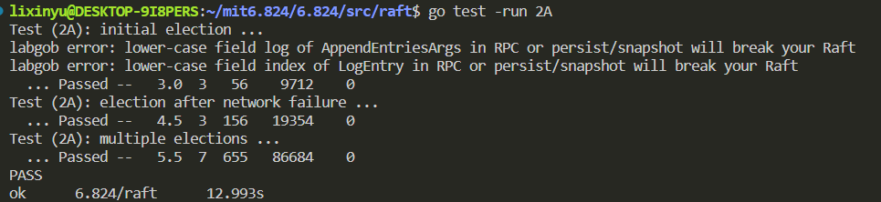

## lab2A LeaderElection

要完成的任务：
- Raft instance data structure design
- RequestVote RPC design
- AppendEntries RPC design
- Make func implement
- ticker func implement
- GetState func implement


### 1. something useful

1. [make you debug easier](https://blog.josejg.com/debugging-pretty/)
2. [students-guide-to-raft](https://thesquareplanet.com/blog/students-guide-to-raft/)

### 2. code

#### 2.1 Raft data structure

内置timer用golang的time.Timer实现，这个timer有两个功能，当machine state是follower和candidate状态时，timer用来实现election timeout，当machine state是leader时，timer用来实现heartbeart timeout。

time.Timer内置一个chan（缓冲区为1），当定时结束，就会向chan里放一个time。那么用select就可以实现定时结束执行相应操作（后续make函数实现里会涉及）。Timer结构如下：
```go
type Timer struct {
   C <-chan Time 
   r runtimeTimer
}
```
Raft 实例如下：
```go
type Raft struct {
	mu        sync.Mutex          // Lock to protect shared access to this peer's state
	peers     []*labrpc.ClientEnd // RPC end points of all peers
	persister *Persister          // Object to hold this peer's persisted state
	me        int                 // this peer's index into peers[]
	dead      int32               // set by Kill()

	currentTerm int32
	votedFor    int
	state       int
	timer       *time.Timer
	overTime    time.Duration
	votedNum    int32

	// log         []LogEntry   // 2B 
	// commitIndex int          // 2B 
	// lastApplied int          // 2B
	// nextIndex   []int        // 2B
	// matchIndex  []int        // 2B
}

// heartbeat timeout
var HeartBeatTimeout = 100 * time.Millisecond

// three states
const (
	STATE_FOLLOWER = iota
	STATE_CANDIDATE
	STATE_LEADER
)

```
#### 2.2 RequestVote RPC design

rpc.reply rpc.args 的数据结构完全采用paper figure2。rpc的实现逻辑与lab1一样，这里不再赘述。

RequestVote逻辑是：
- 当candidate的任期（args.Term）小于当前machine的任期（rf.currentTerm），就不投票并且通过返回的reply.term来提醒调用者candidate转为follower
- 当candidate的任期（args.Term）大于当前machine的任期（rf.currentTerm），直接投票，并且执行转为follower的操作，也不需要判断是否已投给了其他人，因为如果投给了其他candidate，那么rf.term必然跟那个candidate一样，那么投给了term小的candidate相当于没投，raft只有最大的term的candidate才有机会成为leader。
- 当candidate的任期（args.Term）等于当前machine的任期（rf.currentTerm），此时这个machine state有两种可能，candidate或follower，**首先如果是candidate**，因为follower在成为candidate时已经把票投给了自己，又因为term相同，显然这个candidate是与当前call rpc的candidate形成竞争关系的，所以不能投给它。**然后如果是follower的话**，同个term,需要判断有没有投给其他人，如果投了其他人就不能再投当前的candidate

```go
func (rf *Raft) RequestVote(args *RequestVoteArgs, reply *RequestVoteReply) {
	// Your code here (2A, 2B).

	rf.mu.Lock()
	defer rf.mu.Unlock()

	// init return
	reply.VoteGranted = false
	reply.Term = rf.currentTerm

	// operate state and term change

	if args.Term < rf.currentTerm {
		return
	} else if args.Term > rf.currentTerm {

		// if candidate's term is bigger than follower/candidate, it will update term,get vote and reset.and if rf is a candidate, it should change state
		rf.state = STATE_FOLLOWER
		rf.votedFor = args.CandidateId
		rf.votedNum = 0
		rf.overTime = time.Duration(200+rand.Intn(250)) * time.Millisecond // prevent follower from starting a election
		rf.timer.Reset(rf.overTime)
		rf.currentTerm = args.Term

		reply.VoteGranted = true
		// fmt.Printf("term %d, machine %d vote for machine %d\n", rf.currentTerm, rf.me, args.CandidateId)
	} else {
		//  if has the same term, it should judge whether rf has voted for another candidate
		if rf.votedFor == -1 || rf.votedFor == args.CandidateId {
			rf.votedFor = args.CandidateId
			rf.overTime = time.Duration(200+rand.Intn(250)) * time.Millisecond // prevent follower from starting a election
			rf.timer.Reset(rf.overTime)

			reply.VoteGranted = true
			// fmt.Printf("term %d, machine %d vote for machine %d\n", rf.currentTerm, rf.me, args.CandidateId)
		}
	}

}
```
sendRequestVote的实现逻辑：
1. 先要call rpc（rpc调用），这是与lab1一样的地方，并且这一步是不用上锁的（students-guide-to-raft里有说过，**rpc调用不上锁，rpc内部上锁**），可能是因为想尽可能地实现follower转为candidate**立刻**进行投票选举（个人猜测，其实在我的代码中rpc内部也加了锁，还是做不到同步进行投票选举），另外还有可能是rpc需要一直发送知道rpc请求成功，如果这一过程一直上了锁，自然会造成资源浪费，而如果仅仅在rpc内部上锁，调用失败马上可以释放锁，增加了并行性。
2. 比较"candidate"(引号是因为此时有可能不是candidate了)的currentTerm和之前call rpc时的term（args.Term）大小关系。如果后者大，说明这已经是之前任期的rpc请求了，因为某些原因现在才执行完返回，**过期的rpc请求是没用的**。
3. 判断reply.VoteGranted。**并行**统计得票结果。
4. 对reply.term进行处理。其实就是对应paper中"If RPC request or response contains term T > currentTerm:set currentTerm = T, convert to follower"，这里的rpc request or response中的response其实指的就是在处理reply时也要通过reply.term判断rpc请求是否已过期（或者说当时call rpc的candidate是否已过期）
```go
func (rf *Raft) sendRequestVote(server int, args *RequestVoteArgs, reply *RequestVoteReply) bool {

	// candidate call RequestVote rpc via sendRequestVote function, so rf is the candidate

	// send at once
	// don't use lock when call rpc
	ok := rf.peers[server].Call("Raft.RequestVote", args, reply)
	// sentRequestVote until success when meet the network problem or the server dead
	// there has another solution that use 10 times(or a static timeout) to call, if ok is still false, then return
	for ok == false {
		if rf.killed() == false {
			ok = rf.peers[server].Call("Raft.RequestVote", args, reply)
		} else {
			break
		}
	}

	rf.mu.Lock()
	defer rf.mu.Unlock()

	// rpc expiration: candidate call this func in args.term, and now it's term has been rf.currentTerm.
	// wasting so many time in the line286-288 will cause this problem
	if args.Term < rf.currentTerm {
		return false
	}

	// operate the vote situation in this func instead of out of this func
	if reply.VoteGranted == true {
		rf.votedNum += 1
		if int(rf.votedNum) >= (len(rf.peers)/2)+1 {
			// fmt.Printf("term %d, machine %d become a leader\n", rf.currentTerm, rf.me)
			rf.state = STATE_LEADER
			rf.timer.Reset(HeartBeatTimeout)
		}
	} else {
		if reply.Term > rf.currentTerm {

			// when convert to follower, this 6 line is must
			rf.state = STATE_FOLLOWER
			rf.currentTerm = reply.Term
			rf.votedFor = -1
			rf.votedNum = 0
			rf.overTime = time.Duration(200+rand.Intn(250)) * time.Millisecond
			rf.timer.Reset(rf.overTime)

		} else {
			// log replica part
		}
	}

	return true
}
```
#### 2.3 AppendEntries RPC design

逻辑和RequestVote是一样的。

```go
func (rf *Raft) AppendEntries(args *AppendEntriesArgs, reply *AppendEntriesReply) {

	rf.mu.Lock()
	defer rf.mu.Unlock()

	reply.Term = rf.currentTerm
	reply.Success = false

	if args.Term < rf.currentTerm {
		return
	} else {
		// heartbeat

		rf.state = STATE_FOLLOWER
		rf.currentTerm = args.Term
		rf.votedNum = 0
		rf.votedFor = -1
		rf.overTime = time.Duration(200+rand.Intn(250)) * time.Millisecond
		rf.timer.Reset(rf.overTime)

		reply.Success = true
	}

}

func (rf *Raft) sendAppendEntries(server int, args *AppendEntriesArgs, reply *AppendEntriesReply) bool {

	// the same as sendRequestVote
	ok := rf.peers[server].Call("Raft.AppendEntries", args, reply)
	for ok == false {
		if rf.killed() == false {
			ok = rf.peers[server].Call("Raft.AppendEntries", args, reply)
		} else {
			break
		}
	}

	rf.mu.Lock()
	defer rf.mu.Unlock()

	if args.Term < rf.currentTerm {
		return false
	}

	if reply.Success == false {
		if reply.Term > rf.currentTerm {
			rf.state = STATE_FOLLOWER
			rf.currentTerm = reply.Term

			rf.votedFor = -1
			rf.votedNum = 0
			rf.overTime = time.Duration(200+rand.Intn(250)) * time.Millisecond
			rf.timer.Reset(rf.overTime)
		} else {
			// log replica part
		}
	}

	return true
}
```
#### 2.4 Make func

创建Raft实例的入口函数。包含基本的初始化工作以及启动定时器的函数ticker。

```go
func Make(peers []*labrpc.ClientEnd, me int,
	persister *Persister, applyCh chan ApplyMsg) *Raft {

	rand.Seed(time.Now().UnixNano())

	rf := &Raft{}
	rf.peers = peers
	rf.persister = persister
	rf.me = me

	// Your initialization code here (2A, 2B, 2C).
	rf.currentTerm = 0
	rf.votedFor = -1
	rf.state = STATE_FOLLOWER
	rf.overTime = time.Duration(200+rand.Intn(250)) * time.Millisecond
	rf.timer = time.NewTimer(rf.overTime)

	// start ticker goroutine to start elections
	go rf.ticker()

	return rf
}
```

#### 2.5 ticker func

ticker函数是定时器函数，作为一个long going的协程对每个machine进行超时检测。

三个state的machine在每个state都执行相同的操作。**因为整个过程都是上锁的，所以不用担心在执行相应操作时发生状态改变**。想了很久，这里也只能通过整个上锁来处理。

代码基本是按照paper的figure2来实现的，特别是rules for server部分。

```go
func (rf *Raft) ticker() {

	time.Sleep(5 * time.Millisecond) // wait tester to write "test(2A)"

	for rf.killed() == false {

		// Your code here to check if a leader election should
		// be started and to randomize sleeping time using
		// time.Sleep().
		select {
		case <-rf.timer.C:
			rf.mu.Lock()

			switch rf.state {
			case STATE_FOLLOWER:
				rf.state = STATE_CANDIDATE
				// fmt.Printf("term %d, machine %d become a candidate\n", rf.currentTerm, rf.me)
				fallthrough // good idea
			case STATE_CANDIDATE:
				rf.currentTerm += 1
				rf.overTime = time.Duration(200+rand.Intn(250)) * time.Millisecond // rand.Intn(x):生成[0,200)之内的随机数
				rf.timer.Reset(rf.overTime)

				rf.votedFor = rf.me
				rf.votedNum = 1

				for i := 0; i < len(rf.peers); i++ {
					if i == rf.me {
						continue
					}
					reply := RequestVoteReply{}
					go rf.sendRequestVote(i, &RequestVoteArgs{Term: rf.currentTerm, CandidateId: rf.me}, &reply)
				}
			case STATE_LEADER:
				rf.timer.Reset(HeartBeatTimeout)
				for j := range rf.peers {
					if j == rf.me {
						continue
					}

					reply := AppendEntriesReply{}
					go rf.sendAppendEntries(j, &AppendEntriesArgs{Term: rf.currentTerm, LeaderId: rf.me}, &reply)
				}

			}

			rf.mu.Unlock()
		}

	}
}
```

### 3. about test

这部分的测试感觉比较水。

**单次测试**


**多次测试**


### 4. problem

1. 两个candidate（term相同）几乎同时结束election timeout，其中一个成为了leader, 其在sendappendentries过程中，如果还未来得及抢占到锁并对rpc reply进行处理（假设正好要将另一个candidate转化为follower），而恰巧此时是这个candidate正在用锁，那么它就会以为是选举超时未成为leader, 就会把term++，此时他就拥有最大的term。那么这种是不是不被允许的，是代码逻辑的问题吗？
raft算法需要考虑因为代码实现时，**共享内存必然会造成的线程竞争问题**。你永远不知道哪个线程先抢到锁。这个问题描述的情况就是：线程在sendappendentries函数中call appendeneries rpc，在rpc中执行心跳发送机制，也就是将所有term<=leader.term的machine转为follower状态，整个rpc都是上锁的，同时candidate重新选举也是需要加锁，那么这两部分代码都需要上锁，自然谁先谁后都有可能，那么上述的问题也会出现。但是我后来觉得，这种情况其实就是raft允许的，**此时那个term大的candidate有可能成为leader，而那个term小的leader再发送完心跳并收到reply后，就知道有更大的term，就会转变为follower，也即是说，raft是对这种情况有防备的。**
