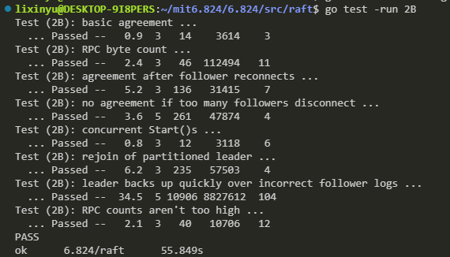
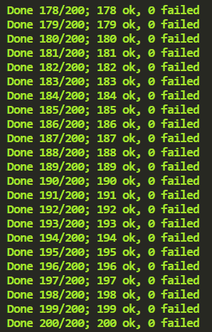
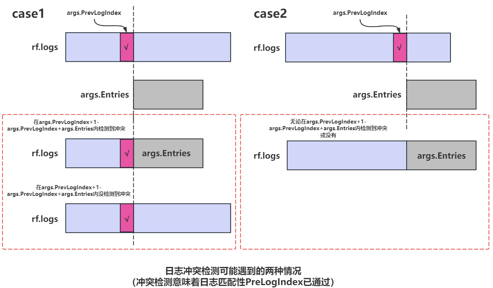

## lab2B LogReplication

### 1. about test

#### test function 
1. TestBasicAgree2B()：最基础的追加日志测试。先使用nCommitted()检查有多少的server认为日志已经提交（在执行Start()函数之前，所有的服务器都不应该提交日志），若满足条件则调用cfg.one()，其通过调用rf.Start(cmd)来追加日志。rf.Start(cmd)用于模拟Raft实例从Client接收实例的情况。
2. TestRPCBytes2B：基于RPC的字节数检查保证每个cmd都只对每个peer发送一次。
3. TestFailAgree2B：断连小部分，不影响整体Raft集群的情况检测追加日志。
4. TestFailNoAgree2B：断连过半数节点，保证无日志可以正常追加。然后又重新恢复节点，检测追加日志情况。
5. TestConcurrentStarts2B：模拟客户端并发发送多个命令
6. TestRejoin2B：Leader 1断连，再让旧leader 1接受日志，再给新Leader 2发送日志，2断连，再重连旧Leader 1，提交日志，再让2重连，再提交日志。
7. TestBackup2B：先给Leader 1发送日志，然后断连3个Follower（总共1Ledaer 4Follower），网络分区。提交大量命令给1。然后让leader 1和其Follower下线，之前的3个Follower上线，向它们发送日志。然后在对剩下的仅有3个节点的Raft集群重复上面网络分区的过程。
8. TestCount2B：检查无效的RPC个数，不能过多。

#### 单次测试

#### 多次测试

### 2. 注意点

1. 发送AppendEntries和RequestVote时需要进行安全性检测
2. 每个server都另起一个ApplyLog线程用于时刻检测是否是否需要提交日志。这个线程不会关心server目前处于什么状态。只会判断commitIndex和lastApplied是否满足了提交日志的要求
3. 在实现时，for循环内一般会先占用锁再放开，如果每次for循环都是不间断的，那么就会在某些测试时出现锁被某个线程的某个for循环长期占用。而使集群无法选出leader或者无法复制日志等等。所以在for循环内最好time.Sleep(10ms)
4. 什么时候选举时间重置：
    - follower变为candidate，开始选举
    - candidate,follower遇到leader发来的heartbeat
    - candidate遇到term比自己大的candidate
    - candidate变为leader，electTimeout可以理解为心跳间隔
    - follower投票时
5. 日志截断处理：如果AppendEntries时对args.Entries和rf.logs进行日志冲突检测时，如果在两者的交集处没有产生冲突，那么是不需要进行日志阶段处理的，相当于只是对交集部分做了日志的冲突检测，具体会遇到的情况见[lab Q&A](https://thesquareplanet.com/blog/raft-qa/)最后一个问题

    

### 3. TODO

1. 有这么一种情况，领导者的日志很长，而某个server的日志几乎没有，领导者在当选后会将nextIndex[server]变为其日志长度，此时对于这个server，领导者需要发很多次心跳才能确定正确的nextIndex[server]是多少，因为每次心跳只能将nextIndex[server]-1。而很可能还没找到该下标领导者就宕机了，新的领导者需要从新开始发心跳，有可能这将导致这个server一直无法同步日志。一种办法是将心跳间隔设置的更小，可以使在领导者当选到宕机这段时间内尽可能多的发心跳。显然这种办法是有问题的。可以通过在AppendEntries reply里返回一个已提交的日志下标来提醒领导者将nextIndex[server]调整为该下标（已提交的日志领导者必定会有）。
2. nextIndex[server]和matchIndex[server]的初始化位置。其实我试了放在成为candidate和成为leader处都行。关键是相同一个问题，初始化后(nextIndex[server]=len(leader.oldlogs))，有可能client写入了日志，那么oldlogs变长了变味了newlogs，但是nextIndex不会调整，在发AppendEntries rpc时可能不是按照论文要求的，nextIndex=len(leader.oldlogs)!=len(leader.newlogs)。一开始我一直找不到如何处理这个问题，后来想通了，其实不需要处理，只要nextIndex是日志存在的下标就不会有问题，因为server会判断preLogIndex处的日志是否匹配。

