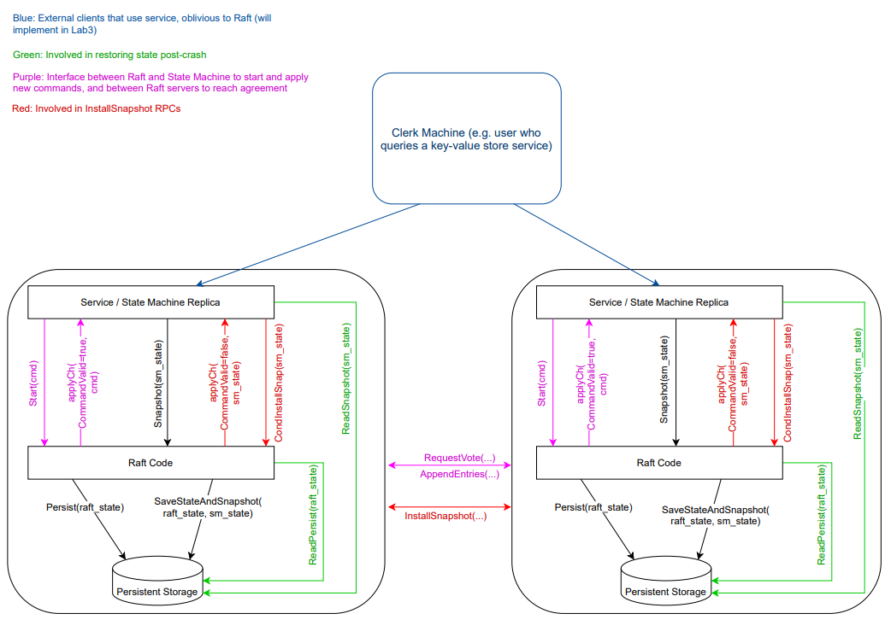
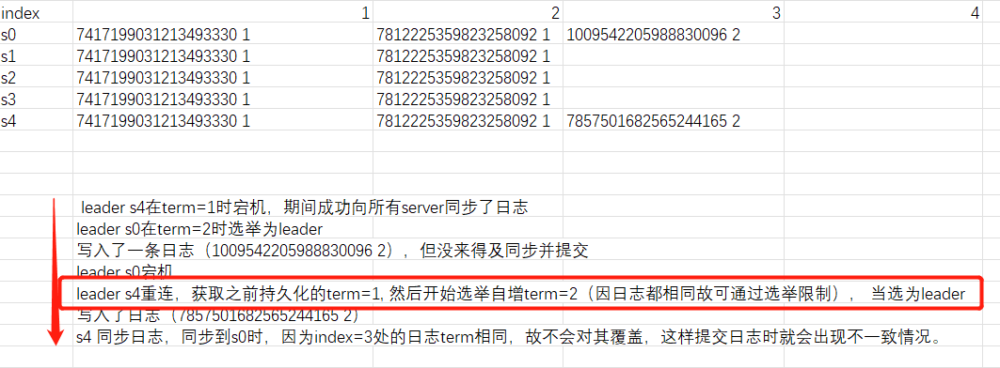
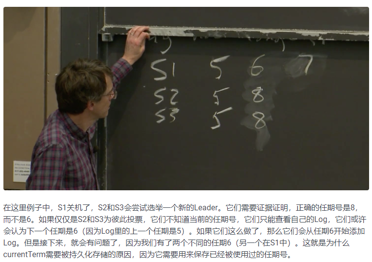

## lab2C Persistence

持久化为帮助server从宕机中恢复部分数据。**这里的宕机指的是服务器的硬盘完好，raft实例和状态机无法运行的情况**。如果是服务器硬盘物理损坏，那持久化也没用。

[中文课程翻译](https://mit-public-courses-cn-translatio.gitbook.io/mit6-824/lecture-07-raft2/7.4-chi-jiu-hua-persistent)这部分讲的内容挺清楚。

主要涉及的函数是：Persist，SaveStateAndSnapshot，ReadPersist，ReadSnapshot。后两个在persist.go里已经实现了。
### 注意点
1. 2C的测试代码中cfg.crash(server)表示的是使server宕机，而cfg.unconnect(server)表示的是形成网络分区，将该server与其他server断开网络连接，crash表示server内存中数据丢失需要使用持久化恢复，而unconnect后数据不会丢失。
2. 日志回退机制改进
   - 优化点1
    如果follower.log不存在prevLog，让Leader下一次从follower.log的末尾开始同步日志。
   - 优化点2
    如果是因为prevLog.Term不匹配，记follower.prevLog.Term为conflictTerm。
      +  如果leader.log找不到Term为conflictTerm的日志，则下一次从follower.log中conflictTerm的第一个log的位置开始同步日志。
      +  如果leader.log找到了Term为conflictTerm的日志，则下一次从leader.log中conflictTerm的最后一个log的下一个位置开始同步日志。
3. 选举逻辑的bug修复:
   
   
   
   S0,S4 index=3处的两条日志任期也相同，代表着S4发起AppendEntries后，日志冲突检查时不会检查出冲突点，故也不会截断覆盖S0的这条日志，并且之后也会在S4更新了commitIndex后将自己的commitIndex更新为3，那么这条日志将会被提交，显然在相同的index处提交了不同的日志，无法保证一致性了，就算这条日志被覆盖，那么就是引出另一个问题-已提交日志被覆盖。
   
    问题出现在正常情况下，S4为什么能在重连后当上leader呢？显然是获得了大多数的选票。说明选举逻辑有问题。并且不是RequestVote RPC 和 sendRequestVote这两个函数的逻辑出问题，而是一个论文中提到的很容易忽视的心跳的作用没有完全实现。

    论文中的心跳作用描述为：
    "It then sends heartbeat messages to all of the other servers to establish its authority and prevent new elections."

    如果心跳实现时只是重置选举时间，而没有将votefor改为leaderid，那么只要在S0宕机后，各个集群里的follower的选举计时剩余时间比S4重启后随机获取的选举计时多，S4就可以率先进行选举并成为leader。

    我的理解是，论文里establish its authority的意思其实是需要将votefor改为leaderid，**防止出现两个同任期同日志新旧程度（但日志不同）的candidate时选举出错误的leader**，即保证了从网络分区恢复后或宕机恢复后的server（拥有与集群当前相同的任期号，与集群当前leader有相同的日志长度）不会马上当上leader，防止了已提交的日志被覆盖。

    在这个前提下那么S4就无法获取多数的选票，因为follower都将votefor改为了S0。
4. **持久化发生在何处**？持久化发生在一切改变 **voteFor,currentTerm,logs** 的操作之后。
   - log：这个不赘述，不持久化如果leader宕机就会丢失已提交的日志，raft日志一致性的前提就是leader拥有所有已提交的日志。
   - voteFor：
     - 保证同一个任期内只有一个leader。解释是：一个server宕机前投给了candidate1，宕机恢复后仍然没选出leader，并且它如果没有持久化votefor所以又投给了另一个candidate2，那么很可能这两个candidate都变为leader。
     - 同样是根据3所述，server投给了谁保证了leader的authority，那么自然每个server的votefor需要持久化防止3的情况出现。
   - currentTerm：
     - 保证同一个任期内只有一个leader。原因如下：
      
     - 因为raft的所有rpc请求都是首要判断两个server的任期，之后才是后续的逻辑。**在选举时有这么一种情况，某个leader有很多未同步到其他server的日志，随后它宕机了，恢复后因为没有持久化任期，那么任期初始化为0，此时它是极大可能不会成为leader（集群中的其他server会因为任期更新而成为leader，并且用新的日志覆盖掉这个宕机leader的很多日志），这种现象不会破坏一致性，因为宕机的leader虽然有很多日志，但是都是未同步的，那么肯定也是未提交的，只要没有提交，这些日志就不会被认定未有效。但是这种现象也会浪费掉很多应用端的请求，所以需要持久化任期，使得在这种情况下旧leader可以继续成为leader。** 上述情况是笔者自己想的。

   另外，上述的持久化时机实际上是及其浪费服务器资源的，因为过多的时间在进行硬盘读写。其实真正意义上区分某些数据是否该被持久化是**synchronous disk updates**，即效率才是第一要义，有些信息宁愿丢失也要保证效率。raft由于其正确性、一致性着想，将上述三个信息就行持久化。
5. 理论上只要不计较硬盘读写带来的速度损失，把所有信息都持久化也可以（就像笔者实现时图方便把lastIncludedIndex也持久化了）。其他几个可以不持久化的原因如下：
   - commitIndex：follower宕机恢复，commitIndex可以从AppendEntries的leaderCommit和当前日志长度来获取；leader宕机恢复后再次变为leader，commitIndex可以从与每个server的AppendEntries中重新更新matchIndex来获取
   - lastApplied：对于任何server。只要日志可以恢复，commitIndex可以恢复，那么重启后的状态机就可以从第一条日志开始重新应用这些日志
   - nextIndex：对于follower，本来就不用去考虑；对于leader，重启后同样也是follower，所以也不用考虑。**raft的日志回退策略保证了nextIndex只需要每次初始化为len(logs)+1就不会出现错误**
   - matchIndex：与nextIndex同理，因为matchIndex在raft中永远是nextIndex+1