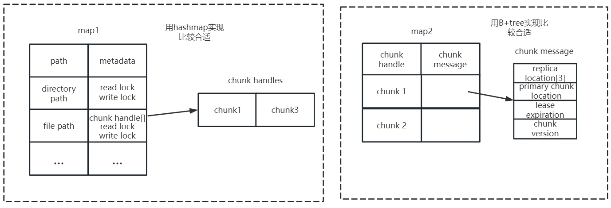
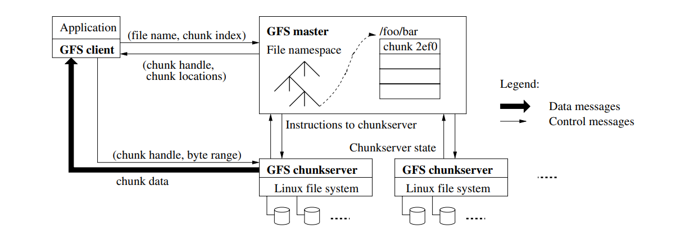
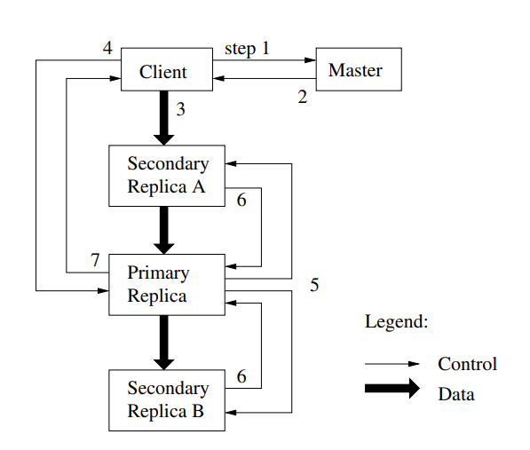

### 分布式存储系统设计的困境

要提升访问的效率（网络带宽是瓶颈），就需要分片存储，将文件的不同部分放在不同的机器上，这样多个客户端就可以并发的进行读写。但是一旦其中某个机器宕机，那么文件的某部分就消失了，所以需要使用多副本的技术，将文件的每个部分的多个副本存在多个机架中（注意这里如果存在同个机架，同时宕机的概率还是很大）。一旦多副本技术引入后，数据的一致性就会出现问题，比如其中存储其中一个副本的机器宕机了，再次重启后，副本之间很明显数据不一致了，那么一旦你需要去考虑数据一致性的问题，就不得不通过网络的交互，比如通过一些轮询的方式获取到副本失效的信息，并通过一些方式重新克隆一个副本，这将不可避免地降低系统的性能。

以上描述的就是分布式系统性能与一致性的相互制衡。

### GFS assumption

1. 分布系统的各个组件是廉价的商品主机，而不是专业服务器，因此它们不得不频繁地自我监测、发现故障，并被要求有一定故障容错与自我故障恢复能力；
2. 文件数量处于几百万的规模，每一个文件的大小通常为 100 MB 或者更大，GB 也是很常见的数据大小；文件系统虽然支持小文件，但是不会进行特殊的优化（因此直接使用 GFS 应当基于大文件的应用背景）；
3. 读工作负载主要由两种读方式构成：大规模的串行读以及小规模的随机读
   + 大规模顺序读：顺序（磁盘地址连续地）读取数百及以上个 KB 大小的数据（或者单位改成 MB）；
   + 小规模随机读：以任意偏移量读取几个 KB 大小的数据；

4. 写工作负载主要是大规模的、连续（即串行的）的写操作，这些操作将数据追加到文件末尾。写操作的规模通常和大规模串行读的规模类似；
5. 系统需要支持并发写，即支持数百台机器并发地追加数据到一个文件。操作的原子性和同步开销是主要指标；
6. 高持续带宽（High sustained bandwidth）比低延迟更重要；

### 对master，chunk server，client的理解

chunkserver 的本质是 Linux 操作系统上对应的 user-level（用户级别）的服务进程，而我们知道 Linux 操作系统可不止运行运行一个线程。事实上，一个主机同一时刻既可以用作 chunkserver 提供服务，也可以作为 client 向其他 chunkserver 索要数据。

### master节点中的数据结构

#### 1. data structure in memory 
* **map1**: path->chunk handle+read/write lock
* **map2**: chunk handle->chunk message
  * **chunk message** :
      * replica locations\[3]: chunk的每个副本位于哪个chunk server
      * chunk version: chunk的版本号，在chunk和master中都要存储这个信息，并且在每次 grant a lease 后version number会自增。主要用来Stale Replica Detection(section 4.5)
      * primary chunk location: primary chunk就是签订了租约的chunk。mutation order发生时，client需要对master发起primary chunk 位置请求（当然大多数情况client会缓存primary chunk location），这是因为gfs独特的控制流数据流分离策略要求控制流要经过primary chunk
      * lease expiration: 租约过期时限

>"GFS does not have a per-directory data structure that lists all the files in that directory...GFS logically represents its namespace as a lookup table mapping full pathnames to metadata. "(section 4.1)

意思就是GFS没有类似Linux文件系统里目录文件（存储目录下每个文件到inode的映射）这样的数据结构，所以也就不会用**目录串起整个文件系统**形成属**树形结构**。GFS的名称空间是一个path->metadata的**映射表**

这里我的理解就是每个绝对路径（不管这个绝对路径是目录还是文件）都有自己的metadata，只不过只有文件才会有的chunk handle列表，普通的目录只会有锁

**这些数据既然存储在内存中，那么当master宕机时这些数据就会消失，所以所有metadata更改操作都会记录在operation log中。**

#### 2. data structure in local disk

* **map1** 要保存在磁盘上。我给它标记成NV（non-volatile, 非易失），这个标记表示对应的数据会写入到磁盘上。
* **Chunk replica locations**不用保存到磁盘上。因为Master节点重启之后可以与所有的Chunk服务器通信，并查询每个Chunk服务器存储了哪些Chunk，所以我认为它不用写入磁盘。所以这里标记成V（volatile），
* **chunk version** 需要写入磁盘，标记成NV。因为在master检查某个副本是否失效时，需要比对chunk 里保存的chunk version和master中的chunk serve进行比对，如果master宕机没了chunk version，就无法比对了。
* **primary chunk location** 可以不用写入磁盘，因为Master节点重启之后会忘记谁是主Chunk，它只需要等待60秒租约到期，那么它知道对于这个Chunk来说没有主Chunk，这个时候，Master节点可以安全指定一个新的主Chunk。所以这里标记成V。
* **lease expiration**也不用写入磁盘，所以这里标记成V。

也就是说map1 以及 map2中的chunk version需要持久化，所以上面提到的chunk message其实是一个分散存储的数据，而不是封装在一个数据结构中。我这样写只是为了理解方便。

**每次持久化操作都会生成一个日志的checkpoint。**

#### 3. operation log 
首先日志也是需要**持久化**的。并且存储在每个master服务器中（单节点多服务器，这个也是GFS主要的单节点master理念）。master会收集**多条**日志记录后再对其进行持久化。日志的持久化过程应该是对客户端**不可见**的。

日志文件一旦过大就会占用大量的master节点的存储空间，并且也会降低master重启恢复时的速度。**所以需要在到达一定大小时对日志文件进行快照，这将生成检查点文件（checkpoint）**

另外checkpoint再上述的map1,map2进行持久化时也会产生。

#### 4. checkpoint
master **重启恢复**需要找到最新的checkpoint（理论上只需要存储一个checkpoint，但是一般为了安全起见还是保存多个）和开始创建checkpoint时起开始记录的新的operation log，并且找到持久化的map1,map2将其读入内存，这样master就重启成功了。

checkpoint 创建过程需要较长时间，所以一般master会重新开一个线程用于记录创建checkpoint期间的operation log，这样就不会产生阻塞。

### chunk server中的数据结构

1. chunk
2. 每个chunk的chunk version
3. 每个chunk是否是primary chunk或者secondary chunk

lease expiration应该是不需要存储的，因为master会通过心跳机制每隔一定时间（<60s,maybe10s）主动指定主chunk，并且会告诉这个chunk，60s之后你必须停止成为主chunk。

这个"60s之后你必须停止成为主chunk"的设定可以保证master宕机时，就算在重启过程中lease到期，也不会有mutation顺序出错问题发生，因为只有主chunk才能处理mutation的执行顺序，所以当主chunk自动停止当主chunk,client根据缓存里的信息访问这个chunk时，会被告知已不是主chunk,那么就只能等到master恢复后才能得到主chunk的信息。（不过我发现shadow master好像也可以和chunk server进行心跳机制交互，所以算是有双保险了）

### interface

1. 文件的 create，delete，open，close，read 以及 write（random）
2. Snapshot 快照：快照指的是以低成本方式创建文件和目录树（directory tree）的副本；
3. Record Append 记录追加：记录追加指的是 GFS 允许多个客户机并发安全地向同一文件追加数据，同时保证每个客户追加操作的原子性；

### read opearation

首先要理清一个前提，就是读操作不需要去修改master中的metadata。

过程：
1. client 通过chunk size+file byte offset计算出file byte offset在file的第几个chunk内，即chunk index。然后将chunk index+filename（这里我倾向去发的是文件路径）发给master
2. master根据filename在map1中找到该文件的chunk handles, 根据chunk index找到指定的chunk handle，然后利用chunk handle在map2中找到replica locations(这里paper里用了复数，明显是将所有副本位置都发给了client)，然后将chunk handle+replica locations发给了client
3. client存储一个键值对到缓存，key:={filename，chunk index}，value:={chunk handle, replica locations}, 方便下次直接与chunk server交互
4. client根据replica location找到某个chunk server，向其发送chunkhandle+byte range(块中字节范围，一开始已经计算出来了)，chunk server返回数据。

### mutation

**mutation** is an operation that changes the contentes or metadata of a chunk such as a write or an append operation(section 3.1)

描述一下record append的过程：
客户端会将要追加的数据发送给Primary和Secondary服务器，这些服务器会将数据写入到一个临时位置。所以最开始，这些数据不会追加到文件中。当所有的服务器都返回确认消息说，已经有了要追加的数据，客户端会向Primary服务器发送一条消息说，你和所有的Secondary服务器都有了要追加的数据，现在我想将这个数据追加到这个文件中。**Primary服务器或许会从大量客户端收到大量的并发请求，Primary服务器会以某种顺序，一次只执行一个请求（执行顺序是不确定的，所以最后的状态最多是consistent but undefined）**。对于每个客户端的追加数据请求（也就是写请求），Primary会查看当前文件结尾的Chunk，并确保Chunk中有足够的剩余空间，然后将客户端要追加的数据写入Chunk的末尾。并且，Primary会通知所有的Secondary服务器也将客户端要追加的数据写入在它们自己存储的Chunk末尾。这样，包括Primary在内的所有副本，都会收到通知将数据追加在Chunk的末尾。
但是对于Secondary服务器来说，它们可能可以执行成功，也可能会执行失败，比如说磁盘空间不足，比如说故障了，比如说Primary发出的消息网络丢包了。如果Secondary实际真的将数据写入到了本地磁盘存储的Chunk中，它会回复“yes”给Primary。如果所有的Secondary服务器都成功将数据写入，并将“yes”回复给了Primary，并且Primary也收到了这些回复。Primary会向客户端返回写入成功。如果至少一个Secondary服务器没有回复Primary，或者回复了，但是内容却是：抱歉，一些不好的事情发生了，比如说磁盘空间不够，或者磁盘故障了，Primary会向客户端返回写入失败。
paper说，如果客户端从Primary得到写入失败，那么客户端应该重新发起整个追加过程。客户端首先会重新与Master交互，找到文件末尾的Chunk；之后，**客户端需要重新发起对于Primary和Secondary的数据追加操作。**

#### write at least once保证

模拟一下两个写入接口:
+ write(filename, chunk index, byte offset)
+ append(filename)

上文最后一段就是为什么record append明明单个操作是原子性的，但是多个client并发时，还是会导致undefined，也就是只能保证**write at least once**。**究其原因在于gfs本身是不会对这样的数据不一致性进行维护调整的，全靠客户端再次发起请求（retry）**。所以，客户端得知写入失败后继续请求写，他是不知道哪个chunk写成功哪个chunk写失败的，也不能够指定写到哪个副本（事实上，gfs提供给client的write接口也只能指定filename+chunk index+byte offset,append接口只能指定filename），那么很明显会有某些chunk被append了两次，第一次append失败的chunk会被append一次。

另外可以知道是，如果append时没有发生网络错误、chunk server宕机等问题，那么append操作是可以做到数据一致性的（defined）。但是write却不行，主要原因是write时需要client提供byte offset，那么同时有多个client都要家write在某个位置时就会出现问题。而append时，master自动解析出file的最后一个chunk location，然后chunk server也会自动解析出byte offset，多个client并发append时，chunk server会按顺序解析出offset再执行append，所以不会发生冲突。

### tolerant

#### chunk/chunk server
之前一直对某个实体（master,chunk,chunk server）宕机了，如何保证数据一致性有疑惑，或者说不知道GFS能不能保证这个，答案是chunk 内容的一致性不能保证（前面也说了）。但是能保证metadata的一致性，因为有锁。

比如说master 检测到某个chunk副本失效，需要重新创建一个副本，那么这个过程中首先创建副本这个操作会对metadata进行修改（chunk locations），所以master内部会对这个文件加写锁（目录加读锁），那么这个过程中其他针对这个metadata的修改操作和访问操作就会被阻塞。但是clien如果缓存了chunk location，那么他的请求是不会被阻塞的，因为它直接和chunk server交互，恰巧又找到了好的副本，那么好的副本写入了新的内容，而正在创建的副本没有写入（后文会谈到无法使用版本号来同步副本），这样显然每个副本的内容会有差别。

#### master

paper里说shadow master是一段时间前的master（有时间延迟是因为shadow master不会真正与chunk server进行心跳机制交互，而是执行master日志里的操作，那么只有等master产生日志记录，shadow master才回去执行，显然慢了一些）。

shadow master在master宕机后可以代替master提供文件的读权限，又因为无法做到与chunk server的交互，所以失效chunk的检测（新的chunk的创建）、垃圾的检测回收、租约的签订（所以一旦宕机时间过长，所有主chunk自动解除lease后，就基本连读权限也无法提供了）、负载均衡管理等master的功能都无法完成。

**只提供读权限可能就是对所有namspace下的节点上了读锁，但讲道理这个时候应该也无法阻止client用缓存的chunk server信息进行写吧，只不过确实会导致数据不一致。**

### read/write locking 

用来对master中的namespace metadata进行保护，但不会保护chunk server中的chunk内容。
所有涉及到metadata的访问和修改的操作，master都会用锁来保护metadata

### consistence

GFS对random write不提供一致性保护。对record append提供添加的原子性，使每次添加操作都是原子操作。

Record Append 采用的是 at least once 的消息通信模型，在绝对确保此次写操作成功的情况下，可能造成在重复写数据。

### lecture Q&A(我觉得有用的问题)
#### 1.可不可以通过版本号来判断副本是否有之前追加的数据？
Robert教授：**所有的Secondary都有相同的版本号。版本号只会在Master指定一个新Primary时才会改变。**通常只有在原Primary发生故障了，才会指定一个新的Primary。所以，副本（参与写操作的Primary和Secondary）都有相同的版本号，你没法通过版本号来判断它们是否一样，或许它们就是不一样的（取决于数据追加成功与否）。
这么做的理由是，当Primary回复“no”给客户端时，客户端知道写入失败了，之后客户端的GFS库会重新发起追加数据的请求，直到最后成功追加数据。成功了之后，追加的数据会在所有的副本中相同位置存在。在那之前，追加的数据只会在部分副本中存在。

#### 2. 如果Master节点发现Primary挂了会怎么办？
Robert教授：可以这么回答这个问题。在某个时间点，Master指定了一个Primary，之后Master会一直通过定期的ping来检查它是否还存活(**也就是心跳机制的时间间隔比lease时限短很多**)。因为如果它挂了，Master需要选择一个新的Primary。Master发送了一些ping给Primary，并且Primary没有回应，你可能会认为Master会在那个时间立刻指定一个新的Primary。但事实是，这是一个错误的想法。为什么是一个错误的想法呢？因为可能是网络的原因导致ping没有成功，所以有可能Primary还活着，但是网络的原因导致ping失败了。但同时，Primary还可以与客户端交互，如果Master为Chunk指定了一个新的Primary，那么就会同时有两个Primary处理写请求，这两个Primary不知道彼此的存在，会分别处理不同的写请求，最终会导致有两个不同的数据拷贝。这被称为**脑裂（split-brain）**。
脑裂是一种非常重要的概念，我们会在之后的课程中再次介绍它（详见6.1），它通常是由网络分区引起的。比如说，Master无法与Primary通信，但是Primary又可以与客户端通信，这就是一种网络分区问题。网络故障是这类分布式存储系统中最难处理的问题之一。
所以，我们想要避免错误的为同一个Chunk指定两个Primary的可能性。Master采取的方式是，当指定一个Primary时，为它分配一个租约，Primary只在租约内有效。Master和Primary都会知道并记住租约有多长，当租约过期了，Primary会停止响应客户端请求，它会忽略或者拒绝客户端请求。因此，如果Master不能与Primary通信，并且想要指定一个新的Primary时，Master会等到前一个Primary的租约到期。这意味着，Master什么也不会做，只是等待租约到期。租约到期之后，可以确保旧的Primary停止了它的角色，这时Master可以安全的指定一个新的Primary而不用担心出现这种可怕的脑裂的情况。

#### 3. 如何将GFS设计成强一致性系统
Robert教授：你可能需要让Primary来**探测重复的请求**，这样第二个写入数据B的请求到达时，Primary就知道，我们之前看到过这个请求，可能执行了也可能没执行成功。Primay要尝试确保B不会在文件中出现两次。所以首先需要的是探测重复的能力。
对于Secondary来说，如果Primay要求Secondary执行一个操作，Secondary必须要执行而不是只返回一个错误给Primary。**对于一个严格一致的系统来说，是不允许Secondary忽略Primary的请求而没有任何补偿措施的**。所以我认为，Secondary需要接受请求并执行它们。如果Secondary有一些永久性故障，例如磁盘被错误的拔出了，你需要有一种机制将Secondary从系统中移除，这样Primary可以与剩下的Secondary继续工作。但是GFS没有做到这一点，或者说至少没有做对。
当Primary要求Secondary追加数据时，直到Primary确信所有的Secondary都能执行数据追加之前，Secondary必须小心不要将数据暴露给读请求，**宏观来看就是给写操作加了写锁，读请求会被阻塞**。所以对于写请求，你或许需要多个阶段。在第一个阶段，Primary向Secondary发请求，要求其执行某个操作，并等待Secondary回复说能否完成该操作，这时Secondary并不实际执行操作。在第二个阶段，如果所有Secondary都回复说可以执行该操作，这时Primary才会说，好的，所有Secondary执行刚刚你们回复可以执行的那个操作。这是现实世界中很多强一致系统的工作方式，这被称为**两阶段提交（Two-phase commit）**。
另一个问题是，当Primary崩溃时，可能有一组操作由Primary发送给Secondary，Primary在确认所有的Secondary收到了请求之前就崩溃了。当一个Primary崩溃了，一个Secondary会接任成为新的Primary，但是这时，新Primary和剩下的Secondary会在最后几个操作有分歧，因为部分副本并没有收到前一个Primary崩溃前发出的请求。所以，**新的Primary上任时，需要显式的与Secondary进行同步，以确保操作历史的结尾是相同的。**
最后，时不时的，Secondary之间可能会有差异，或者客户端从Master节点获取的是稍微过时的Secondary。系统要么需要将所有的读请求都发送给Primary，因为只有Primary知道哪些操作实际发生了，要么对于Secondary需要一个租约系统，就像Primary一样，这样就知道Secondary在哪些时间可以合法的响应客户端。
