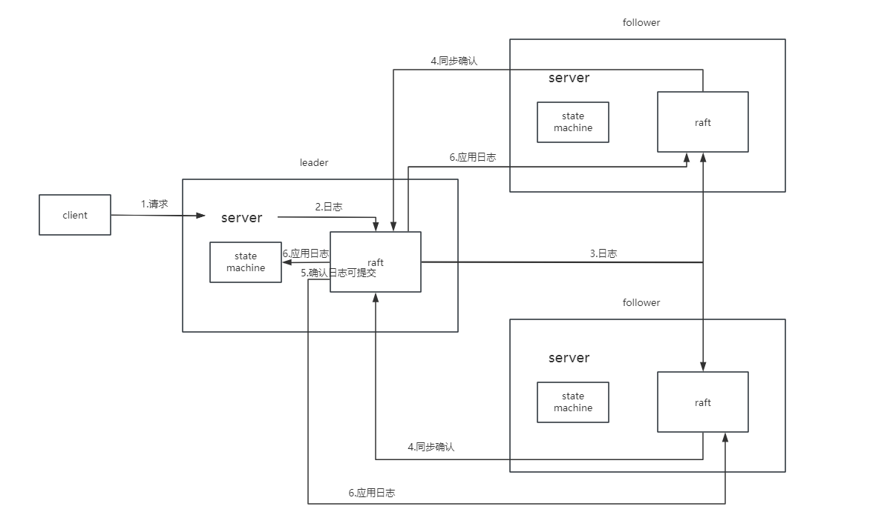

### 一、分布式系统设计三大原则CAP

1. C(consistency)：一致性。又可以称为**强一致性、线性一致性**。该项强调数据的正确性. 具体而言，每次读操作，要么读到最新，要么读失败. 这要求整个分布式系统像是一个不可拆分的整体，写操作作用于集群像作用于单机一样，具有广义的“原子性”.
2. A(availability)：可用性。该项站在使用者的角度，强调使用服务的体验.客户端的请求能够得到响应，不发生错误，也不能出现过长的等待时间.
3. P(partition tolerance)：分区容错性。系统能够在网络分区或节点之间通信发生故障时继续运行，即系统对于网络分区的故障有容忍能力。

一个**分布式系统**最多只能满足上述的两个特性（但两个中必须包括P，且CA不能同时满足），以raft作为共识算法的分布式系统满足CP，不满足A。

一个**单机系统**无需关注P，故可以同时满足CA

### 二、重点：线性一致性

参考：

[线性一致性和 Raft](https://cn.pingcap.com/blog/linearizability-and-raft)

[6.824课程中介绍的线性一致性](https://mit-public-courses-cn-translatio.gitbook.io/mit6-824/lecture-08-zookeeper/8.1)

[万字长文解析raft算法原理](https://zhuanlan.zhihu.com/p/600147978)

#### 6.824中的表述

在6.824的课程中，教授给出的解释是：判断一个系统是否线性一致性是根据**客户端的执行历史记录**（一般都能查到）来的。给出一个客户端的请求发生与响应时序图，那么如果能产生一个顺序无环的执行历史序列，并且该序列满足：
- 如果一个操作在另一个操作开始前就结束了，那么这个操作必须在执行历史中出现在另一个操作前面（线性一致的历史记录必须与请求的实际时间匹配）。
  
- 执行历史中，读操作，必须在相应的key的写操作之后。
  
- 对于整个请求历史记录，只存在一个序列，不允许不同的客户端看见不同的序列

那么这个系统产生的请求历史记录就是线性一致性的。

教授强调的是**线性一致的定义是有关历史记录的定义，而不是系统的定义。所以我们不能说一个系统设计是线性一致的，我们只能说请求的历史记录是线性一致的。**

### 三、raft如何保证线性一致性？

参考：

[etcd与线性一致性](https://boilingfrog.github.io/2021/08/30/etcd%E4%B8%ADraft%E5%AE%9E%E7%8E%B0%E7%BA%BF%E6%80%A7%E4%B8%80%E8%87%B4%E6%80%A7/#%E7%BA%BF%E6%80%A7%E4%B8%80%E8%87%B4%E6%80%A7-1)

顺序一致性（满足）、即时一致性（满足不了）、最终一致性（满足）

**强leader**和**状态机**保证了raft的线性一致性

#### 1. 顺序一致性（满足）
请求通过日志条目的形式写入server的日志中，并且对每个日志条目进行编号，保证了顺序一致性。这种方式又称预写日志（write ahead log，简称 wal）

#### 2. 最终一致性（满足）
只要保证预写日志数组中，被准许应用到状态机的部分每笔预写日志的内容都完全相同，这样就能解决写请求乱序的问题，从而达成数据的最终一致性。

又所有请求都遵循一下链路：

client->server->raft(leader)->raft(follower)

即所有follower的日志最终都会与leader的日志同步，所以每个server都有最终一致性。

#### 3.即时一致性（不满足）
raft日志的应用与响应client（响应client指的是raft通过管道传输日志提交信息给server层）是异步的，所以无法满足即时一致性。

### 四、raft为什么无法保证高可用？

raft中的请求都是两阶段提交的。leader接受到请求后，需将请求同步到所有follower中，再通过follower的响应来判断该请求是否已经同步到半数以上follower中，从而确定该条请求可提交，通知状态机应用。故若集群中大于半数的server宕机则这条请求无法应用到状态机中，客户端也就无法收到状态机传来的该条请求被应用的ack消息，那么客户端不可避免会等待（具体实现时等待只会持续一段时间），但这段等待的时间**客户端无法即时收到响应，就不算高可用了**

### 五、raft论文中的公理及其证明过程

1. **Election Safety**： 一个term内，有且只有1个leader被选出
2. **Leader Append-only**：当选为leader后，才开始接受client的日志写入请求，但不会删除或覆盖某些日志
3. **Log Matching**：当某两个日志的term和index都相同，那么该两个日志前的所有日志都相同。（附：某两个日志的term和index相同，那么这两个日志内容一定是相同的）
    
    **证明过程**:
     + 根据公理1，每个任期内只有一个leader
     + 根据公理2，每个leader只会添加日志，不会删除或覆盖，所以每个leader发出去的appendEntries请求里的日志都是唯一的，不会有相同的下标却是不同的日志内容。
     + 故只要有相同的term，就代表是同一个leader发的日志，又index相同，所以这两个日志内容一定是相同的，附得证
     + 又appendEntries在日志写入时会判断写入日志块的前一个日志下标和任期是否与被写入server里的相同下标处日志匹配，若不匹配就返回添加失败。
     + 如果一个leader在一个term里发了一个日志块给两个server，那么首先两个server接受到的该日志块里的所有日志都是相同的，并且日志块前一个index的日志（logx）也是匹配的。以此类推，那么这个logx在添加时也会经过匹配性检查，显然就可以推出，它之前的日志也是与leader匹配的。那么两个server的日志都与leader的匹配，自然两者都相同
4. **Leader Completeness**：如果某个日志已经在某个term被leader commit，那么该日志也会出现在之后的term的leader的日志中。即每个leader的日志中都保留了之前所有已经commit的日志。
    
    基于选举限制和leader只提交当前任期内的日志两个安全性限制，Leader Completeness可以实现。
    + 选举限制：比较candidate和server的最后一条日志新的程度。先比较term，term大的更新。term相同的话，再比较index，index大的更新。
    + **leader只提交当前任期内的日志**：在leader更新commitIndex时，遍历每个server的matchIndex，但是要找当前term内的最大index的日志条目，把该日志条目当作新的commitIndex。
    
    上图即说明为什么要增加这么一条提交日志的限制。
    
      假设没有这条限制。(b)中term=3,S5当选leader后很快宕机。(c)中在term==4时，S1当选leader（因S5宕机，未能向其同步心跳，所以S5的term保持为3），并通过appendEntries向S2，S3同步了(term:2,index:2)这条日志，接着收到appendEntries成功的消息后，在将matchIndex[S2]和matchInde[S3]都调整为2，然后因为半数以上都同步了这条日志，更新commitIndex=2。**更新commitIndex意味着raft服务器告诉了客户端这条命令必然会写入状态机，必然会执行。**

      (d)中，S5此时的term仍是3（就算是4照样可以赢得选举），即使有选举限制，仍然可以赢得选举（S2,S3的选票）。此时S5将(term:3,index:3)的日志同步给S1，S2, S3, S4，因为appendEntries有日志匹配判断，或判断(term:3,index:3)之前的日志条目是否与之匹配，发现(term:1,index:1)确实匹配，那么(term:3,index:3)就直接覆盖了(term:2,index:2)。很明显，客户端以为这条命令被执行了，而实际上这条命令被覆盖了，这种现象我称之为客户端与服务端的误会。

      添加了提交的限制后，在(c)这里，S1就不会将commitIndex更新为2，因为这是之前任期的日志，而S1只会找当前任期的日志，显然(term:4,index:4)还没有被半数同步，此时commitIndex=1。这样的话，即使后面(term:2,index:2)被覆盖也没事，因为client知道这条命令还没被半数同步，还不一定被执行，所以不会误会。而就如果(c)之后，S1没有宕机，那么当(term:4,index:4)也被半数同步后，S1再更新commitIndex时，发现了当前term的日志，于是将commitIndex更新为3。就算之后S1宕机，S3也不可能用(term:3,index:3)覆盖(term:2,index:2)和(term:4,index:4)，甚至它必然不会被选为leader。因为根据选举限制，term=4为最最大term，S2，S3的日志都比S5新。
5. **State Machine Safety**：server向状态机内写入的相同index的日志，日志内容也一定相同。
   
   证明：
   + 可写入状态机的日志是committed log
   + 根据公理4，每个leader都保存着所有committed log，而每个leader都企图在自己的任期内把这些日志同步到server的日志里去
   + 每个任期内server提交的日志都与该任期内的leader的日志index以及term相同，那么自然每个server之间的提交的日志也相同

### 六、多数派原则

多数派原则指的是，系统的决断无需全员参与，多数派达成的共识即可视为整个系统的答复

raft的领导者选举、日志提交（同步）都采取了多数派原则。同时多数派也提高了系统的可用性A。

#### 为何leader的日志中保留了所有committed的日志？

运用多数派原则。一条日志确认提交需要半数以上follower（假设这些follower集合为A）的同步确认，假设某条日志已被确认提交后，leader发生变更，新的leader获得了半数以上follower（假设这些follower集合为B）的选举投票。根据下面的推理可得新的leader一定已经同步了这条日志：

$$
A>{n}/{2}, B>{n}/{2} => A与B有交集
$$

### 七、两阶段提交

在整个系统层面，两阶段提交的流程可拆解如下：

（1）leader 接收到来自客户端的一笔写请求；

（2）leader 将写请求添加到本地的预写日志中，并向集群中其他节点广播同步这笔写请求. 这个过程可以称之为“提议”（proposal）；

（3）集群中各节点接收到同步请求后，会一套检验机制判断是否能执行同步（添加到预写日志）

（4）倘若集群总计半数以上的节点（包括 leader 自身）都将这笔请求添加预写日志，并给予了 leader 肯定的答复（ack），那么 leader 此时会“提交”这个请求，并给予客户端写请求已成功处理的响应；

（5）其他节点在随后的时段中，会通过与 leader 的交互（心跳或其他同步数据的请求）感知到这个“提交”动作，最终也在预写日志中提交这笔请求；

（6）被提交的预写日志具备了被应用到状态机的资格. 但应用的时机取决于实现方式，倘若只追求最终一致性，可以选择异步应用；倘若追求立即一致性，则会要求 leader 先应用到状态机，才能给予客户端 ack.

### 八、领导者选举（强leader、一主多从）

### 九、日志复制

### 十、安全性

### 十一、成员配置变更

成员变更意味着集群的成员数量改变，这与宕机重启不同，宕机重启时server或leader里的配置信息中，成员数量是不变的。而成员变更是对集群进行**扩缩容**。

**joint consensus**：两阶段提交来同步成员变更信息

把改变配置信息这条命令当作普通命令进行日志同步，只有半数成员同步了这条日志，也就是说这条日志被提交了，才能将新的成员加入集群。

### Q&A
下面通过对几个经典问题的解答，实现对 raft 算法原理的补充。部分可在上面找到答案。但这里做更完善的解答。

#### 1. 为什么能保证一个任期内至多只有一个领导者？
**简要回答：每个follower只有一个选票+多数派原则**

可以，通过选举的机制可以保证.

首先，candidate 竞选前会自增 term，因此 term 在总体上为单调递增趋势；

其次，在选举机制上，一个 term 内，一个 follower 只有一票，因此只能投票给一个 candidate；

最后，基于多数派原则，一个 candidate 只有拿到半数以上的赞同票才能当选 leader.

因此，同一个 term 内，不可能出现有两个 candidate 同时获得半数以上的赞同票，因此一个 term 至多只有一个 leader.

#### 2. 为什么能保证通过任期和索引相同的日志内容一定相同？
**简要回答:Log-Matching附结论(leader-safety+append-only)**

可以，通过选举的机制可以保证.

首先，candidate 竞选前会自增 term，因此 term 在总体上为单调递增趋势；

其次，在选举机制上，一个 term 内，一个 follower 只有一票，因此只能投票给一个 candidate；

最后，基于多数派原则，一个 candidate 只有拿到半数以上的赞同票才能当选 leader.

因此，同一个 term 内，不可能出现有两个 candidate 同时获得半数以上的赞同票，因此一个 term 至多只有一个 leader.

#### 3. 如果两个节点中分别存在一笔任期和索引均相同的日志，那么在这两笔日志之前的日志是否也保证在顺序和内容上都完全一致？
**简要回答：Log-Matching(leader-safety+append-only+prev日志匹配检查)**

#### 4. 关于选举机制方面，如何解决选票瓜分引发的问题？
**简要回答：随机选举超时时间**

#### 5. 为什么新任 leader 一定拥有旧 leader 已提交的日志？
**简要回答：选举+日志同步+多数派原则**

可以，通过选举的机制可以保证.

首先，candidate 竞选前会自增 term，因此 term 在总体上为单调递增趋势；

其次，在选举机制上，一个 term 内，一个 follower 只有一票，因此只能投票给一个 candidate；

最后，基于多数派原则，一个 candidate 只有拿到半数以上的赞同票才能当选 leader.

因此，同一个 term 内，不可能出现有两个 candidate 同时获得半数以上的赞同票，因此一个 term 至多只有一个 leader.

#### 6. 是否一项提议只需要被多数派通过就可以提交？
**简要回答：Leader Completeness**

#### 7. leader 向 follower 同步日志时，如何保证不出现乱序、丢失、重复的问题？
不乱序、不重复：follower 同步日志前，会校验上一笔日志是否和 leader 的上一笔完全一致，只有这样才会执行同步动作.

不丢失：基于 ack 机制保证. 倘若 leader 超时未收到 follower 同步日志的 ack，会重发同步日志请求.（只有同步成功才会更新nextIndex,而appendEntries时会根据nextIndex来决定发的日志）

#### 8. 如何保证各节点已提交的预写日志顺序和内容都完全一致？
**简要回答：强leader+两阶段提交**

#### 9. 如何保证状态机数据的最终一致性？
被提交的预写日志顺序和内容都必然是完全一致的.

又由于只有被提交的预写日志才能被应用到状态机，因此状态机的数据必然会按照正确的顺序和请求内容被依次更新，最终一致性得以保证.

#### 10. 如何解决网络分区引发的无意义选举问题？
倘若集群产生网络分区，部分处于小分区的节点由于无法接收到 leader 的心跳，导致进入选举流程. 又因为网络分区问题，导致选举始终无法获得多数派的响应，最终 candidate 会无限自增 term. 直到网络恢复的那一刻，由于 candidate 异常的高 term，导致 leader 退位，集群进入新一轮的选举流程.

尽管小分区中的节点由于数据的滞后不可能在选举中胜出，最后必然是大分区中的节点胜任，节点数据的一致性依然可以得到保证. 但是这个无意义的选举过程同样会导致集群陷入暂不可用的阶段. 因此，我们可以通过这样的措施来避免这类无意义的选举：

每个 candidate 发起真实选举之前，会有一个提前试探的过程，试探机制是向集群所有节点发送请求，只有得到多数派的响应，证明自己不存在网络环境问题时，才会将竞选任期自增，并且发起真实的选举流程.

#### 11. 如果保证客户端提交写请求不丢失、不重复？
由server层保证

不丢失：通过 ack 机制保证. 客户端超时未收到服务端的 ack，则会重发请求.

不重复：客户端记录写请求的序列号，与server交互时透传这个序列号. 最终由server（leader）实现对相同序列号写请求的幂等去重.