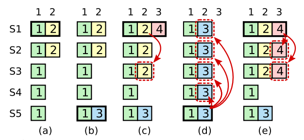

### 分布式系统设计三大原则CAP

1. C(consistency)：一致性。又可以称为**强一致性、线性一致性**。所有节点在同一时间具有相同的数据副本，即对于任意数据操作的结果在所有节点上都是一致的。
2. A(availability)：可用性。系统能够在有限的时间内响应客户端的请求，即系统一直处于可用状态，不会出现长时间的故障或无法访问的情况。
3. P(partition tolerance)：分区容错性。系统能够在网络分区或节点之间通信发生故障时继续运行，即系统对于网络分区的故障有容忍能力。

一个分布式系统最多只能满足上述的两个特性，**以raft作为共识算法的分布式系统满足CP，不满足A**

### 线性一致性

参考[线性一致性和 Raft](https://cn.pingcap.com/blog/linearizability-and-raft),[6.824课程中介绍的线性一致性](https://mit-public-courses-cn-translatio.gitbook.io/mit6-824/lecture-08-zookeeper/8.1)

如何达到线性一致性，要求服务器的每个操作都满足：

- 瞬间完成（或者原子性）

- 发生在 Inv 和 Resp 两个事件之间

- 反映出“最新”的值

在6.824的课程中，教授给出的解释是：判断一个系统是否线性一致性是根据**客户端的执行历史记录**（一般都能查到）来的。给出一个客户端的请求发生与响应时序图，那么如果能产生一个顺序无环的执行历史序列，并且该序列满足：
- 如果一个操作在另一个操作开始前就结束了，那么这个操作必须在执行历史中出现在另一个操作前面（线性一致的历史记录必须与请求的实际时间匹配）。
  
- 执行历史中，读操作，必须在相应的key的写操作之后。
  
- 对于整个请求历史记录，只存在一个序列，不允许不同的客户端看见不同的序列

那么这个系统就是线性一致性的。

教授强调的是**线性一致的定义是有关历史记录的定义，而不是系统的定义。所以我们不能说一个系统设计是线性一致的，我们只能说请求的历史记录是线性一致的。**

### raft如何保证线性一致性？

参考[etcd与线性一致性](https://boilingfrog.github.io/2021/08/30/etcd%E4%B8%ADraft%E5%AE%9E%E7%8E%B0%E7%BA%BF%E6%80%A7%E4%B8%80%E8%87%B4%E6%80%A7/#%E7%BA%BF%E6%80%A7%E4%B8%80%E8%87%B4%E6%80%A7-1)

一般在讨论时可以从线性一致性读，线性一致性写两个方面进行考虑

#### 线性一致性写

所有的写操作，都要经过leader节点，一旦leader被选举成功，就可以对客户端提供服务了。客户端提交每一条命令都会被按顺序记录到leader的日志中，每一条命令都包含term编号和顺序索引，然后向其他节点并行发送AppendEntries RPC用以复制命令(如果命令丢失会不断重发)，当复制成功也就是大多数节点成功复制后，leader就会提交命令，即执行该命令并且将执行结果返回客户端，raft保证已经提交的命令最终也会被其他节点成功执行。因为日志是顺序记录的，并且有严格的确认机制（commitIndex），所以可以认为写是满足线性一致性的。**即每个写操作发生的顺序与请求发生的先后顺序一致。因为不涉及读操作，故满足了这个限制就可以说这个系统线性一致性写。**

#### 线性一致性读

ReadIndex算法：

每次读操作的时候记录此时集群的commited index，当状态机的apply index大于或等于commited index时才读取数据并返回。由于此时状态机已经把读请求发起时的已提交日志进行了apply动作，所以此时状态机的状态就可以反应读请求发起时的状态，符合线性一致性读的要求。

总结：**强leader**和**状态机**保证了raft的线性一致性读/写

### 公理

1. **Election Safety**： 一个term内，有且只有1个leader被选出
2. **Leader Append-only**：当选为leader后，才开始接受client的日志写入请求，但不会删除或覆盖某些日志
3. **Log Matching**：当某两个日志的term和index都相同，那么该两个日志前的所有日志都相同。（附：某两个日志的term和index相同，那么这两个日志内容一定是相同的）
    
    **证明过程**:
     + 根据公理1，每个任期内只有一个leader
     + 根据公理2，每个leader只会添加日志，不会删除或覆盖，所以每个leader发出去的appendEntries请求里的日志都是唯一的，不会有相同的下标却是不同的日志内容。
     + 故只要有相同的term，就代表是同一个leader发的日志，又index相同，所以这两个日志内容一定是相同的，附得证
     + 又appendEntries在日志写入时会判断写入日志块的前一个日志下标和任期是否与被写入server里的相同下标处日志匹配，若不匹配就返回添加失败。
     + 如果一个leader在一个term里发了一个日志块给两个server，那么首先两个server接受到的该日志块里的所有日志都是相同的，并且日志块前一个index的日志（logx）也是匹配的。以此类推，那么这个logx在添加时也会经过匹配性检查，显然就可以推出，它之前的日志也是与leader匹配的。那么两个server的日志都与leader的匹配，自然两者都相同
4. **Leader Completeness**：如果某个日志已经在某个term被leader commit，那么该日志也会出现在之后的term的leader的日志中。即每个leader的日志中都保留了之前所有已经commit的日志。
    
    基于选举限制和leader只提交当前任期内的日志两个安全性限制，Leader Completeness可以实现。
    + 选举限制：比较candidate和server的最后一条日志新的程度。先比较term，term大的更新。term相同的话，再比较index，index大的更新。
    + **leader只提交当前任期内的日志**：在leader更新commitIndex时，遍历每个server的matchIndex，但是要找当前term内的最大index的日志条目，把该日志条目当作新的commitIndex。
    
    上图即说明为什么要增加这么一条提交日志的限制。
    
      假设没有这条限制。(b)中term=3,S5当选leader后很快宕机。(c)中在term==4时，S1当选leader（因S5宕机，未能向其同步心跳，所以S5的term保持为3），并通过appendEntries向S2，S3同步了(term:2,index:2)这条日志，接着收到appendEntries成功的消息后，在将matchIndex[S2]和matchInde[S3]都调整为2，然后因为半数以上都同步了这条日志，更新commitIndex=2。**更新commitIndex意味着raft服务器告诉了客户端这条命令必然会写入状态机，必然会执行。**

      (d)中，S5此时的term仍是3（就算是4照样可以赢得选举），即使有选举限制，仍然可以赢得选举（S2,S3的选票）。此时S5将(term:3,index:3)的日志同步给S1，S2, S3, S4，因为appendEntries有日志匹配判断，或判断(term:3,index:3)之前的日志条目是否与之匹配，发现(term:1,index:1)确实匹配，那么(term:3,index:3)就直接覆盖了(term:2,index:2)。很明显，客户端以为这条命令被执行了，而实际上这条命令被覆盖了，这种现象我称之为客户端与服务端的误会。

      添加了提交的限制后，在(c)这里，S1就不会将commitIndex更新为2，因为这是之前任期的日志，而S1只会找当前任期的日志，显然(term:4,index:4)还没有被半数同步，此时commitIndex=1。这样的话，即使后面(term:2,index:2)被覆盖也没事，因为client知道这条命令还没被半数同步，还不一定被执行，所以不会误会。而就如果(c)之后，S1没有宕机，那么当(term:4,index:4)也被半数同步后，S1再更新commitIndex时，发现了当前term的日志，于是将commitIndex更新为3。就算之后S1宕机，S3也不可能用(term:3,index:3)覆盖(term:2,index:2)和(term:4,index:4)，甚至它必然不会被选为leader。因为根据选举限制，term=4为最最大term，S2，S3的日志都比S5新。
5. **State Machine Safety**：server向状态机内写入的相同index的日志，日志内容也一定相同。
   
   证明：
   + 可写入状态机的日志是committed log
   + 根据公理4，每个leader都保存着所有committed log，而每个leader都企图在自己的任期内把这些日志同步到server的日志里去
   + 每个任期内server提交的日志都与该任期内的leader的日志index以及term相同，那么自然每个server之间的提交的日志也相同

### 领导者选举

### 日志复制

### 安全性

### 成员配置变更

成员变更意味着集群的成员数量改变，这与宕机重启不同，宕机重启时server或leader里的配置信息中，成员数量是不变的。而成员变更是对集群进行**扩缩容**。

**joint consensus**：两阶段提交来同步成员变更信息

把改变配置信息这条命令当作普通命令进行日志同步，只有半数成员同步了这条日志，也就是说这条日志被提交了，才能将新的成员加入集群。