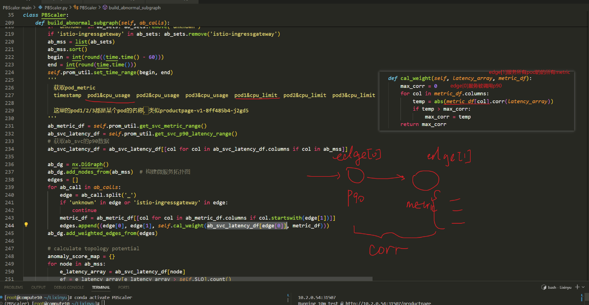
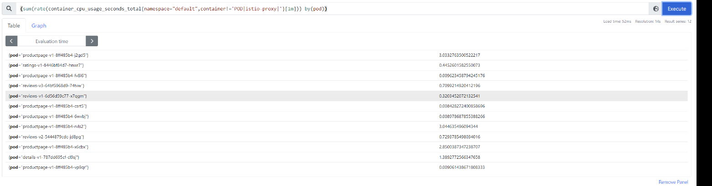
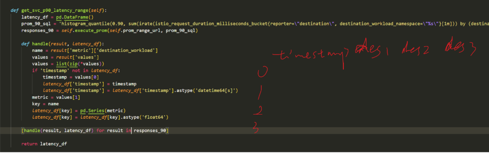

# 问题
1. slo-predict的特征向量组成是
    ```
    x = [svc_index_1, svc_qps_1, svc_count_1,
                svc_index_2, svc_qps_2, svc_count_2,
                ...
                svc_index_n, svc_qps_n, svc_count_n,
                slo_reward]
    ```
    使用服务的qps,pod_count来预测，也就是论文中的w和r,这里是否可以改进

    是否可以引进另外的metric

2. 测试预测器的运行时间与哪些因素有关，包括模型复杂度、特征向量大小


# 算法和源码
## 1.获取abnormal_calls
abnormal_calls如何获得?通过prometheus_client获得每个call的lantency
```python
    def get_abnormal_calls(self):
        # get all call latency last 1min
        begin = int(round((time.time() - 60)))
        end = int(round(time.time()))
        self.prom_util.set_time_range(begin, end)
        # slo Hypothesis testing
        ab_calls = []
        call_latency = self.prom_util.get_call_latency()
        for call, latency in call_latency.items():
            if latency > self.SLO * (1 + ALPHA / 2):
                ab_calls.append(call)
        # call_latency = self.prom_util.get_call_p90_latency_range()
        # for call, latency in call_latency.iteritems():
        #     if call != 'timestamp':
        #         _, p = scipy.stats.ttest_1samp(latency.values, self.SLO * self.alpha, alternative='greater')
        #         if p < self.conf:
        #             ab_calls.append(call)
        return ab_calls
```
## 2.生成sub_graph
论文里子图生成的代码如下，子图包含每个abornal_edge的起点和终点以及边上的权，其中cal_weight用来计算子图中的转移矩阵边权
```python
    def build_abnormal_subgraph(self, ab_calls):
        """
            1. collect metrics for all abnormal services
            2. build the abnormal subgraph with abnormal calls
            3. weight the c by Pearson correlation coefficient
        """
        ab_sets = set()
        for ab_call in ab_calls:
            ab_sets.update(ab_call.split('_'))
        if 'unknown' in ab_sets: ab_sets.remove('unknown')
        if 'istio-ingressgateway' in ab_sets: ab_sets.remove('istio-ingressgateway')
        ab_mss = list(ab_sets)
        ab_mss.sort()
        begin = int(round((time.time() - 60)))
        end = int(round(time.time()))
        self.prom_util.set_time_range(begin, end)
        '''
        get_svc_metric_range()作用

          获取pod_metric
          timestamp  pod1&cpu_usage  pod2&cpu_usage  pod3&cpu_usage  pod1&cpu_limit  pod2&cpu_limit  pod3&cpu_limit  pod1&mem_usage  pod2&mem_usage  pod3&mem_usage
          
          这里的pod1/2/3都是某个pod的名称，类似productpage-v1-8ff485b4-j2gd5
        '''
        ab_metric_df = self.prom_util.get_svc_metric_range()
        ab_svc_latency_df = self.prom_util.get_svc_p90_latency_range()
        # 获取ab_svc的p90数据
        ab_svc_latency_df = ab_svc_latency_df[[col for col in ab_svc_latency_df.columns if col in ab_mss]]

        ab_dg = nx.DiGraph()
        ab_dg.add_nodes_from(ab_mss)  # 构建ab_svc_subgraph
        edges = []
        for ab_call in ab_calls:
            edge = ab_call.split('_')
            if 'unknown' in edge or 'istio-ingressgateway' in edge:
                continue
            metric_df = ab_metric_df[[col for col in ab_metric_df.columns if col.startswith(edge[1])]]
            edges.append((edge[0], edge[1], self.cal_weight(ab_svc_latency_df[edge[0]], metric_df))) 
        ab_dg.add_weighted_edges_from(edges)

        # calculate topology potential 
        anomaly_score_map = {}  # 论文中的anomaly degree
        for node in ab_mss:
            e_latency_array = ab_svc_latency_df[node]
            ef = e_latency_array[e_latency_array > self.SLO].count()
            anomaly_score_map[node] = ef
        personal_array = self.cal_topology_potential(ab_dg, anomaly_score_map)  # 论文中的anomaly potential

        return ab_dg, personal_array

```
cal_weight函数用来计算子图的边权，用来构成pagerank算法中转移矩阵：
```python
    # 计算pagerank算法的转移矩阵Pij
    def cal_weight(self, latency_array, metric_df):
        max_corr = 0
        for col in metric_df.columns:
            temp = abs(metric_df[col].corr(latency_array))
            if temp > max_corr:
                max_corr = temp
        return max_corr
```
Pij = max(当前节点的p90延迟, 下游节点的所有metric)


prometheus查询语句当标签是Pod时，查询结果:


定义了prometheus client，实现了多个查询接口，其中一个如下，红色字体是latency_df的数据结构


```python
# Get the response time of the invocation edges
def collect_call_latency(config: Config, _dir: str):
    call_df = pd.DataFrame()

    prom_util = PrometheusClient(config)
    # P50，P90，P99
    prom_50_sql = 'histogram_quantile(0.50, sum(irate(istio_request_duration_milliseconds_bucket{reporter=\"destination\", destination_workload_namespace=\"%s\"}[1m])) by (destination_workload, destination_workload_namespace, source_workload, le))' % config.namespace
    prom_90_sql = 'histogram_quantile(0.90, sum(irate(istio_request_duration_milliseconds_bucket{reporter=\"destination\", destination_workload_namespace=\"%s\"}[1m])) by (destination_workload, destination_workload_namespace, source_workload, le))' % config.namespace
    prom_99_sql = 'histogram_quantile(0.99, sum(irate(istio_request_duration_milliseconds_bucket{reporter=\"destination\", destination_workload_namespace=\"%s\"}[1m])) by (destination_workload, destination_workload_namespace, source_workload, le))' % config.namespace
    responses_50 = prom_util.execute_prom(config.prom_range_url, prom_50_sql)
    responses_90 = prom_util.execute_prom(config.prom_range_url, prom_90_sql)
    responses_99 = prom_util.execute_prom(config.prom_range_url, prom_99_sql)
    '''
    responses_50 = [
        {
            "metric": {
                "destination_workload": "service-a",
                "destination_workload_namespace": "default",
                "source_workload": "service-b",
                "le": "0.5"
            },
            "values": [
                [1623074400, "0.23"],
                [1623074460, "0.25"],
                ...
            ]
        },
        {
            "metric": {
                "destination_workload": "service-a",
                "destination_workload_namespace": "default",
                "source_workload": "service-c",
                "le": "0.5"
            },
            "values": [
                [1623074400, "0.18"],
                [1623074460, "0.20"],
                ...
            ]
        },
        ...
    ]
    '''
    def handle(result, call_df, type):
        # source_workload -> destination_workload
        name = result['metric']['source_workload'] + '_' + result['metric']['destination_workload']
        values = result['values']
        values = list(zip(*values))
        '''
        values = [
            (timestamp1, timestamp2, timestamp3, ...),
            (value1, value2, value3, ...)
        ]
        '''
        if 'timestamp' not in call_df:
            timestamp = values[0]
            call_df['timestamp'] = timestamp
            call_df['timestamp'] = call_df['timestamp'].astype('datetime64[s]')
        metric = values[1]
        key = name + '&' + type
        call_df[key] = pd.Series(metric)
        call_df[key] = call_df[key].astype('float64')

    '''
    call_df:
        timestamp source_workload_destination_workload&50 各种source_workload_destination_workload&50 ......
    0
    1   
    2 
    '''
    [handle(result, call_df, 'p50') for result in responses_50]
    [handle(result, call_df, 'p90') for result in responses_90]
    [handle(result, call_df, 'p99') for result in responses_99]

    path = os.path.join(_dir, 'call.csv')
    call_df.to_csv(path, index=False)

```