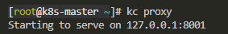
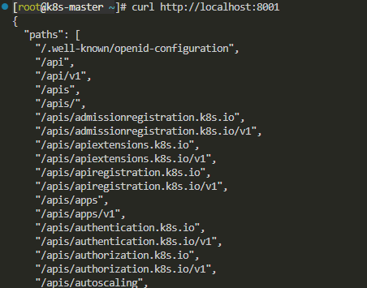
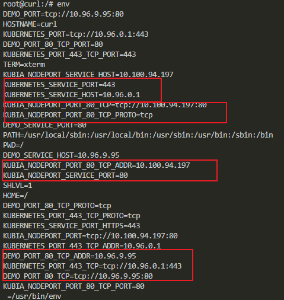
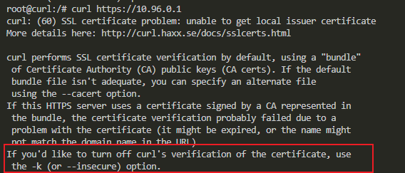
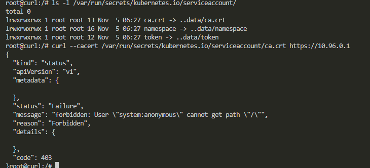
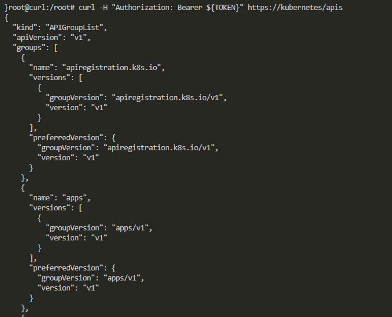
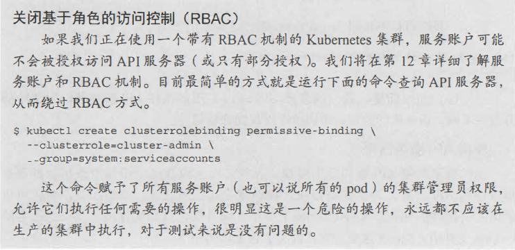
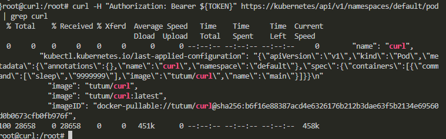
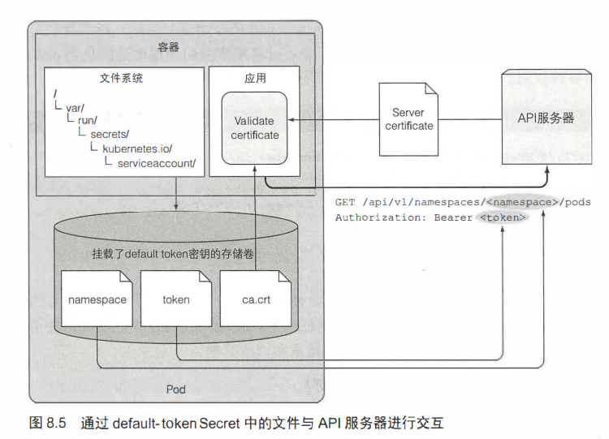
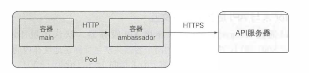

# 使用kubectl proxy作为代理访问apiserver

一个终端输入```kc proxy```开启代理，8001是代理服务器监听的端口，代理服务器帮请求发起者处理服务器验证、加密、授权等。



再起一个终端访问：



# pod内部访问apiServer

默认情况下，每个容器内部都有一套自己的环境变量，而集群中同一命名空间里的所有服务的clusterip和port都会被记录在每个容器的环境变量中。所以理论上每个容器都可以访问集群中的服务。

进入容器查看环境变量



其中apiServer的服务是kubernetes，即KUBERNETES_SERVICE_HOST和KUBERNETES_SERVICE_PORT。说明容器内部对apiserver的访问都是通过https协议。访问如下：



curl提示接受服务器的响应时需要检验服务器证书，提示需要提供一个本地的CA证书，才能够验证服务器证书签发的权威性和安全性。

## CA证书和服务器证书

服务器证书由服务器申请，某个CA组织授权和颁发，用于在客户端请求时，服务器发送该证书给客户端，供客户端验证。

CA证书是客户端持有的，某个CA组织的身份证书，用于验证服务器发送过来的服务器证书的颁发者（某个CA组织）的身份，是否与CA证书上的身份一致。

curl 命令可以通过 --cacert选项来指定CA证书，从而验证服务器方的CA组织的身份

每个pod被创建时，都会挂载一个secret卷（defalut-token-xyz）到 /var/run/secrets/kubernetes.io/serviceaccount/ 目录，卷目录下的ca.crt即为CA证书

结果显示：



仍然有问题，显示访问被forbidden。因为服务器端不允许该用户访问，即需要获取apiserver的授权，通过服务账号的持有者令牌即可获得授权，同样在defalut-token-xyz卷内。

```yaml
TOKEN=$(cat /var/run/secrets/kubernetes.io/serviceaccount/token)
```



但是访问pod仍然不行，访问仍然被禁止


需要如下操作：



查找本pod的信息：



包括所有pod的信息都可以查询的到。

## 流程

简单说明一下在pod中运行的应用如何正确访问Kubemetes的 API:
- 应用应该验证API服务器的证书是否是证书机构所签发，这个证书是在ca.crt文件中。
- 应用应该将它在token文件中持有的凭证通过Authorization标头来获得API服务器的授权。
- 当对pod所在命名空间的API对象进行CRUD操作时，应该使用namespace文件来传递命名空间信息到API服务器。



# 使用ambassader容器简化apiserver的访问



在pod内部再启动一个有kc proxy功能的容器

```yaml
apiVersion: v1
kind: Pod
metadata:
  name: curl-with-ambassador
spec:
  containers:
  - name: main
    image: tutum/curl
    command: ["sleep", "9999999"]
  - name: ambassador
    image: luksa/kubectl-proxy:1.6.2
```

访问ambassador使用pod的8001端口，ambassador监听8001端口。因为pod内部所有容器共享相同的网络接口，所以这两个8001是同一个，所以可以做到main容器访问ambassador容器，并由ambassdor容器访问apiserver。

其中main访问ambassador使用http协议，而