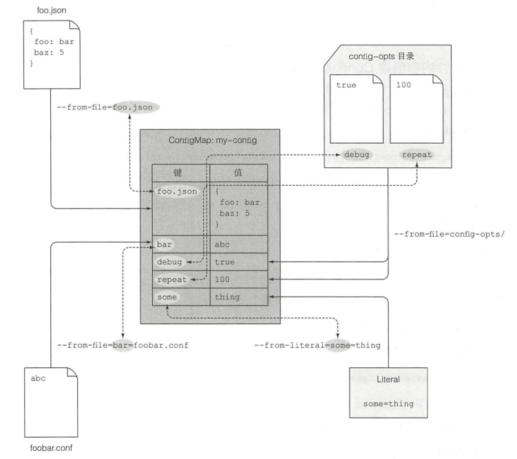
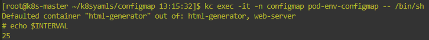
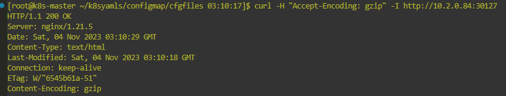
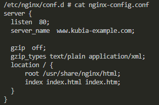
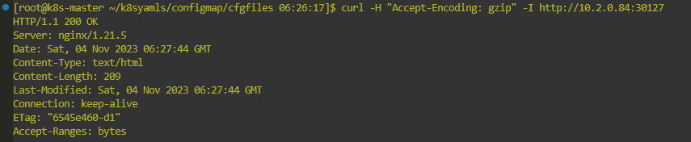

# 应用的配置
 
1. 通过dockerfile配置应用
2. 在pod配置文件中配置应用
3. 通过容器的环境变量注入配置
4. configmap

## 通过dockerfile配置应用 
ENTRYPOINT + CMD的组合可以在容器创建时传入参数，做到相同的镜像产生配置不同的容器。

## 在pod配置文件中配置应用

ENTRYPOINT + CMD 实际上就是pod的spec.containers.command和spec.containers.args

```yaml
kind: Pod
spec: 
  containers:
  - image: xxx
    command: ["可执行命令"]
    args: ["arg1", "arg2", ..]
```

## 通过容器的环境变量注入配置

每个容器都有自己的环境变量

```yaml
kind: Pod 
spec: 
    containers: 
    - image: luksa/fortune:env
    env: 
    - name: INTERVAL 
        value: "30" 
    name: html-generator
```

在镜像创建的可执行文件内，使用$INTERVAL即可

## 使用configmap注入配置
因为不管使用pod.yaml还是环境变量还是dockerfile，都是一种相对聚合的方式，如果对于相同的pod想用不同的配置的话，这几种方式就无法办到。也就是当有了在多个环境中复用pod的定义的话，需要有一种资源，可以把配置解耦出来。这个资源就是Configmap。

k8s 允许把配置选项分离到单独的资源对象ConfigMap中。配置项为键值对，值可以是字面量，也可以是conf文件。如下形式：

[key1 = val1]  
[file.conf = file]

创建configmap两种方式：直接指定配置键值对、直接引用conf文件，直接引用整个目录下的conf文件（这种方式会创建多个条目，每个条目都是一个文件名和文件内容的映射）

```shell
kubectl create configmap myconfigmap --from-literal=foo=bar --from-literal=bar=baz --from-literal=one=two
kubectl create configmap my-config --from-file=config-file.conf 
kubectl create configmap my -config --from-file=/path/to/dir 
```
上述的--from-literal和--from-file可以一起使用



使用时pod必须与configmap处于同一个namespace

### 容器引入configmap条目的方式

1. 设置单个环境变量引入configmap内的一个条目
   ns,pod及svc配置如下
```yaml
apiVersion: v1
kind: Namespace
metadata:
  name: configmap

---
apiVersion: v1
kind: Pod
metadata:
  name: pod-env-configmap
  namespace: configmap
  labels:
    app: pod-env-configmap
spec:
  containers:
  - image: nuaaxyli/fortune:env
    name: html-generator
    env: 
    - name: INTERVAL
      valueFrom:
        configMapKeyRef:
          name: config
          key: sleep-interval
    volumeMounts:
    - name: html
      mountPath: /var/htdocs
  - image: nginx:alpine
    name: web-server
    volumeMounts:
    - name: html
      mountPath: /usr/share/nginx/html
      readOnly: true
    ports:
    - containerPort: 80
      protocol: TCP
  volumes:
  - name: html
    emptyDir: {}
--- 
apiVersion: v1
kind: Service
metadata:
  name: svc-env-configmap
  namespace: configmap
spec:
  type: NodePort
  selector:
    app: pod-env-configmap
  ports:
  - port: 8080
    targetPort: 80
    nodePort: 30127
    
```
   configmap配置如下:
   ```yaml
    apiVersion: v1
    data:
        sleep-interval: "15"
    kind: ConfigMap
    metadata:
        name: config
        namespace: configmap
   ```
   结果：
   

   使用环境变量暴露configmap的方式时，**configmap的更新不会触发pod的更新**

2. 将configmap内所有条目都传递给容器
```yaml
spec:
  containers:
  - image:
    name: 
    envFrom:
    - prefix: CONFIG_  // 引入后每个环境变量的前缀，也可以为空
        configMapRef:
           name: configmap
```
这种方式下要注意config条目的key的命名不能带有"-"符号，不合法的命名k8s不会进行转化，而是直接抛弃这个条目  

3. 传递configmap条目作为命令行参数
4. 使用configmap卷将条目暴露为文件
   configmap资源内的每个条目都会对应的在卷目录下生成key为文件名的文件，然后通过挂载，把这些配置文件挂载到对应容器的某个目录，容器内的应用程序会获取该目录下的配置文件
   pod，svc，ns配置：
```yaml
apiVersion: v1
kind: Namespace
metadata:
  name: configmap

---
apiVersion: v1
kind: Pod
metadata:
  name: pod-env-configmap
  namespace: configmap
  labels:
    app: pod-env-configmap
spec:
  containers:
  - image: nuaaxyli/fortune:env
    name: html-generator
    env:
    - name: INTERVAL
      valueFrom:   // 通过环境变量引入configmap条目
        configMapKeyRef:
          name: config-fortune
          key: sleep-interval
    volumeMounts:
    - name: html
      mountPath: /var/htdocs
  - image: nginx:alpine
    name: web-server
    volumeMounts:
    - name: html
      mountPath: /usr/share/nginx/html
      readOnly: true
    - name: config-nginx    // 通过configmap卷引入configmap条目
      mountPath: /etc/nginx/conf.d
      readOnly: true
    ports:
    - containerPort: 80
      protocol: TCP
  volumes:
  - name: html
    emptyDir: {}
  - name: config-nginx
    configMap:
      name: config-nginx
--- 
apiVersion: v1
kind: Service
metadata:
  name: svc-env-configmap
  namespace: configmap
spec:
  type: NodePort
  selector:
    app: pod-env-configmap
  ports:
  - port: 8080
    targetPort: 80
    nodePort: 30127
```
configmap配置：
```yaml
apiVersion: v1
data:
  sleep-interval: "15"
kind: ConfigMap
metadata:
  name: config-fortune
  namespace: configmap

---
apiVersion: v1
data:
  nginx-config.conf: |
    server {
      listen  80;
      server_name  www.kubia-example.com;

      gzip  on;
      gzip_types text/plain application/xml;
      location / {
          root /usr/share/nginx/html;
          index index.html index.htm;
      }
    }
kind: ConfigMap
metadata:
  name: config-nginx
  namespace: configmap
```
查看nginx-server是否已配置压缩：



注意，这里用两个不同configmap配置同一个pod内的不同容器的做法不是很好。

**重要：**

将configmap暴露为卷的形式注入配置可以做到应用配置的**热更新**，而其他方式不管是不适用configmap的形式注入配置，还是以环境变量或命令行参数引用config条目的方式，都只能在修改配置文件后，删除pod并新建pod才能更新。

```shell
kc edit -n configmap configmaps config-nginx -c web-server -- /bin/sh
kc exec -it -n configmap pod-env-configmap -c web-server -- /bin/sh
```
kc edit 把 gzip:on改为了gzip:off，进入容器查看结果：



但是应用程序nginx不会去监听配置文件的更改，需要手动通知（nginx -s reload重新加载配置文件）：
```shell
kc exec -it -n configmap pod-env-configmap -c web-server -- nginx -s reload
```
配置修改成功，并且kc describe发现未出现pod重建事件


configmap对象更新后，configmap卷的更新是一次性的，即不会出现滚动更新，因为如果滚动更新的话，有些监听配置文件的应用就会自动重载，这显然不正确。一次性更新通过符号链接实现。**另外，如果挂载的不是整个目录而是单个文件，configmap的更新不会对卷内的文件产生影响。**

**问题**：
可以想象，配置更新实际上会产生很多问题，前几种方法会引起相同pod之间的差异，而使用configmap卷的方式也会导致一段时间的一致性
