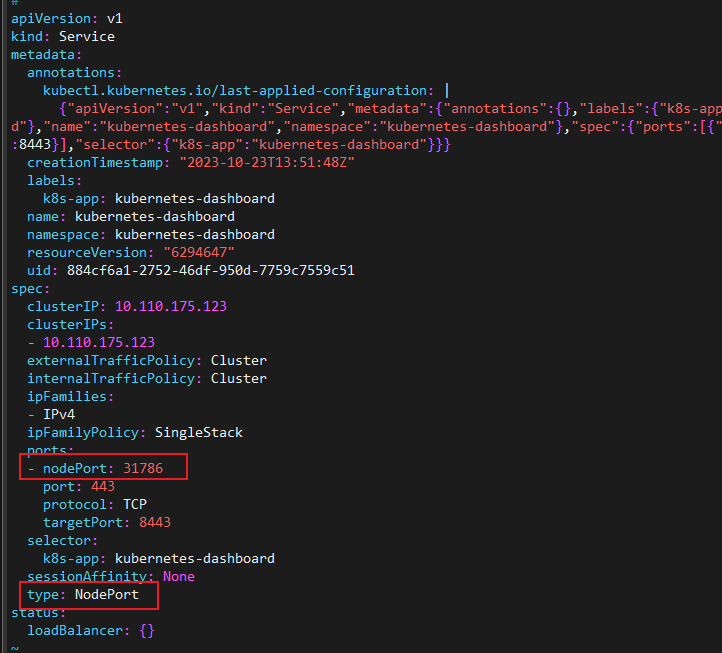
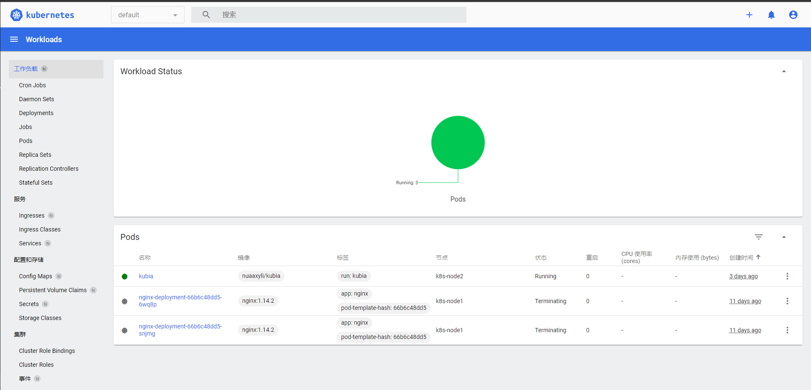

## 步骤1
拉取并应用kubenetes-dashboard的yaml文件：
```shell
kubectl apply -f https://raw.githubusercontent.com/kubernetes/dashboard/v2.7.0/aio/deploy/recommended.yaml
```
集群会创建pod运行dashboard应用（在命名空间kubernetes-dashboard），并以ClusterIP的形式暴露服务，目前只能集群内部访问

## 步骤2

修改服务的暴露方式，以使服务可外部访问：
```shell
kc edit svc -n kubernetes-dashboard kubernetes-dashboard
```

可以从这个服务的yaml文件中（或者kubectl get svc）找到NodePort

在openstack平台里，集群安全组打开NodePort这个端口

使用https协议访问 节点IP:Nodeport 即可
```
https://10.2.0.84:31786/
```
## 步骤3

获取token
```shell
kubectl -n kube-system describe $(kubectl -n kube-system get secret -n kube-system -o name | grep namespace) | grep token
```

输入token登录dashboard


这种情况每次登录需要重新获取token，不太方便。可以使用kubeconfig登录