# 将应用作为服务暴露


## kubectl expose命令

```shell
kubectl expose (-f FILENAME | sourceTYPE sourceNAME) [--port=port] [--protocol=TCP|UDP] [--target-port=number-or-name] [--name=name] [--external-ip=external-ip-of-service] [--type=service type]
```

作用：命令将**资源**暴露为新的**Kubernetes Service**。暴露服务的方式主要为了防止pod的销毁导致生成新的pod时，podIP会发生变化，而外部访问时不需要知道podIP的变化，所有外部访问应用不通过访问podIP，而是通过访问服务。服务有多种类型，但基本的思路都是将服务对外提供一个静态IP或静态Port，外部请求永远只访问这个静态的IP或Port，而内部流量的流向不同服务类型会有不同的处理方式。

资源可以分为以下几种：
- pod（po）
- service（svc）
- replication controller（rc）
- deployment（deploy）
- replica set（rs）
## endpoint资源
记录服务内所有pod的虚拟IP和虚拟端口

endpoint与对应service的namespace和name必须相同

服务内请求重定向并不是通过pod选择器，而是通过endpoint资源。所以实际上**pod选择器并不是必须的**。并且可以把**外部Ip**放到endpoint列表内。（当服务想访问一个不在k8s集群内的服务时，可以通过这种方式）

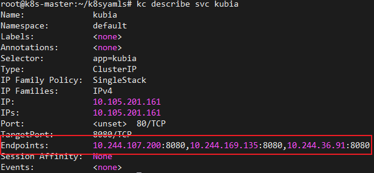

有pod选择器的情况下，svc会自动生成endpoint。没有pod选择器，手动配置服务的endpoint：


## 暴露服务的方式
服务类型有以下几种：
- NodePort（LoadBalane是其中一种）
- ClusterIP
- Ingress

服务中pod的端口都是统一暴露的，即如果服务定义了暴露端口a（这里指的是targetPort），那么服务内的所有pod都暴露端口a。

一个服务可以暴露多个端口

## ClusterIP

服务暴露默认类型为ClusterIP，即这个服务有一个内部IP，只允许在内部访问。

最简单的方式创建，通过selector将所有带有app=kubia的label的pod归为该服务所有，指定port和targetport
```yaml
apiVersion: v1
kind: Service
metadata:
  name: kubia
spec:
  ports:
  - port: 80
    targetPort: 8080
  selector:
    app: kubia
```

每个服务内的pod都会把clusterIP和port记录在环境变量里。某个服务a想要与另一个服务b产生联系，那么就可以把这个服务b的clusterIP写入服务a pod里的环境变量里。下图kubia-8mvp2是kubia服务里的某个pod
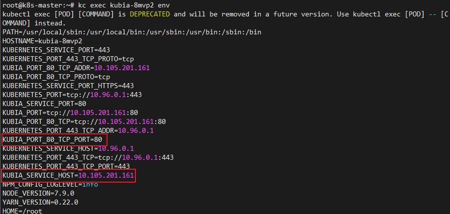
**集群内部如何访问ClusterIP服务？**


## NodePort

每个节点都会提供一个相同的静态端口用于访问，这个端口即为NodePort。

外部访问的节点与实际响应的节点不是同一个：
外部访问某个节点的某个端口后，请求不一定重定向到该节点，而是将请求发往该服务，由服务随机重定向到某个节点。这会导致更多的网络消耗，配置```spec.externalTrafficPolicy: local```可以实现接受请求的节点就是处理请求的服务器。

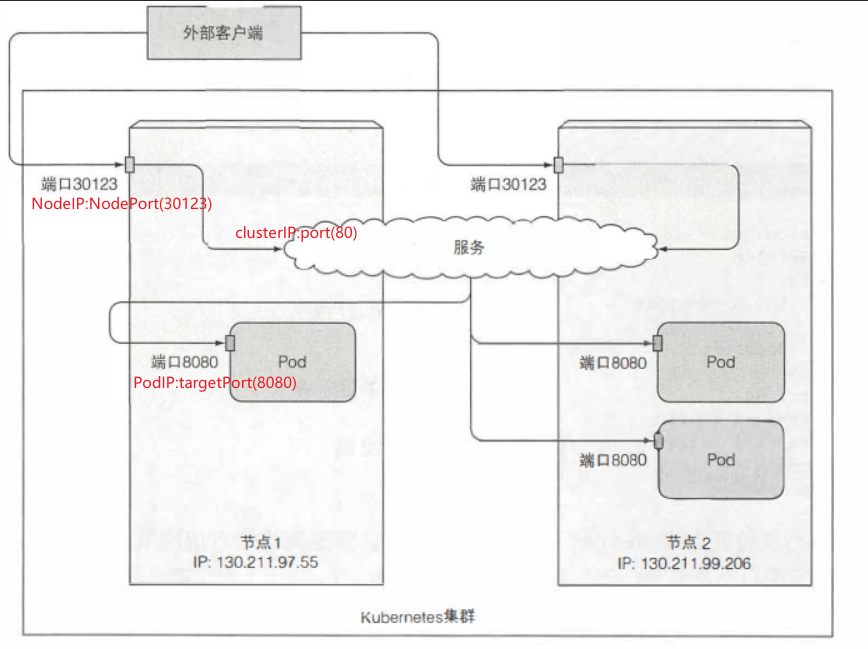
配置文件
```yaml
spec:
  type: NodePort
  ports:
    - protocol: TCP
      port: 80
      targetPort: 8080
      nodePort: 30123
```

### 三个端口
nodePort是节点上监听的端口
port是clusterIP上监听的端口
targetPort是Pod上监听的端口

nodePort是最外层的端口，监听节点的外部请求。然后将请求转发到clusterIP（内部访问）上的端口，然后再请求转发给targetPort，也就是Pod正在监听的端口

### 如何访问NodePort
- clusterIP:port 集群内部服务访问
- NodeIP:NodePort 节点外部服务访问

外部如何访问NodePort服务：
1. 获取NodeIP，这个不多说
2. 获取NodePort: 通过```kc describe po <pod name>```,```kc describe svc <svc name>```,```kc get pod <pod name> -o wide```都可以查看

## loadBalancer

在nodeport外层再套一个外部服务支持的负载均衡器

流量从负载均衡器流向nodeport

如果没有外部提供的负载均衡器或者内部插件，在创建好lB服务后，服务的externalIP属性就会显示<pending>，一直无法获取。

也可以通过安装Metallb组件，实现k8s内部提供负载均衡服务

### 部署metallb
```shell
wget https://github.com/metallb/metallb/archive/refs/tags/v0.12.1.tar.gz
tar -zxvf v0.12.1.tar.gz
cd /metallb-0.12.1/manifests
kc apply -f namespace.yaml
kc apply -f metallb.yaml
```

共有layer2、BGP两种模式

配置一个layer2模式的metallb
```shell
vi example-layer2-config.yaml
```
```yaml
apiVersion: v1
kind: ConfigMap
metadata:
  namespace: metallb-system
  name: config
data:
  config: |
    address-pools:
    - name: my-ip-space
      protocol: layer2
      addresses:
      - 10.10.10.200-10.10.10.250  // 这里要改成和集群同网段的可用IP范围，但不能与集群已用的IP冲突
```

所有工作负载：
Controller：Deployment，用于监听 Service 的变更，分配/回收 IP 地址。
Speaker：DaemonSet，对外广播 Service 的 IP 地址。把服务类型为LoadBalancer的服务的EXTERNAL-IP公布到网络中去，确保客户端能够正常访问到这个IP。

查看metallb-system命名空间下的所有pod，发现controller不是在控制节点：

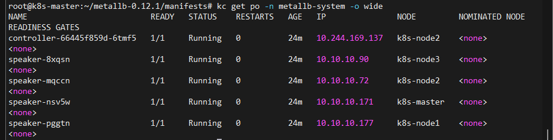


## Ingress
>七层调度器，引入集群外部流量的方式

### 组成

- ingress controller：将新加入的Ingress转化成Nginx的配置文件并使之生效。
- ingress服务：将Nginx的配置抽象成一个Ingress对象，每添加一个新的服务只需写一个新的Ingress的yaml文件即可。

### 工作流程

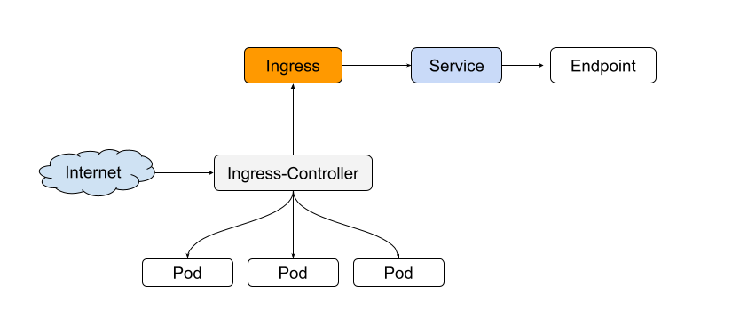


### 反向代理和正向代理

- 正向代理需要你主动设置代理服务器ip或者域名进行访问，由设置的服务器ip或者域名去获取访问内容并返回
- 反向代理不需要你做任何设置，直接访问服务器真实ip或者域名，但是服务器内部会自动根据访问内容进行跳转及内容返回，你不知道它最终访问的是哪些机器。

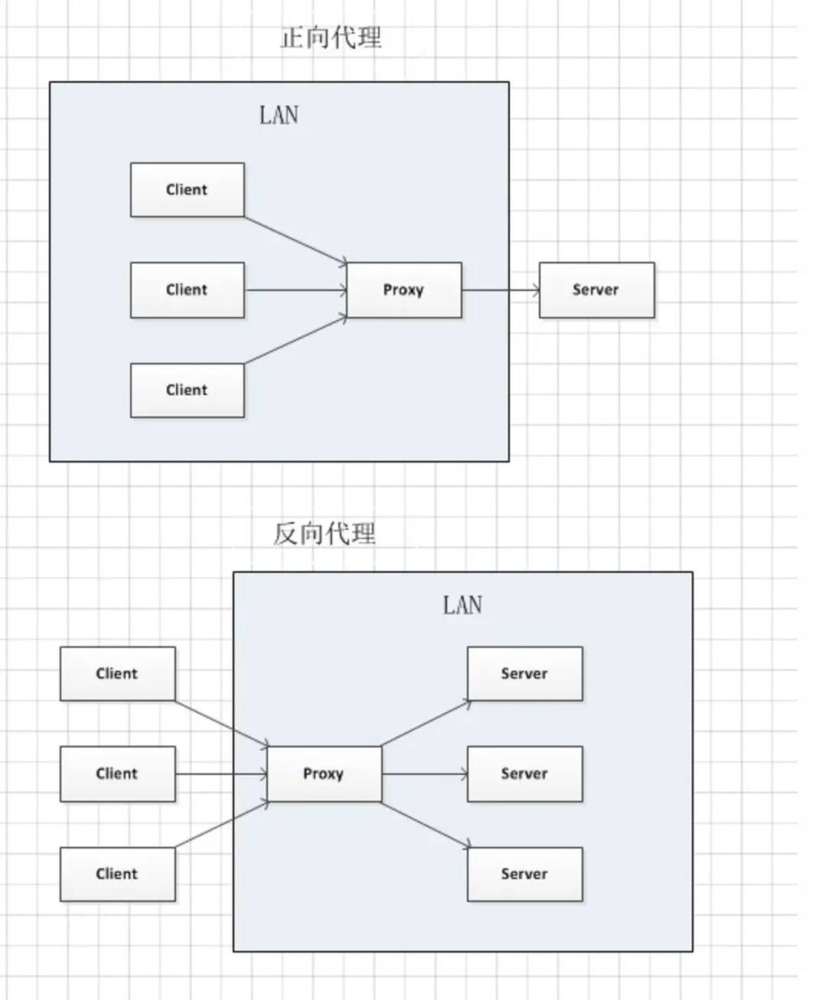

### nginx

在这里主要作为反向代理服务器，可实现负载均衡和虚拟主机（同一台主机运行多个服务）。支持http和https
 
### ingress-nginx工作流程

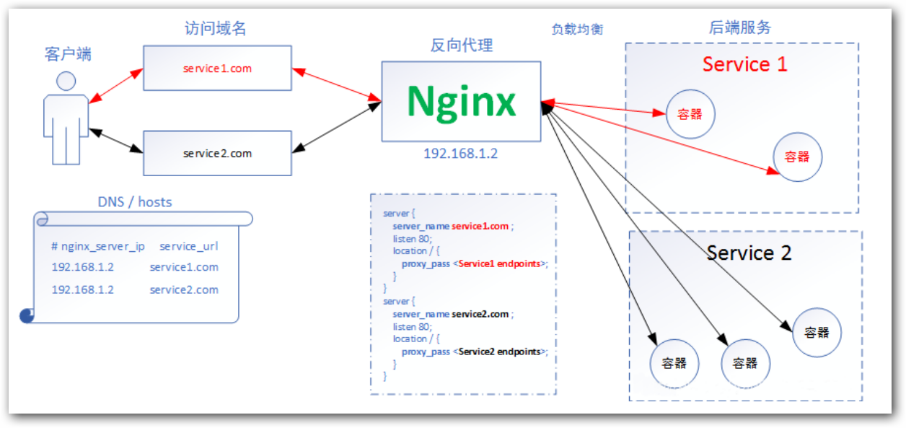

这里没有画出ingress-nginx控制器，控制器负责动态感知ingress资源的更新和添加，然后把ingress配置文件中的rules更新添加到nginx的反向代理配置文件（nginx proxy）中。

其余的负载均衡工作和反向代理都交由nginx来做。


### 部署Ingress控制器

参考[nginx-ingress官方教程](https://kubernetes.github.io/ingress-nginx/deploy/)

有很多ingress控制器，选择ingress-nginx控制器

```shell
kubectl apply -f https://raw.githubusercontent.com/kubernetes/ingress-nginx/controller-v1.8.2/deploy/static/provider/cloud/deploy.yaml
```

这里根据k8s的版本yaml文件里的api版本会有些许改动（报错信息会有提示，跟着修改api版本即可），我的K8s版本是1.22.0，不需要改动。

这个deploy创建了一系列资源，包括命名空间ingress-nginx，所有资源都在这个命名空间下。最重要的资源为ingress-nginx-controller服务（由一个pod组成）：

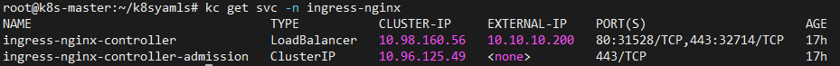

### 部署Ingress对象

```yaml
apiVersion: networking.k8s.io/v1
kind: Ingress
metadata:
   name: kubia
spec:
   ingressClassName: nginx
   rules:
   - host: kubia.example.com  // 需要反向代理的域名
     http:
       paths:
         - path: /
           pathType: Prefix
           backend:
             service:
               name: kubia-nodeport  // 后端服务名
               port:
                 number: 80
```

ingress-nginx需要后端服务是一个nodeport类型

### 实现负载均衡

访问服务：

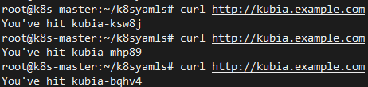

可以看到负载均衡的效果，相同的域名访问，最后处理请求的服务（容器）不一定相同

### 实现虚拟主机

另一个服务用镜像httpd

1. 创建新的rs-httpd
2. 创建新的svc-nodeport-httpd
3. 创建新的ingress-httpd

查看ingress:

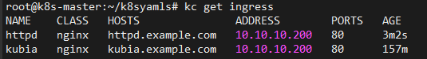

10.10.10.200是ingress-nginx-controller服务的公网IP，所以外部访问服务获取到的IP都是10.10.10.200，后面的端口是ingress-nginx-controller服务的port

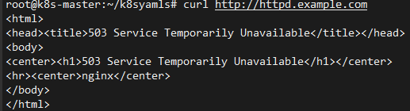

注意，若是在本机通过curl请求域名的话，需要在/etc/hosts内记录[IP:域名]，相当于客户端的dns解析。
```shell
127.0.0.1 localhost
10.10.10.200 kubia.example.com
10.10.10.200 httpd.example.com
```
### 一个ingress暴露多个服务

1. 利用paths数组，可以创建多个子域名->服务的映射
  ```yaml
  apiVersion: networking.k8s.io/v1
  kind: Ingress
  metadata:
    name: kubia
  spec:
    ingressClassName: nginx
    rules:
    - host: kubia.example.com
      http:
        paths:
          - path: /one
            pathType: Prefix
            backend:
              service:
                name: kubia
                port:
                  number: 80
          - path: /two
            pathType: Prefix
            backend:
              service:
                name: bar
                port:
                  number: 80  // 这是后端服务的监听端口，可以是相同的
  ```
2. 利用rules数组将不同的域名映射到不同的服务

```yaml

apiVersion: networking.k8s.io/v1
  kind: Ingress
  metadata:
    name: kubia
  spec:
    ingressClassName: nginx
    rules:
    - host: kubia.example.com
      http:
        paths:
          - path: /
            pathType: Prefix
            backend:
              service:
                name: kubia
                port:
                  number: 80
    - host: bar.example.com
      http:    
          - path: /
            pathType: Prefix
            backend:
              service:
                name: bar
                port:
                  number: 80
```

### headless service

有些客户端需要连接一个服务中的所有pod（我不是很理解），可以通过将服务的clusterIP设置为NONE，创建一个headless服务，这个服务没有IP，那么客户端就可以通过dns服务发现podip，创建[域名：podip]的映射

