# pod 

运行容器的过程以及主节点内部的流程：
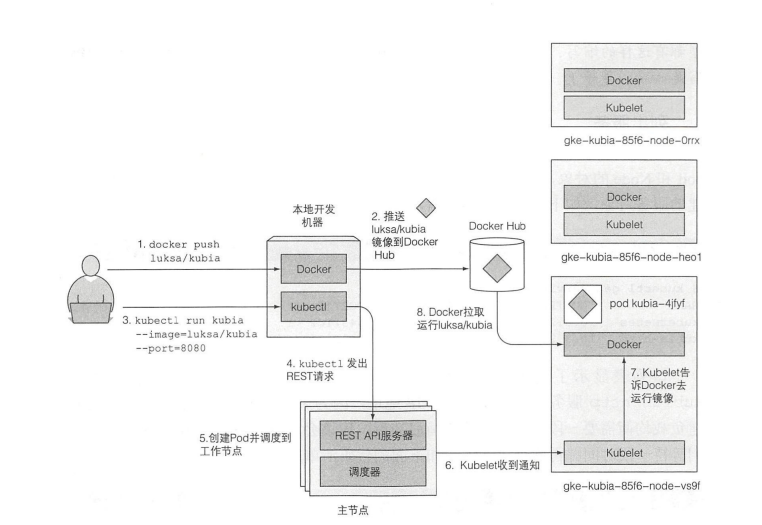

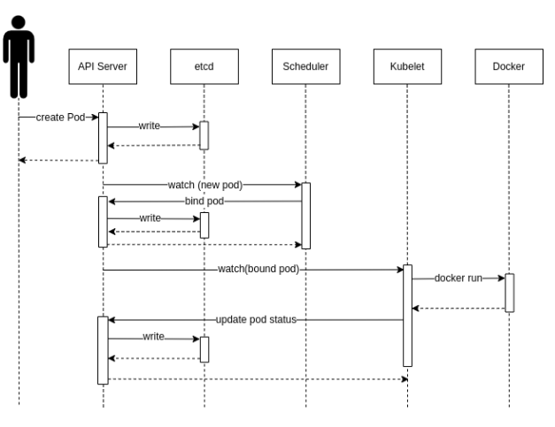

主节点内部的流程如下：
1) 用户通过 kubectl 或其他 API 客户端提交 Pod Spec 给 API Server。

2) API Server 尝试着将 Pod 对象的相关信息存入 etcd 中，待写入操作执行完成，API Server 即会返回确认信息至客户端。

3) API Server 开发反映 etcd 中的状态变化。

4) 所有的 Kubernetes 组件均使用 “watch” 机制来跟踪检查 API Server 上的相关的变动。

5) kube-scheduler（调度器）通过其 “watcher” 觉察到 API Server 创建了新的 Pod 对象但尚未绑定至任何工作节点。

6) kube-scheduler 为 Pod 对象挑选一个工作节点并将结果信息更新至 API Server。

7) 调度结果信息由 API Server 更新至 etcd 存储系统，而且 API Server 也开始反映此 Pod 的调度结果。

8) Pod 被调度到目标工作节点上的 kubelet 尝试在当前节点上调用 Docker 启动容器，并将容器的结果状态回送值 API Server。

9) API Server 将 Pod 状态信息存入 etcd 系统中。

10) 在 etcd 确认写入操作完成后，API Server 将确认信息发送至相关的 kubelet，事件将通过它被接受。


## pod内容器的隔离与共享

同一个pod内部共享网络、uts命名空间以及IPC命名空间

默认不共享PID和文件系统

## 查看pod的yaml文件
包含元数据、配置信息、状态信息三块内容
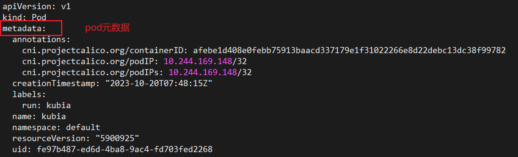
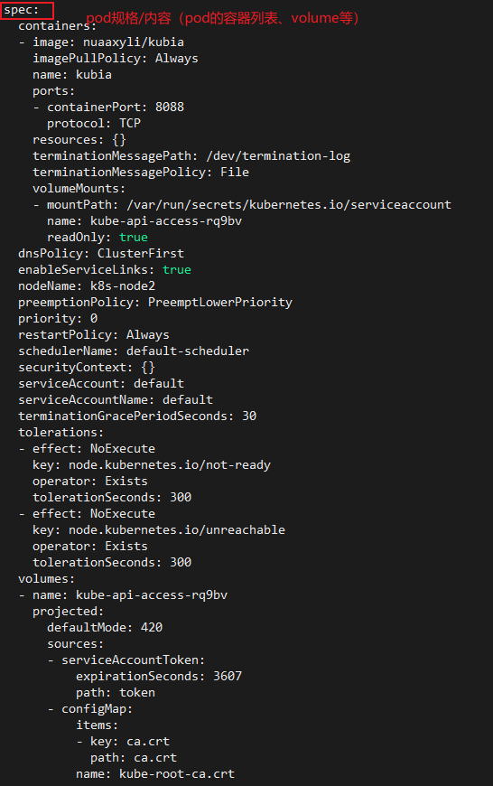
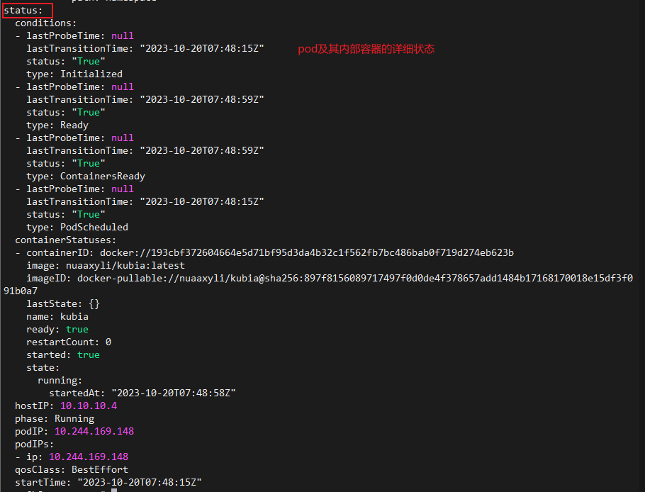

## 查看pod中应用（容器）的日志

### 使用docker查看容器日志（容器在哪个节点就得在哪找）

首先定位该应用所在的pod在哪个node  
```shell
kubectl get pods -o wide
```
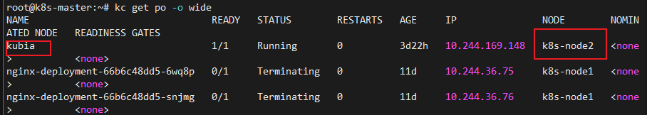

再通过查看pod详细信息(每个pod都有一个容器列表)，获取容器id
```shell
kubectl describe po <pod name>
```
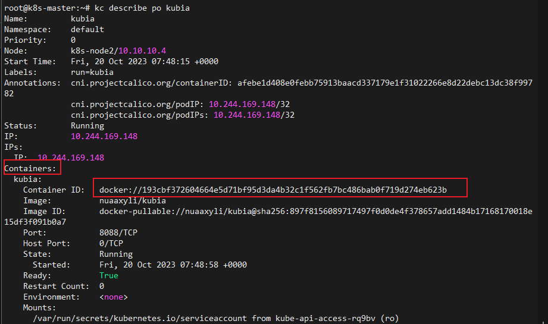

知道了在哪个node运行，知道了container id，就可以去对应节点查找docker 容器的日志了

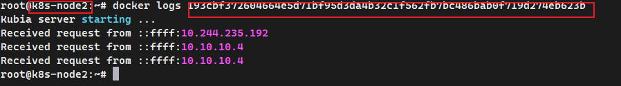

### 使用kubectl logs查看（在主节点上查看）
当pod中只有一个容器时，即可直接查看pod的日志
```shell
kubectl logs <pod name>
```

同样也可以指定容器

```shell
kubectl logs <pod name> -c <container id>
```

当pod被删除后，一般情况下集群也会删除其日志

## 外部绕过服务连接pod

通过端口转发的方式。本质上是将宿主机的某个端口映射到pod的某个端口，那么外部访问宿主机的这个端口，也就可以访问pod的某个端口

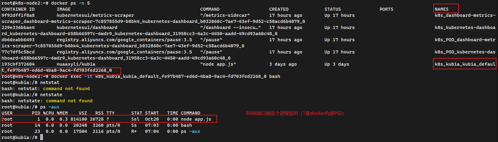

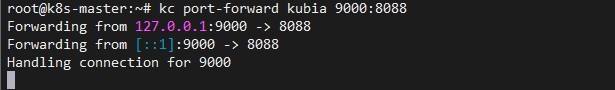

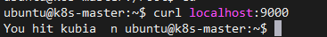

端口转发的误区，不是pod所有的端口都能通过这种形式进行连接，而是pod内部需要有进程在监听这个端口才行（实质是容器内的进程在监听），若没有进程在监听，也就没有容器应用会响应这个请求。pod创建时（一般一个pod运行一个应用）就会指定pod会监听的端口（这个端口是pod的端口，pod内部所有容器共享网络接口）。

端口转发是一个不暴露服务就可以测试应用的方法

## 标签

标签附加在资源上

存在于资源yaml文件的metadata.labels中，以键值对形式存在。可以针对标签对资源进行分类管理。

以pod资源kubia为例：

添加标签creation_method=manual：

```shell
kubectl label po kubia creation_method=manual
```

修改标签env=prod 为env=debug:
```shell
kubectl label po kubia-v2 env=debug --overwrite
```

查看pod并附带所有标签信息：
```shell
kubectl get po --show-label
```

查看pod并附带指定标签信息：
```shell
kubectl get po -L creation_method,env
```

## 标签选择器：对资源进行分类管理

标签选择器根据资源的以下条件来选择资源：
- 包含（或不包含）使用特定键的标签
- 包含具有特定键和值的标签
- 包含具有特定键的标签， 但其值与我们指定的不同

使用kubectl get pods的-l参数即可对标签进行选择,-l后跟的表达式可以是以下几种的组合（多种选择标准）：
- labelname
- labelname=labelval
- labelname!=labelval
- labelname in (labelval1, labelval2)
- labelname notin (labelval1, labelval2)


kubectl get pods -L 与 -l的区别：
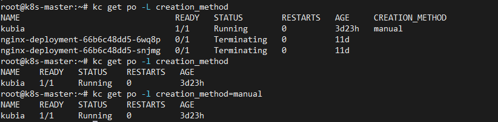

## 通过 nodeSelector 来调度 pod 到 node

```yaml
pod.spec.nodeSelector:
    labelname:labelval
```
其中该字段下的label对是node节点的标签

## 注解
对资源对象的一些描述
```yaml
pod.metadata.annotate:
    key:val
```

添加与修改注解的方式与标签一致：
```shell
kubectl annotate po podname key=val
```

## 命名空间

命名空间提供逻辑上的隔离

不一定提供很严格的隔离，包括网络接口。某个节点上的命名空间1上的pod1可以在已知该节点上命名空间2上的pod2的IP情况下，给pod2转发流量。