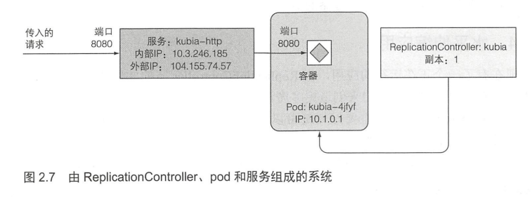
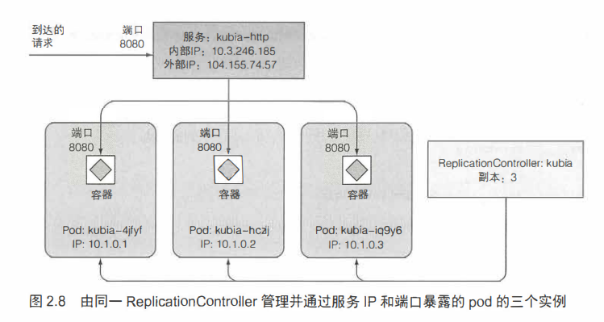

# 将应用作为服务暴露


## kubectl expose命令

```shell
kubectl expose (-f FILENAME | sourceTYPE sourceNAME) [--port=port] [--protocol=TCP|UDP] [--target-port=number-or-name] [--name=name] [--external-ip=external-ip-of-service] [--type=service type]
```

作用：命令将**资源**暴露为新的**Kubernetes Service**。暴露服务的方式主要为了防止pod的销毁导致生成新的pod时，podIP会发生变化，而外部访问时不需要知道podIP的变化，所有外部访问应用不通过访问podIP，而是通过访问服务。服务有多种类型，但基本的思路都是将服务对外提供一个静态IP或静态Port，外部请求永远只访问这个静态的IP或Port，而内部流量的流向不同服务类型会有不同的处理方式。

资源可以分为以下几种：
- pod（po）
- service（svc）
- replication controller（rc）
- deployment（deploy）
- replica set（rs）

## 暴露服务的方式
服务类型有以下几种：
- NodePort（LoadBalane是其中一种）
- ClusterIP
- Ingress
### ClusterIP

服务暴露默认类型为ClusterIP，即这个服务有一个内部IP，只允许在内部访问。

### NodePort

每个节点都会提供一个相同的端口用于访问，这个端口即为NodePort  

每个NodePort服务内部都会有一个ClusterIP服务，故每个NodePort服务都有一个内部IP

访问的方式：https://节点外部IP:NodePort  

如果设置了外部IP，那么NodePort服务就会有一个外部IP，直接访问外部IP:NodePort也可以

上述访问无需是本地访问

下图为请求通过端口定位到服务，再定位到pod的过程：





### Ingress
